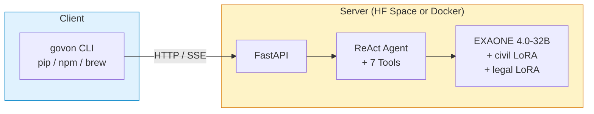

# GovOn

> AI-powered agentic CLI for Korean public-sector civil complaint workflows.

[](https://pypi.org/project/govon/)
[](https://www.npmjs.com/package/govon)
[](https://github.com/GovOn-Org/homebrew-govon)
[](https://pypi.org/project/govon/)
[](https://govon-org.github.io/GovOn/)
[](https://opensource.org/licenses/MIT)

<!-- DORA-BADGES:START -->


<!-- DORA-BADGES:END -->

---

Government employees in South Korea spend hours drafting responses to civil complaints — looking up laws, finding precedents, and formatting official documents. **GovOn automates that entire workflow.** You type a natural-language request, and an AI agent retrieves relevant data, searches legal references, and generates a draft response in official document format.

The CLI is lightweight (~10 MB). The heavy lifting happens on a remote server running [EXAONE 4.0-32B](https://huggingface.co/LGAI-EXAONE/EXAONE-4.0-32B-AWQ) with domain-specific LoRA adapters for civil and legal tasks.

## Quick Start

```bash
pip install govon
export GOVON_RUNTIME_URL=https://umyunsang-govon-runtime.hf.space
govon
```

## Installation

**Prerequisites**: Python 3.10+ **or** Node.js 18+ **or** Homebrew

### pip (recommended)

```bash
pip install govon
```

### npm

```bash
npm install -g govon
```

### Homebrew (macOS / Linux)

```bash
brew tap govon-org/govon && brew install govon
```

### Self-hosted server (GPU required)

If you want to run the inference backend locally instead of using the hosted runtime:

```bash
# Option A: Docker (recommended)
govon server pull
govon server start

# Option B: pip extras
pip install govon[server]
```

> **Note**: The server requires an NVIDIA GPU (A100 80 GB recommended) and Docker with NVIDIA Container Toolkit.

## Usage

### Interactive mode (REPL)

```bash
govon
```

```
govon> Draft a response for a road damage complaint

┌─ Approval Request ────────────────────┐
│  Type: Draft response                 │
│  Goal: Road damage complaint response │
│  Tasks:                               │
│   - Look up legal basis               │
│   - Search similar cases              │
│                                       │
│  ● Approve  ○ Reject                  │
└───────────────────────────────────────┘
```

The agent proposes a plan and waits for your approval before executing any tools.

### One-shot mode

```bash
govon "Show me road damage complaint statistics for this month"
```

### Multi-turn conversations

```bash
govon --session my-session
```

```
govon> What are the most common complaint types?
→ (response with statistics)

govon> Draft a response for the top one
→ (uses conversation context to generate a draft)
```

### API call

```bash
curl -X POST $GOVON_RUNTIME_URL/v3/agent/run \
  -H "Content-Type: application/json" \
  -d '{"query": "Show complaint statistics", "session_id": "demo-1"}'
```

## Features

- **ReAct agent with 7 tools** -- the agent autonomously selects and chains tools based on your request
- **Human-in-the-loop approval** -- every tool execution requires explicit user approval before running
- **Multi-turn conversations** -- session-based context management with extractive summarization
- **Multi-LoRA inference** -- domain-specific adapters (civil complaints + legal references) on a single base model
- **Streaming responses** -- real-time SSE streaming with per-node progress display
- **Three installation methods** -- pip, npm, and Homebrew for maximum accessibility

### Tools

| Tool | Purpose |
|------|---------|
| `api_lookup` | Query civil complaint data |
| `issue_detector` | Detect trending complaint issues |
| `stats_lookup` | Retrieve complaint statistics |
| `keyword_analyzer` | Analyze keyword trends |
| `demographics_lookup` | Look up regional demographics |
| `public_admin_adapter` | Generate official response drafts |
| `legal_adapter` | Search legal references and precedents |

## Architecture



**The CLI is thin, the server is powerful.**

- **CLI**: httpx, rich, prompt-toolkit (~10 MB, no GPU needed)
- **Server**: EXAONE 4.0-32B + vLLM + Multi-LoRA on A100 80 GB

## Server Management

Manage the Docker-based backend with `govon server`:

| Command | Description |
|---------|-------------|
| `govon server pull [TAG]` | Pull the Docker image |
| `govon server start` | Start the backend (`docker compose up -d`) |
| `govon server stop` | Stop the backend (`docker compose down`) |
| `govon server status` | Check container status + `/health` endpoint |
| `govon server logs` | Stream logs in real time |

## Configuration

| Variable | Description | Default |
|----------|-------------|---------|
| `GOVON_RUNTIME_URL` | Server URL | `http://localhost:7860` |
| `API_KEY` | API authentication key | *(none -- unauthenticated access)* |
| `HOST_PORT` | Local server port | `8000` |

```bash
export GOVON_RUNTIME_URL=https://umyunsang-govon-runtime.hf.space
export API_KEY=your-api-key
```

See [`.env.example`](.env.example) for the full list of server-side configuration options.

## Documentation

| Resource | Link |
|----------|------|
| User Guide | [`docs/guide/user-guide.md`](docs/guide/user-guide.md) |
| Operations Guide | [`docs/guide/ops-guide.md`](docs/guide/ops-guide.md) |
| API Reference | [Endpoint reference](docs/guide/ops-guide.md#api-엔드포인트-레퍼런스) |
| Demo Scenarios | [`docs/demo/README.md`](docs/demo/README.md) |
| Docs Portal | [govon-org.github.io/GovOn](https://govon-org.github.io/GovOn/) |
| Public Roadmap | [Workstreams](https://github.com/GovOn-Org/GovOn/issues/402) |
| Community Discussion | [GitHub Discussions](https://github.com/GovOn-Org/GovOn/discussions/606) |

## Resources

| Package | Install |
|---------|---------|
| PyPI | [`pip install govon`](https://pypi.org/project/govon/) |
| npm | [`npm install -g govon`](https://www.npmjs.com/package/govon) |
| Homebrew | [`brew tap govon-org/govon`](https://github.com/GovOn-Org/homebrew-govon) |
| Docker | `ghcr.io/govon-org/govon` |
| HF Space (hosted runtime) | [umyunsang/govon-runtime](https://huggingface.co/spaces/umyunsang/govon-runtime) |
| Civil LoRA Adapter | [umyunsang/govon-civil-adapter](https://huggingface.co/umyunsang/govon-civil-adapter) |
| Legal LoRA Adapter | [siwo/govon-legal-adapter](https://huggingface.co/siwo/govon-legal-adapter) |
| Releases | [GitHub Releases](https://github.com/GovOn-Org/GovOn/releases) |

## Contributing

```bash
git clone https://github.com/GovOn-Org/GovOn.git
cd GovOn
pip install -e ".[dev]"
pytest
```

See [CONTRIBUTING.md](CONTRIBUTING.md) for guidelines.

## About

**GovOn** is an industry-academia project from the Department of Computer Engineering at Dong-A University. It assists local government employees with civil complaint response workflows. The AI does not replace human judgment -- it automates repetitive tasks so public servants can focus on decisions that matter.

## License

[MIT](LICENSE) -- Copyright (c) 2026 umyunsang
