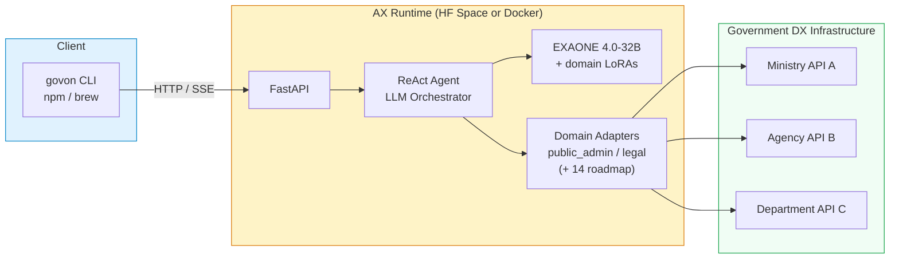

# GovOn

> AX (Agentic Transformation) platform that unifies Korea's fragmented government DX infrastructure through agentic AI.

[](https://www.npmjs.com/package/govon)
[](https://github.com/GovOn-Org/homebrew-govon)
[](https://nodejs.org/)
[](https://govon-org.github.io/GovOn/)
[](LICENSE)
[](https://huggingface.co/LGAI-EXAONE/EXAONE-4.0-32B-AWQ/blob/main/LICENSE)

<!-- DORA-BADGES:START -->


<!-- DORA-BADGES:END -->

---

Korea's public sector has achieved widespread DX (Digital Transformation) — but data and APIs remain siloed across ministries, departments, and agencies, each with independent systems. **GovOn is the AX (Agentic Transformation) layer on top.** It wraps each agency's API endpoints as LLM-callable tools, and a central LLM autonomously decides which tools to call, chains them, and synthesizes results — acting as a single unified interface over the entire government infrastructure.

The CLI is lightweight (~10 MB). The heavy lifting happens on a remote server running [EXAONE 4.0-32B](https://huggingface.co/LGAI-EXAONE/EXAONE-4.0-32B-AWQ) with domain-specific LoRA adapters. **MVP supports 2 domain adapters (공공행정, 법률); the roadmap targets 16 national domains.**

## Quick Start

```bash
npm install -g govon
export GOVON_RUNTIME_URL=https://umyunsang-govon-runtime.hf.space
govon
```

## Installation

**Prerequisites**: Node.js 18+

### npm (recommended)

```bash
npm install -g govon
```

### Native installer

```bash
curl -fsSL https://raw.githubusercontent.com/GovOn-Org/GovOn/main/scripts/install.sh | bash
```

### Homebrew (macOS / Linux)

```bash
brew install govon-org/tap/govon
```

### Update

```bash
# npm
npm install -g govon@latest

# Homebrew
brew upgrade govon
```

### Self-hosted runtime (GPU required)

You can host your own GovOn runtime on **Hugging Face Spaces** or on-premises.

#### Option A: Hugging Face Spaces (recommended)

1. Duplicate the reference Space: [umyunsang/govon-runtime](https://huggingface.co/spaces/umyunsang/govon-runtime)
2. Select **A100 GPU** (80 GB) or higher hardware
3. Wait for the Space to start, then set your CLI to point at it:

```bash
export GOVON_RUNTIME_URL=https://<your-hf-username>-govon-runtime.hf.space
govon
```

> **Tip**: Add the export to your shell profile (`~/.zshrc`, `~/.bashrc`) so it persists across sessions.

#### Option B: Docker (on-premises)

```bash
govon server pull
govon server start
```

#### Option C: pip extras (bare-metal)

```bash
pip install govon[server]
```

> **Hardware requirement**: The runtime requires an NVIDIA GPU with ≥ 80 GB VRAM (A100 80 GB or higher). Smaller GPUs will fail to load the EXAONE 4.0-32B model.

## Usage

### Interactive mode (REPL)

```bash
# Point the CLI to your runtime (HF Space, Docker, or localhost)
export GOVON_RUNTIME_URL=https://<your-hf-username>-govon-runtime.hf.space
govon
```

```
govon> Draft a response for a road damage complaint

┌─ Approval Request ────────────────────┐
│  Type: Draft response                 │
│  Goal: Road damage complaint response │
│  Tasks:                               │
│   - Look up legal basis               │
│   - Search similar cases              │
│                                       │
│  ● Approve  ○ Reject                  │
└───────────────────────────────────────┘
```

The agent proposes a plan and waits for your approval before executing any tools.

### One-shot mode

```bash
govon "Show me road damage complaint statistics for this month"
```

### Multi-turn conversations

```bash
govon --session my-session
```

```
govon> What are the most common complaint types?
→ (response with statistics)

govon> Draft a response for the top one
→ (uses conversation context to generate a draft)
```

### API call

```bash
curl -X POST $GOVON_RUNTIME_URL/v3/agent/run \
  -H "Content-Type: application/json" \
  -d '{"query": "Show complaint statistics", "session_id": "demo-1"}'
```

## Features

- **AX platform architecture** -- government agency APIs wrapped as LLM tools; central LLM orchestrates cross-agency data access through a single interface
- **ReAct agent with 7 tools** -- the agent autonomously selects and chains tools based on your request
- **Human-in-the-loop approval** -- every tool execution requires explicit user approval before running
- **Multi-turn conversations** -- session-based context management with extractive summarization
- **Multi-LoRA inference** -- domain-specific adapters loaded per-request on a single base model
- **Streaming responses** -- real-time SSE streaming with per-node progress display
- **Three installation methods** -- npm, Homebrew, and native installer

### Domain Adapters

| Adapter | Domain | Status |
|---------|--------|--------|
| `public_admin_adapter` | 공공행정 (Public Administration) | Active (MVP) |
| `legal_adapter` | 법률 (Legal) | Active (MVP) |
| *(14 more)* | 과학기술, 교육, 교통물류, 국토관리, 농축수산, 문화관광, 보건의료, 사회복지, 산업고용, 식품건강, 재난안전, 재정금융, 통일외교안보, 환경기상 | Roadmap |

### Tools

| Tool | Purpose |
|------|---------|
| `api_lookup` | Query government data APIs |
| `issue_detector` | Detect trending issues across domains |
| `stats_lookup` | Retrieve domain statistics |
| `keyword_analyzer` | Analyze keyword trends |
| `demographics_lookup` | Look up regional demographics |
| `public_admin_adapter` | Generate public administration response drafts |
| `legal_adapter` | Search legal references and precedents |

## Architecture



**DX → AX: The CLI is the entry point; the server is the AX orchestration layer.**

- **CLI**: React + Ink + TypeScript TUI (Node.js 18+, no GPU needed)
- **AX Runtime**: EXAONE 4.0-32B + vLLM + Multi-LoRA on A100 80 GB
- **Domain Adapters**: Each adapter wraps a government agency's DX APIs as LLM-callable tools

## Server Management

Manage the Docker-based backend with `govon server`:

| Command | Description |
|---------|-------------|
| `govon server pull [TAG]` | Pull the Docker image |
| `govon server start` | Start the backend (`docker compose up -d`) |
| `govon server stop` | Stop the backend (`docker compose down`) |
| `govon server status` | Check container status + `/health` endpoint |
| `govon server logs` | Stream logs in real time |

## Configuration

| Variable | Description | Default |
|----------|-------------|---------|
| `GOVON_RUNTIME_URL` | Server URL | `http://localhost:7860` |
| `API_KEY` | API authentication key | *(none -- unauthenticated access)* |
| `HOST_PORT` | Local server port | `8000` |

```bash
export GOVON_RUNTIME_URL=https://umyunsang-govon-runtime.hf.space
export API_KEY=your-api-key
```

See [`deploy/env/.env.example`](deploy/env/.env.example) for the full list of server-side configuration options.

## Documentation

| Resource | Link |
|----------|------|
| User Guide | [`docs/guide/user-guide.md`](docs/guide/user-guide.md) |
| Operations Guide | [`docs/guide/ops-guide.md`](docs/guide/ops-guide.md) |
| API Reference | [Endpoint reference](docs/guide/ops-guide.md#api-엔드포인트-레퍼런스) |
| Demo Scenarios | [`docs/demo/README.md`](docs/demo/README.md) |
| Docs Portal | [govon-org.github.io/GovOn](https://govon-org.github.io/GovOn/) |
| Public Roadmap | [Workstreams](https://github.com/GovOn-Org/GovOn/issues/402) |
| Community Discussion | [GitHub Discussions](https://github.com/GovOn-Org/GovOn/discussions/606) |

## Resources

| Package | Install |
|---------|---------|
| npm | [`npm install -g govon`](https://www.npmjs.com/package/govon) |
| Homebrew | [`brew install govon-org/tap/govon`](https://github.com/GovOn-Org/homebrew-govon) |
| Native | `curl -fsSL .../install.sh \| bash` |
| Docker | `ghcr.io/govon-org/govon` |
| HF Space (hosted runtime) | [umyunsang/govon-runtime](https://huggingface.co/spaces/umyunsang/govon-runtime) |
| Public Admin LoRA Adapter (`public_admin_adapter`) | [umyunsang/govon-civil-adapter](https://huggingface.co/umyunsang/govon-civil-adapter) |
| Legal LoRA Adapter | [siwo/govon-legal-adapter](https://huggingface.co/siwo/govon-legal-adapter) |
| Releases | [GitHub Releases](https://github.com/GovOn-Org/GovOn/releases) |

## Contributing

```bash
git clone https://github.com/GovOn-Org/GovOn.git
cd GovOn

# Backend (Python)
pip install -e ".[dev]"
pytest

# TUI (Node.js)
cd packages/npm && npm install && npm run build
```

See [CONTRIBUTING.md](CONTRIBUTING.md) for guidelines.

## About

**GovOn** is an industry-academia project from the Department of Computer Engineering at Dong-A University. It is an AX (Agentic Transformation) platform that builds an agentic intelligence layer on top of Korea's existing DX (Digital Transformation) national infrastructure. Rather than replacing independent agency systems, GovOn wraps their APIs as LLM-callable tools — enabling a central agentic AI to orchestrate cross-agency workflows through a single interface. The AI does not replace human judgment -- it transforms fragmented digital infrastructure into a unified agentic experience so public servants can focus on decisions that matter.

## License

The GovOn source code is licensed under [MIT](LICENSE).

**Important:** The runtime uses [EXAONE 4.0-32B-AWQ](https://huggingface.co/LGAI-EXAONE/EXAONE-4.0-32B-AWQ), which is distributed under the [EXAONE AI Model License Agreement](https://huggingface.co/LGAI-EXAONE/EXAONE-4.0-32B-AWQ/blob/main/LICENSE) — **non-commercial use only**. Commercial deployment of the model requires a separate license from LG AI Research.
