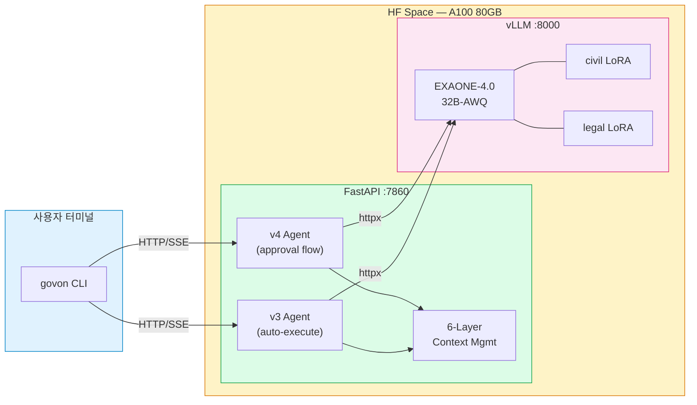
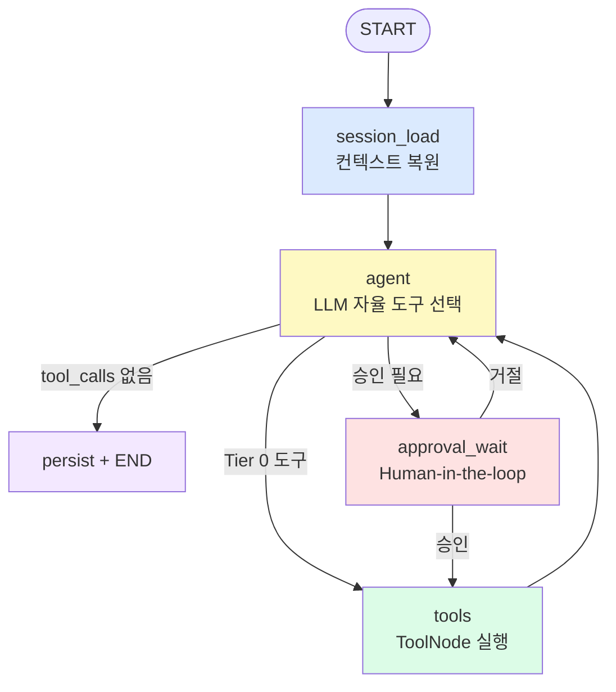
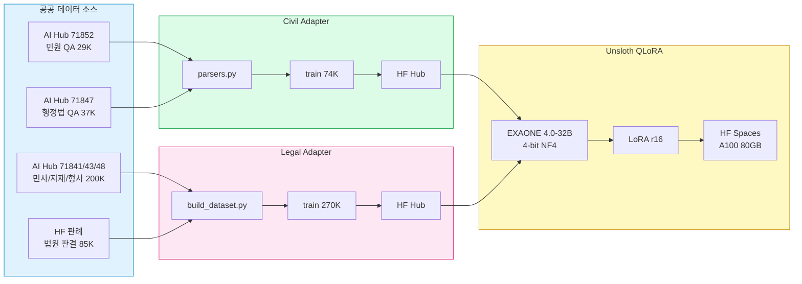

# GovOn — Agentic CLI Shell for Korean Public Sector

> **"도로 파손 민원에 대한 답변 초안을 작성해줘"** — 한마디면 AI가 법령을 찾고, 유사 사례를 조회하고, 공문서 형식의 초안을 생성합니다.

GovOn은 **동아대학교 컴퓨터공학과** 현장미러형 산학연계 프로젝트로 개발된 에이전틱 CLI 셸입니다.
지방자치단체 공무원의 민원 답변 업무를 AI 에이전트가 보조합니다.

[](https://pypi.org/project/govon/)
[](https://pypi.org/project/govon/)
[](https://govon-org.github.io/GovOn/)
[](https://github.com/GovOn-Org/GovOn/issues/402)
[](https://huggingface.co/spaces/umyunsang/govon-runtime)
[](https://github.com/GovOn-Org/GovOn/discussions/606)

<!-- DORA-BADGES:START -->


<!-- DORA-BADGES:END -->

---

## 핵심 특징

### 1. ReAct 자율 에이전트

LLM이 사용자의 의도를 이해하고 **7개 도구 중 어떤 것을 호출할지 자율적으로 판단**합니다.
키워드 매칭이 아니라, 맥락 기반 추론으로 도구를 선택합니다.

| 도구 | 역할 |
|------|------|
| `api_lookup` | 민원 데이터 API 조회 |
| `issue_detector` | 주요 이슈 탐지 |
| `stats_lookup` | 통계 데이터 조회 |
| `keyword_analyzer` | 핵심 키워드 분석 |
| `demographics_lookup` | 인구통계 조회 |
| `public_admin_adapter` | 민원답변 초안 생성 (civil LoRA) |
| `legal_adapter` | 법률 근거 보강 (legal LoRA) |

### 2. 도메인 특화 Multi-LoRA

단일 EXAONE 4.0-32B-AWQ 베이스 모델 위에 요청별로 LoRA 어댑터를 동적 전환합니다.

| 어댑터 | 학습 데이터 | 용도 |
|--------|-----------|------|
| [**civil-adapter**](https://huggingface.co/umyunsang/govon-civil-adapter) (r16) | 74K 민원-답변 쌍 | `public_admin_adapter` tool_call 시 attach |
| [**legal-adapter**](https://huggingface.co/siwo/govon-legal-adapter) (r16) | 270K 법률 문서 | `legal_adapter` tool_call 시 attach |

### 3. Human-in-the-loop 승인 흐름

AI가 도구를 실행하기 전에 사용자에게 승인을 요청합니다.
완전 자동화가 아닌, **사람의 판단을 존중하는 반자동화**입니다.

```bash
$ govon
GovOn Shell v1.0 — 무엇을 도와드릴까요?

> 도로 파손 민원에 대한 답변 초안을 작성해줘

┌─ 작업 승인 요청 ─────────────────┐
│  유형: 답변 초안 작성              │
│  목표: 도로 파손 민원 답변 생성     │
│  작업:                            │
│   • 민원 처리 근거 확인            │
│   • 유사 사례 및 담당 부서 조회     │
│                                   │
│  ● 승인  ○ 거절                   │
└───────────────────────────────────┘
```

---

## 아키텍처



### ReAct 루프 흐름



### 6-Layer 컨텍스트 관리

장기 대화에서 토큰 오버플로를 방지하는 6단계 파이프라인:

| Layer | 단계 | 메커니즘 |
|-------|------|---------|
| L1 | 도구 실행 | 도구 출력 3000자 head+tail 절단 |
| L2 | LLM 호출 | 오래된 도구 결과 placeholder 교체 |
| L3 | LLM 호출 | 역순 토큰 예산 trim (4500 토큰) |
| L4 | LLM 호출 | 예산 초과 시 강제 제거 |
| L5 | 세션 복원 | 룰 기반 대화 요약 |
| L6 | 세션 복원 | 토큰 예산 영구 삭제 |

---

## 데이터 파이프라인



| 데이터셋 | 건수 | HuggingFace Hub |
|---------|------|-----------------|
| Civil Response | 74K | [umyunsang/govon-civil-response-data](https://huggingface.co/datasets/umyunsang/govon-civil-response-data) |
| Legal Citation | 270K | [umyunsang/govon-legal-response-data](https://huggingface.co/datasets/umyunsang/govon-legal-response-data) |

---

## 설치

```bash
# PyPI에서 CLI 클라이언트 설치
pip install govon

# 서버 런타임 전체 설치 (GPU 환경)
pip install govon[server]
```

## 빠른 시작

```bash
# 1. HF Space 런타임에 직접 요청
export GOVON_RUNTIME_URL=https://umyunsang-govon-runtime.hf.space

# 2. v3 자동 실행 모드
curl -X POST $GOVON_RUNTIME_URL/v3/agent/run \
  -H "Content-Type: application/json" \
  -d '{"query": "도로 파손 민원 현황 알려줘", "session_id": "demo-1", "max_iterations": 10}'

# 3. v4 승인 흐름 (CLI 권장)
pip install govon
export GOVON_RUNTIME_URL=https://umyunsang-govon-runtime.hf.space
govon
```

상세한 사용법은 [사용자 가이드](docs/guide/user-guide.md)를 참고하세요.

---

## 검증 지표

### E2E 테스트: 27/27 통과

| Phase | 시나리오 | 검증 대상 |
|-------|---------|---------|
| 1. Infrastructure | 3 | 헬스체크, 베이스 모델, vLLM 연결 |
| 2. v2 Pipeline | 6 | 승인 흐름, 거절, 멀티턴, 동시성 |
| 3. v3 ReAct | 10 | 직접 응답, 도구 실행, SSE 스트리밍 |
| 4. Cross-version | 2 | v2↔v3 일관성 |
| 5. Multi-turn | 3 | 컨텍스트 유지, 세션 격리, 3턴 워크플로우 |
| 6. Context Mgmt | 3 | 도구 클리어링, 5턴 요약 |

### DORA Elite

| 지표 | 값 | 수집 방식 |
|------|---|----------|
| Deployment Frequency | 30/주 | main 머지 PR 수 |
| Lead Time | 0.9h | PR 첫 커밋 → 머지 |
| Change Failure Rate | 28.6% | hotfix/revert 비율 |
| MTTR | 0.0h | bug 이슈 open → close |

- **실시간 대시보드**: [Grafana Cloud](https://umyunsang.grafana.net/d/govon-dora/)
- **주간 보고서**: [`metrics/reports/`](metrics/reports/)

---

## 문서

| 문서 | 설명 |
|------|------|
| [사용자 가이드](docs/guide/user-guide.md) | 설치, CLI 사용법, 도구 설명 |
| [운영 가이드](docs/guide/ops-guide.md) | 배포, 환경변수, 모니터링, 트러블슈팅 |
| [데모 패키지](docs/demo/README.md) | 시연 시나리오 3종 + curl 재현 |
| [프로젝트 회고](docs/retrospective.md) | v1→v4 진화, 기술적 도전, KPT |
| [ADR](docs/adr/README.md) | Architecture Decision Records |
| [PRD](docs/prd.md) | Product Requirements Document |
| [WBS](docs/wbs.md) | Work Breakdown Structure |
| [Docs Portal](https://govon-org.github.io/GovOn/) | GitHub Pages 통합 문서 |

---

## 프로젝트 구조

```
src/
├── cli/                    # CLI 인터페이스
│   ├── shell.py            # 인터랙티브 REPL
│   ├── approval_ui.py      # Rich Panel 승인 UI
│   ├── daemon.py           # 백그라운드 데몬
│   └── renderer.py         # 출력 렌더러
└── inference/              # 추론 엔진
    ├── api_server.py       # FastAPI 서버
    ├── session_context.py  # SQLite 세션 저장소
    └── graph/              # LangGraph 코어
        ├── builder.py      # v4/v3 그래프 빌더
        ├── nodes.py        # 노드 팩토리 (5개 노드)
        ├── state.py        # GovOnGraphState
        ├── capabilities/   # 도구 Capability 클래스
        └── tools/          # StructuredTool 팩토리
```

---

## API 엔드포인트

| 메서드 | 엔드포인트 | 용도 |
|--------|-----------|------|
| GET | `/health` | 헬스체크 (인증 불필요) |
| POST | `/v2/agent/stream` | v4 에이전트 스트리밍 (승인 흐름) |
| POST | `/v2/agent/run` | v4 에이전트 동기 실행 |
| POST | `/v2/agent/approve` | 도구 실행 승인/거절 |
| POST | `/v2/agent/cancel` | 실행 취소 |
| POST | `/v3/agent/stream` | v3 에이전트 SSE 스트리밍 |
| POST | `/v3/agent/run` | v3 에이전트 동기 실행 |

---

## 리소스

| 자원 | 링크 |
|------|------|
| HF Space (Runtime) | [umyunsang/govon-runtime](https://huggingface.co/spaces/umyunsang/govon-runtime) |
| Civil Adapter | [umyunsang/govon-civil-adapter](https://huggingface.co/umyunsang/govon-civil-adapter) |
| Legal Adapter | [siwo/govon-legal-adapter](https://huggingface.co/siwo/govon-legal-adapter) |
| Civil Dataset | [umyunsang/govon-civil-response-data](https://huggingface.co/datasets/umyunsang/govon-civil-response-data) |
| Legal Dataset | [umyunsang/govon-legal-response-data](https://huggingface.co/datasets/umyunsang/govon-legal-response-data) |
| DORA Dashboard | [Grafana Cloud](https://umyunsang.grafana.net/d/govon-dora/) |
| Public Roadmap | [#402](https://github.com/GovOn-Org/GovOn/issues/402) |

---

## 개발 규칙

- 브랜치 전략: GitHub Flow (`main` 단일 브랜치)
- 모든 변경은 PR을 통해 진행
- CI: lint(Black+isort+flake8) + test(pytest 3.10/3.11/3.12) + security + runtime-contract
- 기여 가이드: [CONTRIBUTING.md](CONTRIBUTING.md)

---

## GitHub 이슈 구조

```
#402 Public Roadmap (root)
 ├── Workstream (🧭 라벨)
 │    └── Task ([Task X.Y] 접두사)
 └── Workstream
      └── Task
```

---

## 라이선스

이 프로젝트는 동아대학교 현장미러형 산학연계 프로젝트의 산출물입니다.
