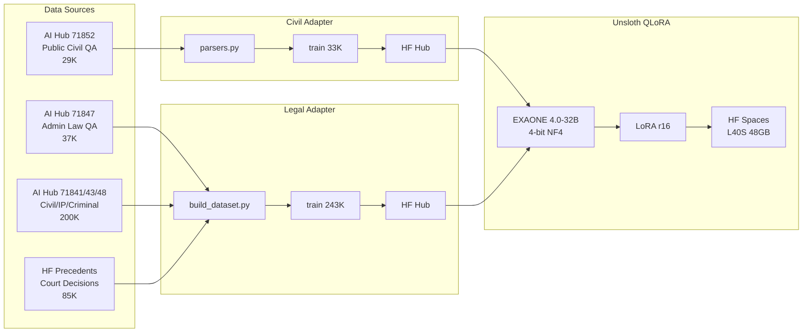

# GovOn

GovOn은 행정 업무를 보조하는 **에이전틱 CLI 셸**이다. 사용자는 `govon`을 실행한 뒤 자연어로 요청하고, 셸은 로컬 daemon runtime과 연결되어 검색·조회·작성 도구를 승인 기반으로 사용한다.

[](https://govon-org.github.io/GovOn/)
[](https://github.com/GovOn-Org/GovOn/issues?q=label%3A%22%F0%9F%A7%AD+Workstream%22+sort%3Aupdated-desc)

<!-- DORA-BADGES:START -->


<!-- DORA-BADGES:END -->

## 아키텍처

> ReAct + ToolNode 기반 v4 아키텍처. LLM이 자율적으로 도구를 선택하며, 정적 planner/executor를 제거했다.

<p align="center">
  <a href="https://govon-org.github.io/GovOn/govon-tobe-architecture.svg">
    
  </a>
</p>

### 모델 구성

| 역할 | 모델 | LoRA | 용도 |
|---|---|---|---|
| Agent | EXAONE 4.0-32B-AWQ | 없음 (베이스) | 자율 도구 선택 (bind_tools + ReAct loop) |
| 민원답변 초안 | EXAONE 4.0-32B-AWQ | **civil-adapter** (r16) | `public_admin_adapter` tool |
| 법률 근거 인용 | EXAONE 4.0-32B-AWQ | [**legal-adapter**](https://huggingface.co/siwo/govon-legal-adapter) (r16) | `legal_adapter` tool |
| 검색/분석 | EXAONE 4.0-32B-AWQ | 없음 | `rag_search`, `api_lookup`, `stats_lookup` 등 |

## 데이터 파이프라인



| 데이터셋 | 건수 | HuggingFace Hub |
|---|---|---|
| Civil Response | 33K (train) | [umyunsang/govon-civil-response-data](https://huggingface.co/datasets/umyunsang/govon-civil-response-data) |
| Legal Citation | 243K (train) | [umyunsang/govon-legal-response-data](https://huggingface.co/datasets/umyunsang/govon-legal-response-data) |

## LangGraph Agent Flow

```
START → session_load → agent → [route_agent]
     ├── (no tool_calls)   → persist → END
     ├── (all Tier 0)      → tools → agent → ...  (ReAct loop)
     └── (needs approval)  → approval_wait → [route_after_approval]
                                 ├── (approved) → tools → agent → ...
                                 └── (rejected) → agent → ...  (suggest alternatives)
```

## 현재 제품 기준

- 진입점은 웹이 아니라 `govon` 대화형 CLI 셸
- 내부 runtime은 로컬 FastAPI daemon 또는 원격 서버 (`GOVON_RUNTIME_URL`)
- LangGraph ReAct 루프에서 agent LLM이 자율적으로 도구 호출을 결정
- 도구 선택은 EXAONE 4.0의 `bind_tools()` + 네이티브 tool calling으로 수행
- Tier 0 도구(검색/분석)는 자동 실행, Tier 1 도구(어댑터)는 사용자 승인 후 실행
- 민원 답변 작성 시 `public_admin_adapter`, 법률 근거 시 `legal_adapter` LoRA tool 사용
- 거부 시 agent가 대안을 제시하는 루프 구조
- 서빙은 HuggingFace Spaces ZeroGPU 또는 전용 GPU Space

상세 기준 문서는 [docs/architecture/GovOn-shell-mvp-architecture.md](docs/architecture/GovOn-shell-mvp-architecture.md)다.

## MVP 범위

포함:

- 자연어 기반 CLI 셸
- 로컬 daemon 자동 기동 및 재연결
- 원격 서버 연결 (`GOVON_RUNTIME_URL`)
- 민원 답변 작성 (civil-adapter LoRA)
- 법적 근거 인용 (legal-adapter LoRA)
- 외부 API lookup
- 로컬 RAG 검색
- 작업 단위 승인 UI
- SQLite 기반 세션 resume
- 후속 근거/출처 증강

제외:

- 공문서 작성
- 분류 기능
- 웹/앱 제품화

## 사용자 흐름

1. 사용자가 `govon`을 실행한다.
2. CLI가 로컬 daemon을 자동 기동하거나 기존 daemon에 재연결한다.
3. 사용자가 자연어로 업무를 요청한다.
4. LangGraph agent 노드가 자율적으로 필요한 도구를 선택한다.
5. Tier 1 도구가 포함되면 `승인 / 거절` UI를 보여준다.
6. 승인되면 ToolNode가 도구를 병렬 실행하고, 결과를 agent에 반환한다 (ReAct loop).
7. agent가 충분한 정보가 모이면 최종 답변을 직접 작성한다.
8. 거절 시 agent가 대안을 제시하고, 사용자가 후속 요청을 할 수 있다.
9. 종료 시 세션 ID를 보여주고, `govon --session <id>`로 재개한다.

## 문서

- 제품 아키텍처: [docs/architecture/GovOn-shell-mvp-architecture.md](docs/architecture/GovOn-shell-mvp-architecture.md)
- 오케스트레이션 워크플로우: [docs/architecture/WORKFLOW-orchestrator-tool-calling.md](docs/architecture/WORKFLOW-orchestrator-tool-calling.md)
- ADR: [docs/adr/README.md](docs/adr/README.md)
- PRD: [docs/prd.md](docs/prd.md)
- WBS: [docs/wbs.md](docs/wbs.md)
- 공식 문서: [docs/official](docs/official)
- 아키텍처 다이어그램: [TO-BE Architecture SVG](https://govon-org.github.io/GovOn/govon-tobe-architecture.svg)

## GitHub 이슈 구조

- root roadmap: `#402`
- roadmap의 하위: `workstream`
- workstream의 하위: `task`
- 세부 작업 내용은 `task` 이슈 본문에만 작성한다.

## DORA Metrics

<!-- latest-dora.png는 워크플로우 첫 실행 후 자동 생성됩니다. 실시간 대시보드는 아래 Grafana 링크를 이용하세요. -->

| 지표 | 설명 | 수집 방식 |
|------|------|----------|
| Deployment Frequency | main 머지 PR 수 / 주 | GitHub API |
| Lead Time | PR 첫 커밋 → 머지 평균 시간 | GitHub API |
| Change Failure Rate | hotfix/revert 커밋 비율 | git log |
| MTTR | bug 이슈 open → close 평균 시간 | GitHub API |

- **실시간 대시보드**: [Grafana Cloud](https://umyunsang.grafana.net/d/govon-dora/govon-dora-metrics-dashboard?orgId=1&from=now-7d&to=now&timezone=Asia%2FSeoul)
- **주간 보고서**: [`metrics/reports/`](metrics/reports/)
- **수집 워크플로우**: [`.github/workflows/dora-metrics.yml`](.github/workflows/dora-metrics.yml)

## 개발 규칙

기여 전 아래 문서를 먼저 본다.

- [CONTRIBUTING.md](CONTRIBUTING.md)
- [site/docs/guide/development.md](site/docs/guide/development.md)

브랜치는 GitHub Flow를 사용하고, 기본 대상 브랜치는 항상 `main`이다.
