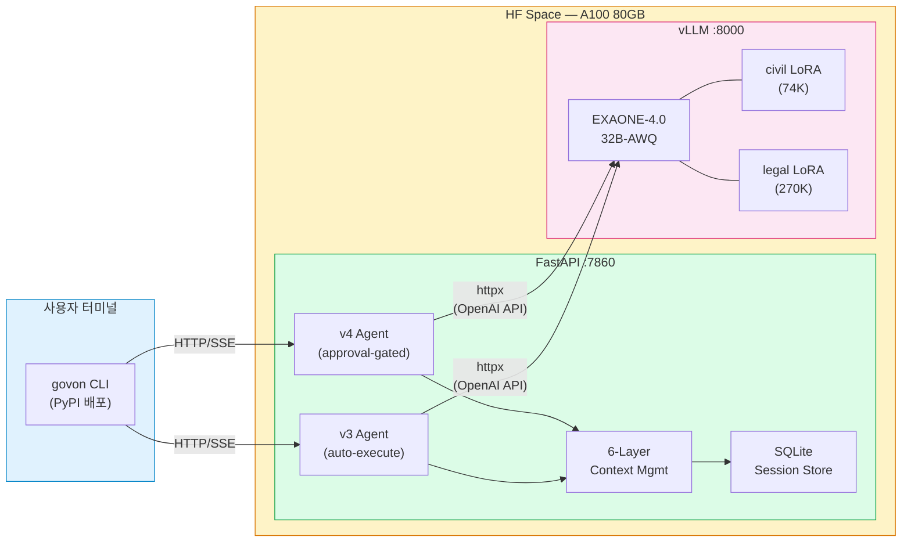
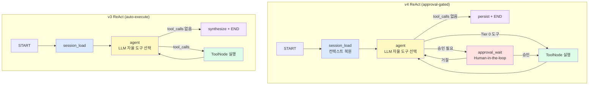
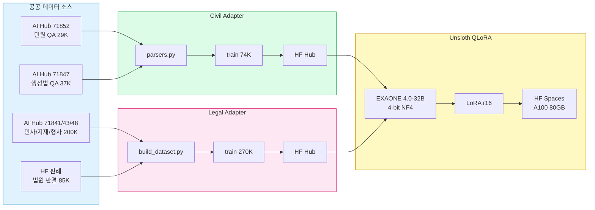

# GovOn 최종 납품 패키지

> 지방자치단체 민원 답변 AI 보조 에이전틱 CLI 셸의 R1 납품 산출물, 아키텍처, 설치 검증 절차, 인수인계 정보를 정리한다.

---

## 목차

1. [납품 개요](#납품-개요)
2. [산출물 목록](#산출물-목록)
3. [설치 및 실행 검증 체크리스트](#설치-및-실행-검증-체크리스트)
4. [아키텍처 요약](#아키텍처-요약)
5. [환경 설정 가이드](#환경-설정-가이드)
6. [Known Issues 및 제한사항](#known-issues-및-제한사항)
7. [Post-R1 Backlog](#post-r1-backlog)
8. [인수인계 연락처](#인수인계-연락처)

---

## 납품 개요

| 항목 | 내용 |
|------|------|
| **프로젝트명** | GovOn — Agentic CLI Shell for Korean Public Sector |
| **수행 기관** | 동아대학교 컴퓨터공학과 |
| **프로젝트 유형** | 현장미러형 산학연계 프로젝트 |
| **개발 기간** | 2026-03-04 ~ 2026-04-09 (5주) |
| **팀 구성** | 3명 (umyunsang, yuujjjj, siu Jang) |
| **납품일** | 2026-04-09 |
| **최종 버전** | v1.0.1 (v4 ReAct + ToolNode 아키텍처) |
| **베이스 모델** | LGAI-EXAONE/EXAONE-4.0-32B-AWQ |
| **LoRA 어댑터** | 2개 (civil 74K, legal 270K) |
| **E2E 테스트** | 27/27 시나리오 통과 |
| **DORA 등급** | Elite |

### 프로젝트 목적

지방자치단체 공무원이 민원에 답변할 때, AI 에이전트가 데이터 조회, 답변 초안 생성, 법률 참조를 자동 수행하고 사용자 승인을 거쳐 최종 답변을 제공한다. 키워드 매칭이 아닌 LLM 자율 추론 기반의 도구 선택으로, 한국어 민원의 다양한 표현을 처리한다.

### 핵심 수치

| 지표 | 값 |
|------|-----|
| 전체 커밋 수 | 766+ |
| 기능 커밋 (feat/fix/refactor/test/docs) | 305+ |
| 도구 수 | 7개 (5 분석 + 2 LoRA 어댑터) |
| API 엔드포인트 | 7개 (health + v2 4개 + v3 2개) |
| 아키텍처 버전 | v4 (v1 -> v2 -> v3 -> v4, 5주간 4회 전환) |
| CI 워크플로우 | 21개 (lint, test, security, deploy, DORA 등) |
| Deployment Frequency | 30/주 |
| Lead Time | 0.8h |

---

## 산출물 목록

### 1. 소프트웨어 산출물

| 번호 | 산출물 | 위치 | 설명 |
|------|--------|------|------|
| S-1 | **GitHub Repository** | [GovOn-Org/GovOn](https://github.com/GovOn-Org/GovOn) | 전체 소스코드, CI/CD, 문서 일체 |
| S-2 | **HF Space (Runtime)** | [umyunsang/govon-runtime](https://huggingface.co/spaces/umyunsang/govon-runtime) | A100 80GB 위 vLLM + FastAPI 프로덕션 런타임 |
| S-3 | **Civil Adapter (LoRA)** | [umyunsang/govon-civil-adapter](https://huggingface.co/umyunsang/govon-civil-adapter) | 행정 민원 답변 LoRA (r16, 74K 학습) |
| S-4 | **Legal Adapter (LoRA)** | [siwo/govon-legal-adapter](https://huggingface.co/siwo/govon-legal-adapter) | 법률 해석 및 법령 인용 LoRA (r16, 270K 학습) |
| S-5 | **PyPI 패키지** | `pip install govon` | CLI 클라이언트 배포 패키지 |
| S-6 | **Homebrew Formula** | `brew install govon` | macOS용 CLI 설치 경로 |
| S-7 | **npm 패키지** | `npm install govon` | Node.js 환경용 패키지 |

### 2. 문서 산출물

| 번호 | 산출물 | 위치 | 설명 |
|------|--------|------|------|
| D-1 | **사용자 가이드** | [`docs/guide/user-guide.md`](../guide/user-guide.md) | 설치, CLI 사용법, 도구별 설명, 멀티턴 대화 |
| D-2 | **운영 가이드** | [`docs/guide/ops-guide.md`](../guide/ops-guide.md) | Docker/HF Space 배포, 환경변수, 모니터링, 트러블슈팅 |
| D-3 | **데모 패키지** | [`docs/demo/README.md`](../demo/README.md) | 시연 시나리오 3종 + curl 재현 명령 |
| D-4 | **프로젝트 회고** | [`docs/retrospective.md`](../retrospective.md) | v1->v4 아키텍처 진화, 기술적 도전 Top 5, KPT |
| D-5 | **ADR** | [`docs/adr/`](../adr/) | Architecture Decision Records (vLLM 서빙, FAISS 등) |
| D-6 | **PRD** | [`docs/prd.md`](../prd.md) | Product Requirements Document |
| D-7 | **WBS** | [`docs/wbs.md`](../wbs.md) | Work Breakdown Structure |
| D-8 | **납품 패키지 (본 문서)** | [`docs/delivery/README.md`](./README.md) | 최종 납품 체크리스트 및 인수인계 |
| D-9 | **Docs Portal** | [govon-org.github.io/GovOn](https://govon-org.github.io/GovOn/) | GitHub Pages 통합 문서 포털 |

### 3. 데이터 산출물

| 번호 | 산출물 | 위치 | 설명 |
|------|--------|------|------|
| T-1 | **Civil Response Dataset** | [umyunsang/govon-civil-response-data](https://huggingface.co/datasets/umyunsang/govon-civil-response-data) | 민원-답변 학습 데이터 74K건 |
| T-2 | **Legal Response Dataset** | [umyunsang/govon-legal-response-data](https://huggingface.co/datasets/umyunsang/govon-legal-response-data) | 법률 답변 학습 데이터 270K건 |

### 4. 인프라 산출물

| 번호 | 산출물 | 위치 | 설명 |
|------|--------|------|------|
| I-1 | **DORA 메트릭 대시보드** | [Grafana Cloud](https://umyunsang.grafana.net/d/govon-dora/) | Deployment Frequency, Lead Time, CFR, MTTR 실시간 대시보드 |
| I-2 | **DORA 주간 보고서** | [`metrics/reports/`](../../metrics/reports/) | 주간 DORA 지표 보고서 (자동 생성) |
| I-3 | **CI/CD 워크플로우** | [`.github/workflows/`](../../.github/workflows/) | 21개 워크플로우 (lint, test, security, deploy, DORA 등) |
| I-4 | **E2E 테스트 스위트** | `scripts/verify_e2e_tool_calling.py` | 27개 시나리오 (6-Phase), HF Space 전용 |

### 5. 공식 문서 산출물

| 번호 | 산출물 | 위치 | 설명 |
|------|--------|------|------|
| O-1 | **프로젝트 서식** | [`docs/official/`](../official/) | 산학연계 프로젝트 공식 서식 (PDF) |
| O-2 | **보안 아키텍처** | [`docs/GovOn_Secure_On-Premise_AI.pdf`](../GovOn_Secure_On-Premise_AI.pdf) | 온프레미스 보안 AI 배포 가이드 |

---

## 설치 및 실행 검증 체크리스트

납품 검수 시 아래 항목을 순서대로 확인한다.

### Phase 1: CLI 설치 검증

| 단계 | 명령어 | 기대 결과 |
|------|--------|-----------|
| 1-1 | `pip install govon` | 정상 설치, 의존성 해결 완료 |
| 1-2 | `govon --version` | `1.0.1` 출력 |
| 1-3 | `govon --help` | 사용법 출력 (REPL, daemon 모드 등) |
| 1-4 | `govon` | REPL 모드 진입, `GovOn Shell v1.0` 프롬프트 표시 |

### Phase 2: HF Space 런타임 검증

| 단계 | 명령어 | 기대 결과 |
|------|--------|-----------|
| 2-1 | `curl https://umyunsang-govon-runtime.hf.space/health` | `{"status": "ok", ...}` 응답 |
| 2-2 | Health 응답 내 `model_loaded` | `true` |
| 2-3 | Health 응답 내 `adapters` | `["public_admin", "legal"]` 포함 |

### Phase 3: v3 ReAct API 검증 (자동 실행 모드)

```bash
# 단순 질의 (도구 불필요)
curl -X POST https://umyunsang-govon-runtime.hf.space/v3/agent/run \
  -H "Content-Type: application/json" \
  -d '{"query": "민원이란 무엇인가요?", "session_id": "verify-1", "max_iterations": 10}'
```

| 단계 | 검증 항목 | 기대 결과 |
|------|-----------|-----------|
| 3-1 | 응답 HTTP 상태 | `200 OK` |
| 3-2 | `response` 필드 | 한국어 답변 포함 |
| 3-3 | `metadata.total_iterations` | 1 (도구 미호출) |

```bash
# 도구 호출 질의
curl -X POST https://umyunsang-govon-runtime.hf.space/v3/agent/run \
  -H "Content-Type: application/json" \
  -d '{"query": "도로 파손 민원 현황 알려줘", "session_id": "verify-2", "max_iterations": 10}'
```

| 단계 | 검증 항목 | 기대 결과 |
|------|-----------|-----------|
| 3-4 | `metadata.tools_used` | 1개 이상 도구 호출 |
| 3-5 | `metadata.total_iterations` | 2 이상 (도구 호출 + 응답 생성) |

### Phase 4: v4 승인 흐름 검증

```bash
# 1단계: 에이전트에 질의 (승인 대기 상태 진입)
curl -X POST https://umyunsang-govon-runtime.hf.space/v2/agent/stream \
  -H "Content-Type: application/json" \
  -d '{"query": "도로 파손 민원에 대한 답변 초안을 작성해줘", "session_id": "verify-3"}'

# 2단계: 승인
curl -X POST https://umyunsang-govon-runtime.hf.space/v2/agent/approve \
  -H "Content-Type: application/json" \
  -d '{"session_id": "verify-3", "approved": true}'
```

| 단계 | 검증 항목 | 기대 결과 |
|------|-----------|-----------|
| 4-1 | 1단계 응답 | 승인 요청 이벤트 포함 |
| 4-2 | 2단계 응답 | 도구 실행 결과 포함 |

### Phase 5: 멀티턴 대화 검증

```bash
# 1턴: 첫 질의
curl -X POST https://umyunsang-govon-runtime.hf.space/v3/agent/run \
  -H "Content-Type: application/json" \
  -d '{"query": "도로 파손 민원 현황 알려줘", "session_id": "verify-multi"}'

# 2턴: 후속 질의 (동일 session_id)
curl -X POST https://umyunsang-govon-runtime.hf.space/v3/agent/run \
  -H "Content-Type: application/json" \
  -d '{"query": "그 민원에 대한 답변 초안도 작성해줘", "session_id": "verify-multi"}'
```

| 단계 | 검증 항목 | 기대 결과 |
|------|-----------|-----------|
| 5-1 | 2턴 응답 | 1턴 컨텍스트를 반영한 답변 |
| 5-2 | `session_id` | 동일한 `verify-multi`로 유지 |

### Phase 6: E2E 테스트 스위트 검증

```bash
# GitHub Actions에서 수동 트리거
gh workflow run e2e-hfspace.yml
```

| 단계 | 검증 항목 | 기대 결과 |
|------|-----------|-----------|
| 6-1 | 전체 시나리오 통과율 | 27/27 (100%) |
| 6-2 | Phase 1 (Infrastructure) | 3/3 통과 |
| 6-3 | Phase 2 (v2 Pipeline) | 6/6 통과 |
| 6-4 | Phase 3 (v3 ReAct) | 10/10 통과 |
| 6-5 | Phase 4 (Cross-version) | 2/2 통과 |
| 6-6 | Phase 5 (Multi-turn) | 3/3 통과 |
| 6-7 | Phase 6 (Context Mgmt) | 3/3 통과 |

---

## 아키텍처 요약

### 시스템 아키텍처

GovOn은 CLI 클라이언트와 HF Space 런타임으로 구성된다. 런타임 내부에서 FastAPI 서버와 vLLM 서버가 독립 프로세스로 실행된다.



### ReAct 루프 흐름

v4와 v3 두 가지 그래프가 병렬 운영된다.



**v4 (approval-gated)**: 사용자에게 도구 실행 승인을 요청하는 Human-in-the-loop 패턴. CLI의 Rich Panel UI로 승인/거절 인터페이스를 제공한다.

**v3 (auto-execute)**: 모든 도구를 자동 실행하는 ReAct 패턴. 멀티턴 대화에서 빠른 응답 속도가 필요할 때 사용한다.

### 7개 도구

| 도구 | 유형 | 역할 | LoRA |
|------|------|------|------|
| `api_lookup` | 분석 | 민원 데이터 API 조회 (data.go.kr) | - |
| `issue_detector` | 분석 | 주요 이슈 탐지 | - |
| `stats_lookup` | 분석 | 통계 데이터 조회 (기간/카테고리별) | - |
| `keyword_analyzer` | 분석 | 핵심 키워드 추출 및 분석 | - |
| `demographics_lookup` | 분석 | 인구통계 조회 | - |
| `public_admin_adapter` | 어댑터 | 공공행정 민원 답변 생성 | civil (r16, 74K) |
| `legal_adapter` | 어댑터 | 법률 해석 및 법령 인용 답변 생성 | legal (r16, 270K) |

도구 선택은 LLM 자율 판단이다. 키워드 매칭, fallback 로직 없이 EXAONE 4.0의 function calling 능력으로 도구를 선택한다. 도구 description은 영어로 작성하여 BFCL 벤치마크 최적화를 활용한다.

### 6-Layer 컨텍스트 관리

`max_model_len=8192` 제약 하에서 장기 멀티턴 대화를 가능하게 하는 계층적 방어 파이프라인이다.

| Layer | 단계 | 적용 시점 | 메커니즘 | 작동 조건 |
|-------|------|-----------|---------|-----------|
| L1 | Tool Output Truncation | 도구 실행 후 | ToolMessage 3000자 head+tail 절단 | ToolMessage > 3000자 |
| L2 | Tool Result Clearing | LLM 호출 전 | 오래된 ToolMessage를 placeholder로 교체 | iteration >= 2 |
| L3 | 역순 토큰 예산 Trim | LLM 호출 전 | 최근 메시지부터 역순으로 토큰 예산(4500) 내 선택 | 총 토큰 > 4500 |
| L4 | Hard Cap | LLM 호출 전 | 예산 초과 시 강제 제거 | 최후 안전장치 |
| L5 | Extractive Summarization | 세션 복원 시 | 룰 기반(LLM 호출 없음) 대화 요약 | older 토큰 > 예산 60% |
| L6 | RemoveMessage Trim | 세션 복원 시 | 토큰 예산 내 영구 삭제 | 메시지 수 > 6 |

핵심 설계 원칙:
1. **마지막 HumanMessage는 항상 보존** -- 예산 초과해도 사용자의 현재 질문은 유지
2. **State 변경 없음** -- Layer 1-4는 LLM 입력만 가공하고 state는 원본 유지
3. **LLM 호출 없는 요약** -- Extractive Summarization은 결정적(deterministic) 룰 기반

### 데이터 파이프라인



### 프로젝트 디렉터리 구조

```
GovOn/
├── src/
│   ├── cli/                        # CLI 인터페이스
│   │   ├── shell.py                # 인터랙티브 REPL
│   │   ├── approval_ui.py          # Rich Panel 승인 UI
│   │   ├── daemon.py               # 백그라운드 데몬
│   │   └── renderer.py             # 출력 렌더러
│   ├── data_collection_preprocessing/  # 데이터 수집/전처리
│   └── inference/                  # 추론 엔진
│       ├── api_server.py           # FastAPI 서버
│       ├── session_context.py      # SQLite 세션 저장소
│       └── graph/                  # LangGraph 코어
│           ├── builder.py          # v4/v3 그래프 빌더
│           ├── nodes.py            # 노드 팩토리 (5개 노드)
│           ├── state.py            # GovOnGraphState
│           ├── capabilities/       # 도구 Capability 클래스
│           └── tools/              # StructuredTool 팩토리
├── docs/
│   ├── guide/                      # 사용자/운영 가이드
│   ├── demo/                       # 데모 패키지
│   ├── delivery/                   # 납품 패키지 (본 문서)
│   ├── adr/                        # Architecture Decision Records
│   ├── architecture/               # 아키텍처 다이어그램 (SVG)
│   ├── official/                   # 공식 산학연계 서식
│   ├── outputs/                    # M1-M4 산출물
│   ├── retrospective.md            # 프로젝트 회고
│   ├── prd.md                      # PRD
│   └── wbs.md                      # WBS
├── scripts/
│   └── verify_e2e_tool_calling.py # E2E 테스트 (27 시나리오)
├── tests/
│   └── test_{cli,data,inference}/  # 단위 테스트
├── metrics/
│   └── reports/                    # DORA 주간 보고서
├── .github/
│   └── workflows/                  # CI/CD 워크플로우 21개
├── pyproject.toml                  # 패키지 설정 (v1.0.1)
├── deploy/
│   ├── docker/Dockerfile           # 컨테이너 빌드
│   ├── compose/docker-compose.yml  # 로컬 개발 환경
│   └── env/.env.example            # 환경변수 템플릿
```

---

## 환경 설정 가이드

### 필수 환경변수

`deploy/env/.env.example` 기반 환경변수 레퍼런스이다. `cp deploy/env/.env.example .env` 후 필수 값을 수정한다.

#### 서버 설정

| 변수 | 기본값 | 필수 | 설명 |
|------|--------|------|------|
| `SERVING_PROFILE` | `container` | O | 서빙 프로필 (container / airgap) |
| `HOST` | `0.0.0.0` | O | 서버 바인드 주소 |
| `PORT` | `8000` | O | 서버 포트 |
| `LOG_LEVEL` | `INFO` | - | 로그 레벨 (DEBUG/INFO/WARNING/ERROR) |
| `WORKERS` | `1` | - | Uvicorn 워커 수 |

#### 모델 설정

| 변수 | 기본값 | 필수 | 설명 |
|------|--------|------|------|
| `MODEL_PATH` | `LGAI-EXAONE/EXAONE-4.0-32B-AWQ` | O | 베이스 모델 경로 (HF repo ID 또는 로컬 경로) |
| `TRUST_REMOTE_CODE` | `true` | O | EXAONE 모델의 커스텀 코드 허용 |
| `GPU_UTILIZATION` | `0.8` | - | GPU 메모리 사용률 |
| `MAX_MODEL_LEN` | `8192` | - | 최대 컨텍스트 길이 (토큰) |
| `SKIP_MODEL_LOAD` | `false` | - | 모델 로드 스킵 (API 테스트용) |

#### Multi-LoRA 어댑터

| 변수 | 기본값 | 필수 | 설명 |
|------|--------|------|------|
| `ADAPTER_PATHS` | (빈 값) | - | `name=path` 쉼표 구분. 빈 값이면 base model만 사용 |

어댑터 설정 예시:
```bash
# HF Hub에서 직접 로드
ADAPTER_PATHS=public_admin=umyunsang/govon-civil-adapter,legal=siwo/govon-legal-adapter

# 로컬 경로
ADAPTER_PATHS=public_admin=/app/models/adapters/public_admin-adapter,legal=/app/models/adapters/legal-adapter
```

#### 데이터 경로

| 변수 | 기본값 | 필수 | 설명 |
|------|--------|------|------|
| `DATA_PATH` | `/app/data/processed/v2_train.jsonl` | - | 학습 데이터 경로 |
| `INDEX_PATH` | `/app/models/faiss_index/complaints.index` | - | FAISS 인덱스 경로 |
| `FAISS_INDEX_DIR` | `/app/models/faiss_index` | - | FAISS 인덱스 디렉터리 |
| `BM25_INDEX_DIR` | `/app/models/bm25_index` | - | BM25 인덱스 디렉터리 |

#### DB / 세션

| 변수 | 기본값 | 필수 | 설명 |
|------|--------|------|------|
| `GOVON_HOME` | `/home/user/.govon` | - | GovOn 홈 디렉터리 |
| `DATABASE_URL` | `sqlite:////home/user/.govon/metadata.sqlite3` | - | 메인 DB URL |
| `GOVON_SESSION_DB` | (빈 값) | - | 세션 DB 경로 |

#### 보안 / 인증

| 변수 | 기본값 | 필수 | 설명 |
|------|--------|------|------|
| `API_KEY` | `CHANGE_ME_TO_SECURE_RANDOM_KEY` | O | API 인증 키 (반드시 변경) |
| `CORS_ORIGINS` | `http://localhost:3000,...` | - | CORS 허용 오리진 |
| `ALLOW_NO_AUTH` | `false` | - | 인증 없이 접근 허용 (개발 전용) |

#### 외부 API

| 변수 | 기본값 | 필수 | 설명 |
|------|--------|------|------|
| `DATA_GO_KR_API_KEY` | (placeholder) | O | 공공데이터포털 API 키 |
| `LANGGRAPH_MODEL_BASE_URL` | `http://127.0.0.1:8001/v1` | O | vLLM OpenAI-compatible 엔드포인트 |
| `LANGGRAPH_MODEL_API_KEY` | `EMPTY` | - | vLLM API 키 |

#### Generation 파라미터

| 변수 | 기본값 | 설명 |
|------|--------|------|
| `GEN_MAX_TOKENS` | `512` | 최대 생성 토큰 수 |
| `GEN_TEMPERATURE` | `0.7` | 생성 온도 |
| `GEN_TOP_P` | `0.9` | Top-p 샘플링 |
| `GEN_REPETITION_PENALTY` | `1.1` | 반복 패널티 |

### HF Space 설정

HuggingFace Spaces 런타임 배포 시 필요한 설정이다.

**Secrets (Settings > Repository secrets)**:

| Secret 이름 | 설명 |
|-------------|------|
| `API_KEY` | 런타임 API 인증 키 |
| `DATA_GO_KR_API_KEY` | 공공데이터포털 API 키 |
| `BM25_INDEX_HMAC_KEY` | BM25 인덱스 무결성 HMAC 키 |

**Variables (Settings > Variables)**:

| Variable 이름 | 값 | 설명 |
|--------------|-----|------|
| `ADAPTER_PATHS` | `public_admin=umyunsang/govon-civil-adapter,legal=siwo/govon-legal-adapter` | LoRA 어댑터 경로 |
| `MODEL_PATH` | `LGAI-EXAONE/EXAONE-4.0-32B-AWQ` | 베이스 모델 |
| `MAX_MODEL_LEN` | `8192` | 컨텍스트 길이 |

**Space 설정**:
- **Hardware**: A100 80GB (GPU)
- **SDK**: Docker
- **Port**: 7860

### GitHub Secrets 목록

CI/CD 워크플로우에서 사용하는 GitHub Secrets이다.

| Secret | 용도 | 사용 워크플로우 |
|--------|------|----------------|
| `HF_TOKEN` | HuggingFace Hub 인증 | `deploy-hfspace.yml` |
| `DOCKER_USERNAME` | Docker Hub 인증 | `docker-publish.yml` |
| `DOCKER_PASSWORD` | Docker Hub 인증 | `docker-publish.yml` |
| `PYPI_TOKEN` | PyPI 패키지 배포 | `publish-package.yml` |
| `NPM_TOKEN` | npm 패키지 배포 | `publish-package.yml` |
| `GRAFANA_SERVICE_ACCOUNT_TOKEN` | DORA 메트릭 전송 | `dora-metrics.yml` |
| `RUNTIME_URL` | HF Space 런타임 URL | `e2e-hfspace.yml` |
| `RUNTIME_API_KEY` | HF Space API 키 | `e2e-hfspace.yml` |

---

## Known Issues 및 제한사항

현재 알려진 제한사항을 기록한다. 각 이슈의 영향도와 현재 상태를 명시한다.

| 번호 | 이슈 | 영향도 | 현재 상태 | 비고 |
|------|------|--------|-----------|------|
| 1 | **HF Space 콜드 스타트 3-5분** | 중 | 미해결 | EXAONE 32B-AWQ 모델 로딩 시간. Space 비활성 시 재시작 대기 필요 |
| 2 | **`max_model_len=8192` 제한** | 중 | 완화됨 | 6-Layer 컨텍스트 관리로 10턴 이상 대화 가능하나, 장기 대화 시 정보 손실 발생 |
| 3 | **LoRA 답변 품질 벤치마크 부재** | 중 | 미해결 | BLEU/ROUGE 등 객관적 품질 측정 미수행. E2E는 구조적 검증만 수행 |
| 4 | **Web UI 미구현** | 중 | Post-R1 | CLI 전용. 비개발자(공무원)가 직접 사용하려면 웹 인터페이스 필요 |
| 5 | **RAG 비활성** | 낮 | Post-R1 | FAISS/BM25 인덱스 코드 존재하나 현재 비활성. 로컬 문서 검색 불가 |
| 6 | **v2/v3 엔드포인트 병존** | 낮 | 의도적 설계 | v4 approval-gated와 v3 auto-execute를 각각 /v2, /v3 경로로 제공 |
| 7 | **`thread_id` query parameter** | 낮 | 개선 예정 | REST 관례(body)와 상이. 클라이언트 마이그레이션 후 전환 예정 |
| 8 | **Windows 미지원** | 낮 | Post-R1 | POSIX 환경(Linux/macOS)에서만 테스트 완료 |

---

## Post-R1 Backlog

R1 이후 개선 방향을 우선순위 순으로 정리한다.

### 1. Web/App UI Surface

CLI에서 웹 인터페이스로 전환하여 비개발자(공무원)도 직접 사용할 수 있게 한다.

- v3 SSE 스트리밍 API(`/v3/agent/stream`)에 연결하는 React/Next.js 프론트엔드
- 승인 UI를 웹으로 이식 (현재 Rich Panel은 CLI 전용)
- 세션 히스토리 조회 기능

### 2. 고급 성능 벤치마킹

"답변이 올바른가"를 체계적으로 측정한다.

- latency benchmark 워크플로우 확장 (현재 `benchmark.yml`에 기본 구현)
- LoRA 답변 품질 자동 평가 (BLEU, ROUGE-L, BERTScore)
- 도구 선택 정확도 confusion matrix

### 3. 추가 도메인 어댑터

현재 행정(civil)과 법률(legal) 2개 도메인 외 확장한다.

- 복지 도메인 LoRA 학습 (복지로 API 데이터 활용)
- 환경/교통 도메인 확장
- `adapters.yaml`에 추가하면 자동 등록되는 동적 아키텍처는 이미 구현 완료

### 4. RAG 재도입

지방자치단체별 조례, 내부 지침에 기반한 답변 강화한다.

- FAISS/BM25 하이브리드 검색 (이전 코드 아카이브에 기반 존재)
- `rag_search` 도구를 tools 목록에 재활성화
- 문서 인덱싱 자동화 파이프라인

### 5. 보안 강화

공공기관 납품을 위한 보안 인증 대응한다.

- RBAC(Role-Based Access Control) 도입
- 감사 로그(audit log) 기록
- 폐쇄망(airgap) 배포 최적화 (ServingProfile.AIRGAP 프로필 이미 존재)

### 6. Windows 지원

- Windows 환경 테스트 및 호환성 확보
- CI matrix에 Windows runner 추가

---

## 인수인계 연락처

| 역할 | 이름 | GitHub | 담당 영역 |
|------|------|--------|-----------|
| 팀장 / 백엔드 | umyunsang | [@umyunsang](https://github.com/umyunsang) | 아키텍처 설계, LangGraph, CI/CD, E2E |
| 팀원 / 데이터 | yuujjjj | [@yuujjjj](https://github.com/yuujjjj) | 데이터 수집/전처리, Civil Adapter 학습 |
| 팀원 / 모델 | siu Jang | [@siwo](https://github.com/siwo) | Legal Adapter 학습, vLLM 서빙 |

### 인수인계 체크포인트

후속 팀이 프로젝트를 이어받을 때 아래 순서를 따른다.

1. **README.md 읽기**: 프로젝트 개요와 아키텍처를 파악한다
2. **사용자 가이드 따라하기**: `pip install govon` 후 CLI 실행
3. **운영 가이드 읽기**: HF Space 배포, 환경변수, 모니터링 절차 확인
4. **데모 패키지 실행**: 3개 시나리오로 핵심 기능 체험
5. **프로젝트 회고 읽기**: 아키텍처 전환 이유와 기술적 도전을 이해
6. **ADR 읽기**: 주요 기술 결정의 배경과 근거 확인
7. **Post-R1 Backlog 확인**: 후속 작업 우선순위 파악
8. **E2E 테스트 실행**: `gh workflow run e2e-hfspace.yml`로 시스템 정상 여부 검증

---

## 변경 이력

| 날짜 | 버전 | 변경 내용 |
|------|------|-----------|
| 2026-04-09 | 1.0 | 최초 작성 (R1 납품) |
