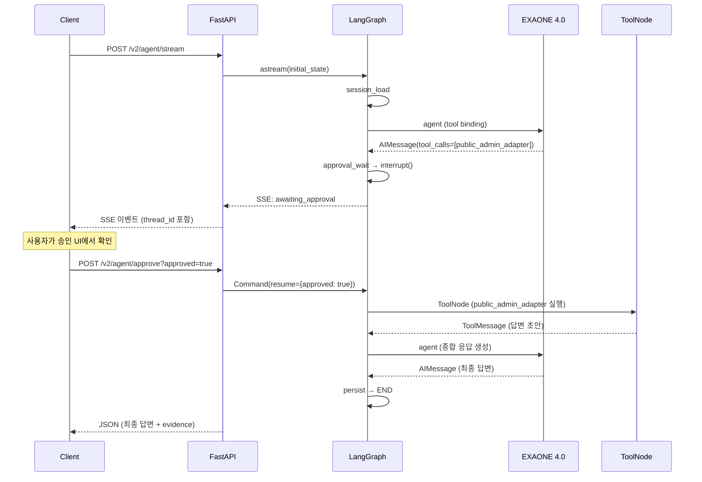
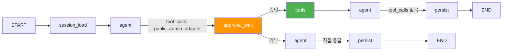
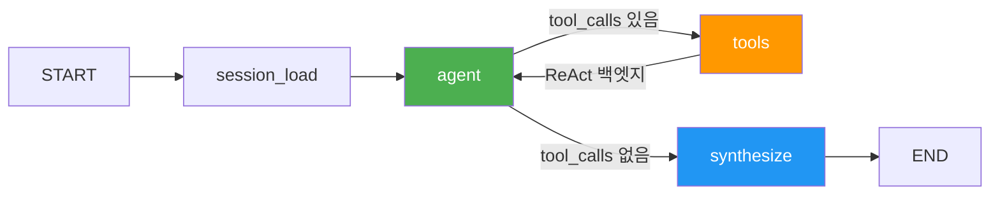

# GovOn 데모 패키지

> GovOn 에이전틱 셸의 핵심 기능(도구 자율 선택, Human-in-the-loop 승인, 멀티턴 대화)을 3개 시나리오로 시연한다.

---

## 목차

1. [데모 개요](#데모-개요)
2. [사전 준비](#사전-준비)
3. [시나리오 1: 단순 질의 (도구 불필요)](#시나리오-1-단순-질의-도구-불필요)
4. [시나리오 2: 도구 호출 + 승인 (v4 핵심 흐름)](#시나리오-2-도구-호출--승인-v4-핵심-흐름)
5. [시나리오 3: 멀티턴 대화 (컨텍스트 유지)](#시나리오-3-멀티턴-대화-컨텍스트-유지)
6. [시연 팁](#시연-팁)

---

## 데모 개요

이 데모는 GovOn의 세 가지 핵심 능력을 보여준다.

| 시나리오 | 핵심 능력 | 사용 API | 예상 소요 |
|----------|-----------|----------|-----------|
| 1. 단순 질의 | LLM 자율 판단 (도구 불요) | v3 `/v3/agent/run` | 5-10초 |
| 2. 도구 호출 + 승인 | Human-in-the-loop 승인 게이트 | v2 `/v2/agent/stream` + `/v2/agent/approve` | 20-40초 |
| 3. 멀티턴 대화 | session_id 기반 컨텍스트 유지 | v3 `/v3/agent/run` (동일 session_id) | 30-60초 |

**아키텍처 요약**: GovOn은 EXAONE 4.0-32B-AWQ 기반 LLM에 7개 도구(api_lookup, issue_detector, stats_lookup, keyword_analyzer, demographics_lookup, public_admin_adapter, legal_adapter)를 바인딩하고, LangGraph StateGraph가 ReAct 루프를 제어한다.

---

## 사전 준비

### 1. HF Space 상태 확인

GovOn 서버는 HuggingFace Spaces에서 운영된다. 데모 전 반드시 서버 상태를 확인한다.

```bash
# 헬스체크 — status가 "healthy"이면 정상
curl -s https://<HF_SPACE_URL>/health | python3 -m json.tool
```

기대 응답:

```json
{
    "status": "healthy",
    "profile": "container",
    "model": "LGAI-EXAONE/EXAONE-4.0-32B-AWQ",
    "vllm_connected": true,
    "agents_loaded": ["draft_response"],
    "feature_flags": {
        "model_version": "v2"
    },
    "session_store": {
        "driver": "sqlite"
    }
}
```

`"status": "degraded"`이면 vLLM 서버가 아직 기동 중이다. 1-2분 후 재시도한다.

### 2. API Key 설정

인증이 활성화된 환경에서는 `X-API-Key` 헤더가 필요하다.

```bash
# 환경변수로 설정
export GOVON_API_KEY="your-api-key-here"
export GOVON_BASE_URL="https://<HF_SPACE_URL>"
```

### 3. 필수 도구

- `curl` (HTTP 요청)
- `python3 -m json.tool` 또는 `jq` (JSON 포매팅)

---

## 시나리오 1: 단순 질의 (도구 불필요)

### 목적

LLM이 도구 호출 없이 직접 응답하는 과정을 보여준다. system prompt의 Decision Rule 4번("Only respond directly WITHOUT tools for simple greetings or questions requiring no data")이 작동하는 것을 확인한다.

### 입력

```
안녕하세요
```

### 기대 출력

도구 호출 없이 한국어 인사 응답이 반환된다. `metadata.total_tool_calls`가 `0`이다.

### curl 명령어

```bash
curl -s -X POST "${GOVON_BASE_URL}/v3/agent/run" \
  -H "Content-Type: application/json" \
  -H "X-API-Key: ${GOVON_API_KEY}" \
  -d '{
    "query": "안녕하세요",
    "session_id": "demo-scenario-1",
    "max_iterations": 10
  }' | python3 -m json.tool
```

### 기대 응답 구조

```json
{
    "status": "completed",
    "thread_id": "v3:demo-scenario-1",
    "session_id": "demo-scenario-1",
    "graph_run_id": "...",
    "text": "안녕하세요! GovOn 민원 답변 보조 시스템입니다. 무엇을 도와드릴까요?",
    "evidence_items": [],
    "metadata": {
        "total_iterations": 0,
        "total_tool_calls": 0,
        "total_messages": 2,
        "total_latency_ms": 3500.0,
        "node_latencies": {
            "session_load": 1.5,
            "agent": 3200.0,
            "persist": 2.0
        }
    }
}
```

### 시연 포인트

1. **LLM 자율 판단**: "안녕하세요"라는 입력에 대해 LLM이 `tool_calls`를 생성하지 않는다. System prompt의 규칙 "Only respond directly WITHOUT tools for simple greetings"이 실제로 작동하는 것을 확인할 수 있다.
2. **ReAct 루프 경로**: `session_load -> agent -> synthesize -> END` 경로를 거친다. agent 노드에서 tool_calls가 비어 있으므로 `_route_agent_v3`가 `"synthesize"`를 반환한다.
3. **응답 속도**: 도구 호출이 없으므로 LLM 추론 시간만 소요된다. `node_latencies.agent`가 전체 지연의 대부분을 차지한다.

### Graph 경로 시각화


---

## 시나리오 2: 도구 호출 + 승인 (v4 핵심 흐름)

### 목적

GovOn의 핵심 차별점인 Human-in-the-loop 승인 흐름을 보여준다. LLM이 답변 초안 도구(adapter)를 선택하면, 사용자 승인을 거쳐야 실행된다.

### 입력

```
도로 파손 민원에 대한 답변 초안을 작성해줘
```

### 기대 흐름



### Step 1: 에이전트 실행 (승인 대기까지)

```bash
curl -s -X POST "${GOVON_BASE_URL}/v2/agent/stream" \
  -H "Content-Type: application/json" \
  -H "X-API-Key: ${GOVON_API_KEY}" \
  -d '{
    "query": "도로 파손 민원에 대한 답변 초안을 작성해줘",
    "session_id": "demo-scenario-2"
  }'
```

SSE 이벤트가 순차적으로 수신된다.

```
data: {"node": "session_load", "status": "completed"}

data: {"node": "agent", "status": "completed", "planned_tools": ["public_admin_adapter"]}

data: {"node": "approval_wait", "status": "awaiting_approval", "approval_request": {"tools": ["public_admin_adapter"], "planned_tools": ["public_admin_adapter"], "message": "다음 도구를 실행합니다: public_admin_adapter", "approval_required": ["public_admin_adapter"]}, "thread_id": "demo-scenario-2", "session_id": "demo-scenario-2"}
```

`awaiting_approval` 이벤트를 수신하면 스트림이 종료된다. `thread_id`를 기록해둔다.

### Step 2: 승인 전송

```bash
curl -s -X POST "${GOVON_BASE_URL}/v2/agent/approve?thread_id=demo-scenario-2&approved=true" \
  -H "Content-Type: application/json" \
  -H "X-API-Key: ${GOVON_API_KEY}" \
  -d '{}' | python3 -m json.tool
```

### 기대 응답 구조

```json
{
    "status": "completed",
    "thread_id": "demo-scenario-2",
    "session_id": "demo-scenario-2",
    "graph_run_id": "...",
    "text": "도로 파손 민원에 대한 답변 초안입니다.\n\n민원인께서 제기하신 도로 파손 문제에 대해 ...",
    "evidence_items": [...],
    "approval_status": "approved"
}
```

### (선택) 거부 시나리오

승인 대신 거부하면 LLM이 도구 호출 없이 직접 답변을 시도한다.

```bash
curl -s -X POST "${GOVON_BASE_URL}/v2/agent/approve?thread_id=demo-scenario-2&approved=false" \
  -H "Content-Type: application/json" \
  -H "X-API-Key: ${GOVON_API_KEY}" \
  -d '{}' | python3 -m json.tool
```

연속 2회 거부 시 system prompt에 도구 호출 금지 힌트가 추가되어, LLM이 가진 정보만으로 응답한다.

### 시연 포인트

1. **Human-in-the-loop**: LLM이 `public_admin_adapter`를 선택했지만, `adapters.yaml`에서 `requires_approval: true`로 설정되어 있어 사용자 승인 없이는 실행되지 않는다. 이것이 공무원 업무 보조 시스템의 핵심 안전장치다.
2. **Graph interrupt/resume**: LangGraph의 `interrupt()` 함수가 graph 실행을 일시 중단하고, `Command(resume=...)` 으로 재개한다. SqliteSaver 덕분에 프로세스 재시작 후에도 interrupt 상태가 유지된다.
3. **LoRA 어댑터**: `public_admin_adapter`는 74K 민원-답변 쌍으로 학습된 QLoRA 어댑터다. vLLM Multi-LoRA 서빙으로 베이스 모델(EXAONE 4.0-32B-AWQ)에 per-request로 LoRA 가중치를 적용한다.
4. **Rich Panel 승인 UI**: CLI 환경에서는 `prompt_toolkit` + `rich`를 사용한 구조화된 승인 패널이 표시된다. 방향키로 승인/거부를 선택할 수 있다.

### Graph 경로 시각화



---

## 시나리오 3: 멀티턴 대화 (컨텍스트 유지)

### 목적

동일 `session_id`로 여러 턴의 대화를 이어가며, 이전 턴의 맥락이 유지되는 것을 보여준다. v3 ReAct 엔드포인트는 LangGraph checkpointer가 `thread_id` 단위로 대화 히스토리를 자동 복원한다.

### 대화 흐름

3턴에 걸쳐 점진적으로 구체화하는 대화를 구성한다. 모든 턴에서 동일한 `session_id`를 사용한다.

### 1턴: 민원 현황 질의

```bash
curl -s -X POST "${GOVON_BASE_URL}/v3/agent/run" \
  -H "Content-Type: application/json" \
  -H "X-API-Key: ${GOVON_API_KEY}" \
  -d '{
    "query": "도로 파손 민원 현황 알려줘",
    "session_id": "demo-scenario-3",
    "max_iterations": 10
  }' | python3 -m json.tool
```

기대 동작:
- LLM이 `issue_detector` 또는 `stats_lookup` 도구를 호출하여 민원 데이터를 조회한다.
- `metadata.total_tool_calls >= 1`이다.
- 도로 파손 관련 민원 현황 데이터가 포함된 답변이 반환된다.

```json
{
    "status": "completed",
    "session_id": "demo-scenario-3",
    "text": "도로 파손 민원 현황입니다. ...",
    "metadata": {
        "total_iterations": 1,
        "total_tool_calls": 1
    }
}
```

### 2턴: 후속 질의 (대명사 참조)

```bash
curl -s -X POST "${GOVON_BASE_URL}/v3/agent/run" \
  -H "Content-Type: application/json" \
  -H "X-API-Key: ${GOVON_API_KEY}" \
  -d '{
    "query": "그 중에서 가장 많은 유형은?",
    "session_id": "demo-scenario-3",
    "max_iterations": 10
  }' | python3 -m json.tool
```

기대 동작:
- "그 중에서"라는 대명사가 1턴의 "도로 파손 민원"을 참조한다.
- LLM이 checkpointer에 저장된 이전 대화를 기반으로 맥락을 이해한다.
- 추가 도구를 호출하거나, 1턴 결과를 기반으로 직접 답변한다.

### 3턴: 답변 초안 요청 (컨텍스트 누적)

```bash
curl -s -X POST "${GOVON_BASE_URL}/v3/agent/run" \
  -H "Content-Type: application/json" \
  -H "X-API-Key: ${GOVON_API_KEY}" \
  -d '{
    "query": "그 유형에 대한 답변 초안을 작성해줘",
    "session_id": "demo-scenario-3",
    "max_iterations": 10
  }' | python3 -m json.tool
```

기대 동작:
- "그 유형"이 2턴에서 확인된 민원 유형을 참조한다.
- LLM이 `public_admin_adapter` 또는 `legal_adapter` 를 호출하여 답변 초안을 생성한다.
- v3에서는 모든 도구가 자동 실행(auto-execute)되므로 별도 승인 없이 진행된다.

### 시연 포인트

1. **session_id 기반 컨텍스트**: 세 번의 요청 모두 `"session_id": "demo-scenario-3"`을 사용한다. v3 API 내부에서 `thread_id = f"v3:{session_id}"`로 변환되어 LangGraph checkpointer에서 이전 messages를 자동 복원한다.
2. **대명사 해소**: "그 중에서", "그 유형"이라는 대명사가 이전 턴의 맥락 없이는 해석 불가능하다. 멀티턴 동작의 증거다.
3. **6-Layer 컨텍스트 관리**: 대화가 길어지면 다음 6단계 파이프라인이 작동한다.

| Layer | 기법 | 작동 시점 |
|-------|------|-----------|
| 1 | Tool Output Truncation | 매 도구 실행 시 (3000자 초과) |
| 2 | Tool Result Clearing | iteration 2+에서 오래된 ToolMessage 제거 |
| 3 | 역순 토큰 예산 Trim | agent 입력 시 (4500 토큰 예산 초과) |
| 4 | Hard Cap | 최후 안전장치 (4500 토큰 초과) |
| 5 | Extractive Summarization | session_load에서 older 메시지 60% 초과 시 |
| 6 | 토큰 예산 기반 RemoveMessage | session_load에서 메시지 수 초과 시 |

4. **v3 auto-execute**: v3 ReAct 그래프는 모든 도구가 low-risk로 분류되어 승인 없이 자동 실행된다. v2의 approval_wait 노드가 없는 대신 빠른 반복(iteration)이 가능하다.

### Graph 경로 시각화 (v3 ReAct 루프)



---

## 시연 팁

### 네트워크 환경

- HF Space는 cold start에 3-5분이 소요될 수 있다. 데모 30분 전에 health check로 서버를 깨워둔다.
- vLLM 모델 로딩(EXAONE 4.0-32B-AWQ, ~20GB)에 추가 시간이 필요하다. `vllm_connected: true`를 반드시 확인한다.
- SSE 스트리밍(시나리오 2)은 프록시 서버가 buffering하면 이벤트가 지연될 수 있다. 직접 연결을 권장한다.

### 타이밍

| 구간 | 예상 소요 시간 |
|------|---------------|
| LLM 추론 (도구 호출 없음) | 3-8초 |
| LLM 추론 (도구 선택) | 3-8초 |
| 도구 실행 (API 호출) | 2-10초 |
| 도구 실행 (LoRA 초안 생성) | 5-15초 |
| 전체 v2 승인 흐름 | 20-40초 |
| 전체 v3 멀티턴 3턴 | 30-60초 |

### 실패 시 대처법

| 증상 | 원인 | 해결 |
|------|------|------|
| `"status": "degraded"` | vLLM 서버 미기동 | 1-2분 대기 후 `/health` 재확인 |
| HTTP 401 | API Key 미설정/불일치 | `X-API-Key` 헤더 확인 |
| HTTP 503 | Graph 초기화 미완료 | 서버 로그 확인, 재시작 |
| SSE 이벤트 미수신 | 프록시 buffering | `curl --no-buffer` 옵션 추가 |
| 답변이 영어로 나옴 | 모델 한국어 문맥 부족 | 쿼리에 "한국어로 답변해줘" 추가 |
| 멀티턴에서 맥락 소실 | session_id 불일치 | 동일 session_id 사용 확인 |
| `"error": "세션 저장소 오류"` | SQLite 파일 권한 | 서버 디스크/권한 확인 |

### SSE 스트리밍 디버깅

SSE 이벤트를 실시간으로 확인하려면 `--no-buffer` 옵션을 사용한다.

```bash
curl -s --no-buffer -X POST "${GOVON_BASE_URL}/v2/agent/stream" \
  -H "Content-Type: application/json" \
  -H "X-API-Key: ${GOVON_API_KEY}" \
  -d '{
    "query": "도로 파손 민원에 대한 답변 초안을 작성해줘",
    "session_id": "demo-debug"
  }'
```

### v3 SSE 스트리밍 (세밀한 토큰 스트리밍)

v3 엔드포인트는 LLM 추론 과정을 토큰 단위로 스트리밍한다.

```bash
curl -s --no-buffer -X POST "${GOVON_BASE_URL}/v3/agent/stream" \
  -H "Content-Type: application/json" \
  -H "X-API-Key: ${GOVON_API_KEY}" \
  -d '{
    "query": "도로 파손 민원 현황 알려줘",
    "session_id": "demo-v3-stream"
  }'
```

v3 SSE 이벤트 타입:

| 이벤트 타입 | 설명 |
|-------------|------|
| `thinking_start` | LLM 추론 시작 |
| `thinking_delta` | LLM 토큰 스트리밍 (실시간 텍스트) |
| `thinking_end` | LLM 추론 완료 (tool_calls 포함) |
| `tool_start` | 도구 실행 시작 |
| `tool_end` | 도구 실행 완료 (성공/실패) |
| `run_complete` | 전체 실행 완료 (최종 텍스트 + 메타데이터) |

---

## API 엔드포인트 요약

| 엔드포인트 | 메서드 | 설명 |
|-----------|--------|------|
| `/health` | GET | 서버 상태 확인 |
| `/v2/agent/stream` | POST | v2 에이전트 SSE 스트리밍 (interrupt/approve 패턴) |
| `/v2/agent/run` | POST | v2 에이전트 블로킹 실행 |
| `/v2/agent/approve` | POST | interrupt 상태 승인/거부 |
| `/v2/agent/cancel` | POST | interrupt 상태 강제 취소 |
| `/v3/agent/stream` | POST | v3 ReAct SSE 스트리밍 (토큰 단위) |
| `/v3/agent/run` | POST | v3 ReAct 블로킹 실행 |

### 공통 요청 스키마 (AgentRunRequest)

```json
{
    "query": "string (필수, 1-10000자)",
    "session_id": "string (선택, 미지정 시 자동 생성)",
    "stream": "boolean (기본 false)",
    "max_tokens": "integer (기본 512, 1-4096)",
    "temperature": "float (기본 0.7, 0.0-2.0)",
    "max_iterations": "integer (기본 10, 1-20, v3 전용)"
}
```

---

## 도구 목록

| 도구 이름 | 설명 | 승인 필요 |
|-----------|------|-----------|
| `api_lookup` | 공공데이터포털(data.go.kr) 민원분석 데이터 검색 | 아니오 |
| `issue_detector` | 민원 패턴/트렌드 감지 | 아니오 |
| `stats_lookup` | 기간/카테고리별 민원 통계 조회 | 아니오 |
| `keyword_analyzer` | 민원 텍스트 키워드 빈도 분석 | 아니오 |
| `demographics_lookup` | 민원인 인구통계 분포 조회 | 아니오 |
| `public_admin_adapter` | 행정 민원 답변 초안 생성 (LoRA, 74K 학습) | 예 (v2) |
| `legal_adapter` | 법률 답변 초안 생성 (LoRA, 270K 학습) | 예 (v2) |
