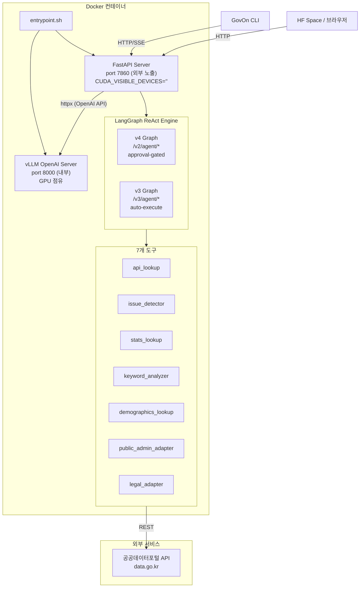
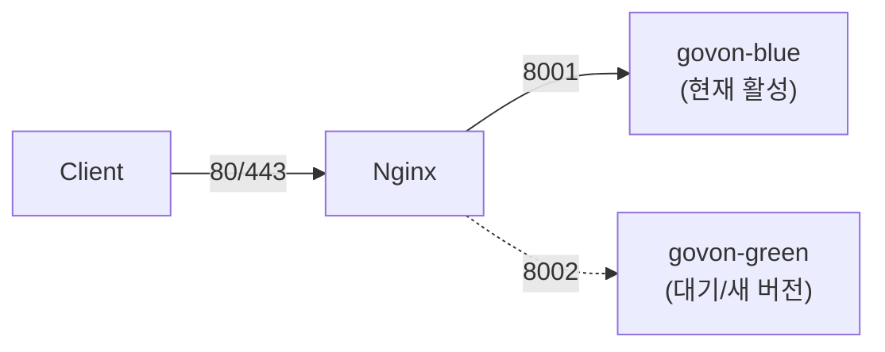

# GovOn 운영 가이드

> 이 가이드를 읽으면, GovOn 시스템을 Docker/HF Space에 배포하고, 모니터링하며, 장애에 대응하는 전체 운영 절차를 수행할 수 있다.

---

## 목차

1. [배포 아키텍처](#배포-아키텍처)
2. [Docker 배포](#docker-배포)
3. [HF Space 배포](#hf-space-배포)
4. [환경변수 레퍼런스](#환경변수-레퍼런스)
5. [Multi-LoRA 어댑터 설정](#multi-lora-어댑터-설정)
6. [모니터링](#모니터링)
7. [트러블슈팅](#트러블슈팅)
8. [API 엔드포인트 레퍼런스](#api-엔드포인트-레퍼런스)

---

## 배포 아키텍처

GovOn은 2-프로세스 아키텍처를 사용한다. 하나의 컨테이너 안에서 vLLM 서버와 FastAPI 서버가 각각 독립적으로 실행된다.



핵심 설계:

1. **vLLM 서버**: EXAONE 4.0-32B-AWQ 모델을 GPU에 로드하고, OpenAI 호환 API(`/v1/chat/completions`)를 제공한다.
2. **FastAPI 서버**: `CUDA_VISIBLE_DEVICES=""`로 GPU 접근을 차단하고, httpx를 통해 vLLM API만 호출한다. GPU 메모리를 절약하기 위한 설계이다.
3. **entrypoint.sh**: vLLM을 백그라운드로 기동한 후 health check로 준비 완료를 확인하고, FastAPI를 포그라운드로 실행한다. SIGTERM 시 양쪽 프로세스를 정리한다.

---

## Docker 배포

### 기본 배포 (docker-compose.yml)

```bash
# 1. 환경변수 파일 준비
cp .env.example .env
# .env 에서 API_KEY, MODEL_PATH, ADAPTER_PATHS 등 수정

# 2. 빌드 및 실행
docker compose up -d --build

# 3. 로그 확인
docker compose logs -f govon-backend

# 4. 헬스체크
curl http://localhost:8000/health
```

`docker-compose.yml`은 단일 서비스(`govon-backend`)를 정의한다.

| 항목 | 값 |
|------|-----|
| 이미지 | `Dockerfile` 기반 빌드 |
| 외부 포트 | `${HOST_PORT:-8000}` |
| GPU | NVIDIA 전체 GPU 할당 |
| 재시작 정책 | `unless-stopped` |
| 헬스체크 | `http://127.0.0.1:8000/health` (30초 간격) |

볼륨 마운트:

| 호스트 경로 | 컨테이너 경로 | 용도 |
|-------------|---------------|------|
| `./models` | `/app/models` | FAISS/BM25 인덱스 |
| `./data` | `/app/data` | 학습 데이터 |
| `./agents` | `/app/agents` | 에이전트 설정 |
| `./configs` | `/app/configs` | adapters.yaml 등 |
| `./logs` | `/var/log/govon` | 서버 로그 |
| `./.cache` | `/app/.cache` | HuggingFace 캐시 |

### 프로덕션 배포 (docker-compose.prod.yml)

프로덕션 환경에서는 Blue/Green 배포 전략을 사용한다.

```bash
# Blue 배포 시작
docker compose -f docker-compose.prod.yml --profile blue up -d

# Green 배포 (새 버전)
docker compose -f docker-compose.prod.yml --profile green up -d

# Nginx 라우터 시작
docker compose -f docker-compose.prod.yml --profile router up -d
```



| 배포 슬롯 | 컨테이너 | 포트 |
|-----------|---------|------|
| Blue | `govon-blue` | 8001 |
| Green | `govon-green` | 8002 |
| Router | `govon-nginx` | 80, 443 |

롤백: Nginx upstream을 이전 슬롯으로 변경하면 즉시 롤백된다.

### Dockerfile 구조

`Dockerfile.hfspace`(HF Space/프로덕션 통합)의 빌드 순서:

1. **베이스 이미지**: `nvidia/cuda:12.6.3-runtime-ubuntu22.04`
2. **Python 의존성**: `uv`(Astral)를 사용해 빌드. torch CUDA 12.6 → autoawq → 나머지 순서로 설치
3. **소스 복사**: `src/`, `config/`, `scripts/`, `agents/`
4. **사용자**: UID 1000 (`user`) — HF Spaces 호환
5. **헬스체크**: 600초 시작 대기, 30초 간격
6. **엔트리포인트**: `scripts/entrypoint.sh`

---

## HF Space 배포

### GitHub Actions 자동 배포

`deploy-hfspace.yml` 워크플로우가 자동으로 HF Space에 배포한다.

**트리거 조건**:

| 트리거 | 조건 |
|--------|------|
| Push | `main` 브랜치, `Dockerfile.hfspace`, `src/**`, `requirements.txt` 변경 시 |
| 수동 | `workflow_dispatch` (하드웨어 선택 가능) |

**워크플로우 단계**:

1. **Hardware 변경**: HF API로 Space 하드웨어 설정 (기본: `a100-large`)
2. **Space 환경변수 설정**: `ADAPTER_PATHS`, `SERVING_PROFILE`
3. **코드 Push**: GitHub 소스를 HF Space 리포에 동기화
4. **배포 대기**: Space가 `RUNNING` 상태가 될 때까지 최대 10분 폴링

**필수 Secrets** (GitHub repo Settings > Secrets):

| Secret | 설명 |
|--------|------|
| `HF_TOKEN` | HuggingFace API 토큰 (write 권한) |

**Space 환경변수** (HF Space Settings > Variables):

| 변수 | 값 |
|------|-----|
| `ADAPTER_PATHS` | `public_admin=umyunsang/govon-civil-adapter,legal=siwo/govon-legal-adapter` |
| `SERVING_PROFILE` | `container` |

### 수동 배포

```bash
# 1. HF Space 리포 클론
git clone https://huggingface.co/spaces/umyunsang/govon-runtime /tmp/hfspace
cd /tmp/hfspace

# 2. Dockerfile 및 소스 복사
cp /path/to/GovOn/Dockerfile.hfspace Dockerfile
cp /path/to/GovOn/requirements.txt .
rsync -a --delete /path/to/GovOn/src/ src/

# 3. Push
git add -A && git commit -m "manual deploy" && git push
```

### 배포 후 검증

```bash
# LoRA 서빙 검증 스크립트
GOVON_RUNTIME_URL=https://umyunsang-govon-runtime.hf.space \
  python3 scripts/verify_lora_serving.py
```

---

## 환경변수 레퍼런스

`.env.example` 기반 전체 환경변수 목록이다.

### 서버 설정

| 변수 | 설명 | 기본값 | 필수 |
|------|------|--------|------|
| `SERVING_PROFILE` | 서빙 프로필 | `container` | 아니오 |
| `HOST` | 서버 바인드 주소 | `0.0.0.0` | 아니오 |
| `PORT` | FastAPI 서버 포트 | `8000` (HF Space: `7860`) | 아니오 |
| `HOST_PORT` | 호스트 노출 포트 (Docker) | `8000` | 아니오 |
| `LOG_LEVEL` | 로그 레벨 | `INFO` | 아니오 |
| `RELOAD` | 코드 변경 시 자동 리로드 | `false` | 아니오 |

### 모델 설정

| 변수 | 설명 | 기본값 | 필수 |
|------|------|--------|------|
| `MODEL_PATH` | HF 모델 ID 또는 로컬 경로 | `LGAI-EXAONE/EXAONE-4.0-32B-AWQ` | 아니오 |
| `TRUST_REMOTE_CODE` | 원격 코드 신뢰 여부 | `true` | 아니오 |
| `MODEL_DTYPE` | 모델 데이터 타입 | `half` | 아니오 |
| `ENFORCE_EAGER` | Eager 모드 강제 | `true` | 아니오 |
| `GPU_UTILIZATION` | GPU 메모리 사용률 | `0.8` (HF Space: `0.85`) | 아니오 |
| `MAX_MODEL_LEN` | 최대 시퀀스 길이 | `8192` | 아니오 |
| `SKIP_MODEL_LOAD` | 모델 로드 건너뛰기 (테스트용) | `false` | 아니오 |

### Multi-LoRA 어댑터

| 변수 | 설명 | 기본값 | 필수 |
|------|------|--------|------|
| `ADAPTER_PATHS` | 어댑터 목록 (`name=path` 쌍, 쉼표 구분) | (빈 값) | 아니오 |

### 데이터 경로

| 변수 | 설명 | 기본값 | 필수 |
|------|------|--------|------|
| `DATA_PATH` | 학습 데이터 경로 | `/app/data/processed/v2_train.jsonl` | 아니오 |
| `INDEX_PATH` | FAISS 인덱스 경로 | `/app/models/faiss_index/complaints.index` | 아니오 |
| `FAISS_INDEX_DIR` | FAISS 인덱스 디렉토리 | `/app/models/faiss_index` | 아니오 |
| `BM25_INDEX_DIR` | BM25 인덱스 디렉토리 | `/app/models/bm25_index` | 아니오 |
| `AGENTS_DIR` | 에이전트 설정 디렉토리 | `/app/agents` | 아니오 |

### 로그/캐시

| 변수 | 설명 | 기본값 | 필수 |
|------|------|--------|------|
| `LOG_DIR` | 로그 디렉토리 | `/var/log/govon` | 아니오 |
| `CACHE_DIR` | 캐시 디렉토리 | `/app/.cache` | 아니오 |

### 보안

| 변수 | 설명 | 기본값 | 필수 |
|------|------|--------|------|
| `API_KEY` | API 인증 키 | `CHANGE_ME_TO_SECURE_RANDOM_KEY` | **예** (프로덕션) |
| `CORS_ORIGINS` | 허용 CORS 오리진 (쉼표 구분) | `http://localhost:3000,http://127.0.0.1:3000` | 아니오 |
| `ALLOW_NO_AUTH` | 인증 없이 접근 허용 | `false` | 아니오 |
| `BM25_INDEX_HMAC_KEY` | BM25 인덱스 무결성 검증 키 | (빈 값) | 아니오 |

### Rate Limiting / 타임아웃

| 변수 | 설명 | 기본값 | 필수 |
|------|------|--------|------|
| `RATE_LIMIT_ENABLED` | 요청 속도 제한 활성화 | `true` | 아니오 |
| `REQUEST_TIMEOUT_SEC` | 요청 타임아웃 (초) | `60` (HF Space: `300`) | 아니오 |

### Generation 기본값

| 변수 | 설명 | 기본값 | 필수 |
|------|------|--------|------|
| `GEN_MAX_TOKENS` | 기본 최대 생성 토큰 | `512` | 아니오 |
| `GEN_TEMPERATURE` | 기본 온도 | `0.7` | 아니오 |
| `GEN_TOP_P` | 기본 top-p | `0.9` | 아니오 |
| `GEN_REPETITION_PENALTY` | 반복 페널티 | `1.1` | 아니오 |

### Feature Flags

| 변수 | 설명 | 기본값 | 필수 |
|------|------|--------|------|
| `USE_RAG_PIPELINE` | RAG 파이프라인 사용 | `true` | 아니오 |
| `MODEL_VERSION` | 모델 버전 | `v2_lora` | 아니오 |

### LangGraph / vLLM 연결

| 변수 | 설명 | 기본값 | 필수 |
|------|------|--------|------|
| `LANGGRAPH_MODEL_BASE_URL` | vLLM OpenAI API 엔드포인트 | `http://127.0.0.1:8001/v1` | 아니오 |
| `LANGGRAPH_MODEL_API_KEY` | vLLM API 키 | `EMPTY` | 아니오 |

### 헬스체크

| 변수 | 설명 | 기본값 | 필수 |
|------|------|--------|------|
| `HEALTH_INTERVAL_SEC` | 헬스체크 간격 (초) | `30` | 아니오 |
| `HEALTH_TIMEOUT_SEC` | 헬스체크 타임아웃 (초) | `10` | 아니오 |

### 외부 API

| 변수 | 설명 | 기본값 | 필수 |
|------|------|--------|------|
| `DATA_GO_KR_API_KEY` | 공공데이터포털 API 키 | (빈 값) | **예** (도구 사용 시) |

---

## Multi-LoRA 어댑터 설정

### 개요

GovOn은 vLLM의 Multi-LoRA 기능으로 하나의 베이스 모델(EXAONE 4.0-32B-AWQ) 위에 여러 LoRA 어댑터를 동시에 서빙한다.

### ADAPTER_PATHS 형식

```
ADAPTER_PATHS=name1=path_or_hf_repo1,name2=path_or_hf_repo2
```

현재 등록된 어댑터:

| 어댑터 이름 | HF 리포 | 학습 데이터 | 용도 |
|-------------|---------|-------------|------|
| `public_admin` (또는 `civil`) | `umyunsang/govon-civil-adapter` | 74K 민원-답변 쌍 | 행정 민원 답변 초안 |
| `legal` | `siwo/govon-legal-adapter` | 270K 법률 문서 | 법률 근거 답변 초안 |

### 설정 예시

```bash
# HF Hub 리포 ID 사용 (권장 — vLLM이 자동 다운로드)
ADAPTER_PATHS=public_admin=umyunsang/govon-civil-adapter,legal=siwo/govon-legal-adapter

# 로컬 경로 사용
ADAPTER_PATHS=civil=/app/models/adapters/civil-adapter,legal=/app/models/adapters/legal-adapter

# LoRA 비활성화 (base model만 사용)
ADAPTER_PATHS=
```

### 새 어댑터 추가 방법

1. `config/adapters.yaml`에 어댑터 메타데이터를 추가한다.

```yaml
adapters:
  # 기존 어댑터 ...

  welfare:
    path: "your-org/govon-welfare-adapter"
    description: "Welfare policy response generation."
    domain: "welfare"
    keywords:
      - welfare
      - benefit
      - subsidy
    tool_description: >
      Generate a draft response for welfare-related complaints.
      USE THIS TOOL for queries about social welfare benefits, subsidies, or support programs.
      Returns: JSON with "text" (draft response) and "success" (boolean).
    requires_approval: true
```

2. `ADAPTER_PATHS` 환경변수에 새 어댑터를 추가한다.

```bash
ADAPTER_PATHS=public_admin=umyunsang/govon-civil-adapter,legal=siwo/govon-legal-adapter,welfare=your-org/govon-welfare-adapter
```

3. 컨테이너를 재시작한다. `adapter_tools.py`가 `AdapterRegistry`를 순회하여 새 도구(`welfare_adapter`)를 자동으로 생성한다.

### vLLM LoRA 파라미터

`entrypoint.sh`에서 `ADAPTER_PATHS`가 설정되면 다음 vLLM 옵션이 활성화된다.

| 옵션 | 값 | 설명 |
|------|----|------|
| `--enable-lora` | (플래그) | LoRA 서빙 활성화 |
| `--max-loras` | `4` | 동시 로드 가능한 LoRA 수 |
| `--max-lora-rank` | `64` | 최대 LoRA rank |
| `--lora-modules` | `name=path ...` | 각 어댑터 등록 |

---

## 모니터링

### /health 엔드포인트

```bash
curl http://localhost:8000/health
```

응답 예시:

```json
{
  "status": "healthy",
  "profile": "container",
  "model": "LGAI-EXAONE/EXAONE-4.0-32B-AWQ",
  "vllm_connected": true,
  "agents_loaded": [],
  "feature_flags": {
    "model_version": "v2_lora"
  },
  "session_store": {
    "driver": "sqlite"
  }
}
```

| 상태 | 의미 |
|------|------|
| `healthy` | vLLM 연결 정상 (또는 `SKIP_MODEL_LOAD=true`) |
| `degraded` | vLLM 연결 실패 (FastAPI는 동작하지만 추론 불가) |

상세 헬스체크(`HealthChecker` 클래스)는 컴포넌트별 상태를 확인한다.

| 컴포넌트 | 체크 내용 |
|---------|---------|
| `model` | vLLM 서버 `/health` 응답 |
| `faiss_index` | FAISS 인덱스 로드 상태 |
| `bm25_index` | BM25 인덱스 로드 상태 |
| `database` | SQLite 세션 저장소 접근 |

### Docker 헬스체크

`docker-compose.yml`에 정의된 헬스체크가 30초 간격으로 실행된다. Docker가 unhealthy 상태를 감지하면 `restart: unless-stopped` 정책에 따라 컨테이너를 재시작한다.

```bash
# Docker 헬스 상태 확인
docker inspect --format='{{.State.Health.Status}}' govon-backend
```

### DORA 메트릭

`dora-metrics.yml` 워크플로우가 DORA(DevOps Research and Assessment) 4대 메트릭을 자동 수집한다.

| 메트릭 | 설명 | 수집 주기 |
|--------|------|----------|
| Deployment Frequency | 배포 빈도 | main push 시 + 매주 월요일 |
| Lead Time for Changes | 코드 변경 → 배포 소요 시간 | 동일 |
| Change Failure Rate | 배포 후 장애 비율 | 동일 |
| Time to Restore Service | 장애 복구 시간 | 동일 |

Grafana 대시보드: `umyunsang.grafana.net/d/govon-dora/`

### 로그 모니터링

```bash
# Docker 로그 실시간 확인
docker compose logs -f govon-backend

# 컨테이너 내부 로그 파일
docker exec govon-backend ls /var/log/govon/
```

프로덕션 환경(`docker-compose.prod.yml`)에서는 JSON 파일 로그 드라이버를 사용한다 (최대 50MB x 5개 파일).

---

## 트러블슈팅

### 1. vLLM 서버 시작 타임아웃 (900초 초과)

**증상**: `[entrypoint] ERROR: vLLM 서버 시작 타임아웃 (900s)`

**원인**: 모델 다운로드가 느리거나, GPU 메모리 부족

**해결**:
1. `hf_transfer`가 설치되어 있는지 확인 (병렬 다운로드 10x 가속)
2. `GPU_UTILIZATION` 값을 낮춘다 (예: `0.8` → `0.7`)
3. `MAX_MODEL_LEN`을 줄인다 (예: `8192` → `4096`)
4. 모델을 미리 캐시에 다운로드한다:
   ```bash
   docker exec govon-backend python3.10 -c \
     "from huggingface_hub import snapshot_download; snapshot_download('LGAI-EXAONE/EXAONE-4.0-32B-AWQ')"
   ```

### 2. vLLM 프로세스 비정상 종료

**증상**: `[entrypoint] ERROR: vLLM 프로세스 종료됨`

**원인**: CUDA OOM(Out of Memory) 또는 모델 호환성 문제

**해결**:
1. GPU 메모리 상태 확인:
   ```bash
   nvidia-smi
   ```
2. 다른 GPU 프로세스를 종료한다
3. `GPU_UTILIZATION`을 낮춘다
4. `ENFORCE_EAGER=true`가 설정되어 있는지 확인 (CUDA graph 메모리 절약)

### 3. "LangGraph graph가 초기화되지 않았습니다" (503)

**증상**: `/v2/agent/run` 또는 `/v3/agent/run`에서 503 응답

**원인**: vLLM 서버가 아직 준비되지 않았거나, `SKIP_MODEL_LOAD=true` 상태에서 graph 초기화 실패

**해결**:
1. `/health` 엔드포인트에서 `vllm_connected: true`인지 확인
2. FastAPI 서버 로그에서 LangGraph 초기화 에러 확인:
   ```bash
   docker compose logs govon-backend | grep -i "graph\|langgraph"
   ```
3. `LANGGRAPH_MODEL_BASE_URL`이 올바른지 확인 (기본: `http://127.0.0.1:8001/v1`, HF Space: `http://127.0.0.1:7860/v1`)

### 4. Rate Limiting 오류 (429)

**증상**: `429 Too Many Requests`

**원인**: 분당 30회 요청 제한 초과

**해결**:
1. 요청 간격을 늘린다
2. Rate limit을 비활성화한다 (`RATE_LIMIT_ENABLED=false`) — 프로덕션에서는 권장하지 않음
3. `slowapi` 패키지가 설치되지 않으면 rate limiting이 자동 비활성화된다

### 5. API 키 인증 실패 (401)

**증상**: `유효하지 않은 API 키입니다.` 또는 `API_KEY가 설정되지 않았습니다.`

**원인**: `X-API-Key` 헤더 누락 또는 불일치

**해결**:
1. 서버의 `API_KEY` 환경변수 확인
2. 요청에 `X-API-Key` 헤더가 포함되어 있는지 확인:
   ```bash
   curl -H "X-API-Key: your-key" http://localhost:8000/health
   ```
3. 개발 환경에서는 `ALLOW_NO_AUTH=true`로 인증을 비활성화할 수 있다

### 6. LoRA 어댑터 로드 실패

**증상**: 답변 초안 생성 도구가 에러를 반환

**원인**: `ADAPTER_PATHS` 형식 오류 또는 어댑터 다운로드 실패

**해결**:
1. `ADAPTER_PATHS` 형식 확인: `name=path` 쌍이 쉼표로 구분되어야 한다
2. HF 리포 접근 권한 확인 (`HF_TOKEN` 필요할 수 있음)
3. 어댑터 없이 base model만으로 테스트: `ADAPTER_PATHS=` (빈 값)
4. LoRA 서빙 검증:
   ```bash
   GOVON_RUNTIME_URL=http://localhost:8000 python3 scripts/verify_lora_serving.py
   ```

### 7. HF Space 배포 후 Space가 RUNNING 상태가 되지 않음

**증상**: `deploy-hfspace.yml` 워크플로우에서 Space 상태가 `BUILDING` 또는 `ERROR`에서 멈춤

**해결**:
1. HF Space 로그 확인 (huggingface.co/spaces/umyunsang/govon-runtime > Logs)
2. `Dockerfile.hfspace` 빌드 오류 확인
3. Space 하드웨어가 `a100-large`인지 확인 (32B 모델에 필요)
4. Space를 수동으로 Restart (Settings > Factory Reboot)

---

## API 엔드포인트 레퍼런스

### 공통 사항

- 인증: `X-API-Key` 헤더 (서버에 `API_KEY`가 설정된 경우)
- Rate Limit: 분당 30회 (`slowapi` 설치 시)
- Content-Type: `application/json`

### 엔드포인트 목록

| 메서드 | 경로 | 설명 | 인증 |
|--------|------|------|------|
| `GET` | `/health` | 시스템 헬스체크 | 불필요 |
| `POST` | `/v2/agent/stream` | v4 에이전트 SSE 스트리밍 | 필요 |
| `POST` | `/v2/agent/run` | v4 에이전트 블로킹 실행 | 필요 |
| `POST` | `/v2/agent/approve` | v4 승인/거절 처리 | 필요 |
| `POST` | `/v2/agent/cancel` | v4 실행 취소 | 필요 |
| `POST` | `/v3/agent/stream` | v3 에이전트 SSE 스트리밍 | 필요 |
| `POST` | `/v3/agent/run` | v3 에이전트 블로킹 실행 | 필요 |

### GET /health

시스템 상태를 반환한다. 인증 불필요.

**응답 필드**:

| 필드 | 타입 | 설명 |
|------|------|------|
| `status` | `string` | `healthy` 또는 `degraded` |
| `profile` | `string` | 서빙 프로필 |
| `model` | `string` | 로드된 모델 경로 |
| `vllm_connected` | `boolean` | vLLM 서버 연결 상태 |
| `agents_loaded` | `array` | 로드된 에이전트 목록 |
| `feature_flags` | `object` | 활성화된 피처 플래그 |
| `session_store.driver` | `string` | 세션 저장소 드라이버 (`sqlite`) |

### POST /v2/agent/run

에이전트를 실행하고, 승인이 필요한 도구 호출 시 `awaiting_approval` 상태로 응답한다.

**요청 본문** (`AgentRunRequest`):

| 필드 | 타입 | 기본값 | 설명 |
|------|------|--------|------|
| `query` | `string` | (필수) | 사용자 질문 (1-10000자) |
| `session_id` | `string` | (자동 생성) | 세션 ID |
| `stream` | `boolean` | `false` | 사용 안 함 (스트리밍은 `/stream` 엔드포인트) |
| `force_tools` | `array[string]` | `null` | 강제 실행할 도구 목록 |
| `max_tokens` | `integer` | `512` | 최대 생성 토큰 (1-4096) |
| `temperature` | `float` | `0.7` | 생성 온도 (0.0-2.0) |
| `max_iterations` | `integer` | `10` | 최대 반복 횟수 (1-20) |

**응답 (승인 대기 시)**:

```json
{
  "status": "awaiting_approval",
  "thread_id": "uuid",
  "session_id": "uuid",
  "graph_run_id": "uuid",
  "approval_request": { ... }
}
```

**응답 (완료 시)**:

```json
{
  "status": "completed",
  "thread_id": "uuid",
  "session_id": "uuid",
  "graph_run_id": "uuid",
  "text": "답변 내용",
  "evidence_items": []
}
```

### POST /v2/agent/approve

`/v2/agent/run`에서 반환된 `thread_id`로 승인 또는 거절한다.

**쿼리 파라미터**:

| 파라미터 | 타입 | 설명 |
|----------|------|------|
| `thread_id` | `string` | run에서 반환된 thread ID |
| `approved` | `boolean` | `true`면 도구 실행, `false`면 종료 |

### POST /v2/agent/cancel

진행 중인 실행을 취소한다.

**쿼리 파라미터**:

| 파라미터 | 타입 | 설명 |
|----------|------|------|
| `thread_id` | `string` | 취소할 thread ID |

### POST /v3/agent/stream

v3 ReAct 에이전트를 SSE 스트리밍으로 실행한다. 모든 도구가 자동 실행된다.

**요청 본문**: `AgentRunRequest` (v2와 동일)

**SSE 이벤트 형식** (`data: <JSON>\n\n`):

| type | 필드 | 설명 |
|------|------|------|
| `thinking_start` | `iteration` | LLM 추론 시작 |
| `thinking_delta` | `content` | 토큰 스트리밍 |
| `thinking_end` | `tool_calls`, `iteration` | 추론 완료 |
| `tool_start` | `tool` | 도구 실행 시작 |
| `tool_end` | `tool`, `success` | 도구 실행 완료 |
| `run_complete` | `text`, `session_id`, `metadata` | 전체 완료 |
| `error` | `error` | 오류 발생 |

### POST /v3/agent/run

v3 ReAct 에이전트를 블로킹 모드로 실행한다.

**요청 본문**: `AgentRunRequest` (v2와 동일)

**응답**:

```json
{
  "status": "completed",
  "thread_id": "v3:uuid",
  "session_id": "uuid",
  "graph_run_id": "uuid",
  "text": "답변 내용",
  "evidence_items": [],
  "metadata": {
    "total_iterations": 2,
    "total_tool_calls": 3,
    "total_latency_ms": 4521.3,
    "node_latencies": {}
  }
}
```
