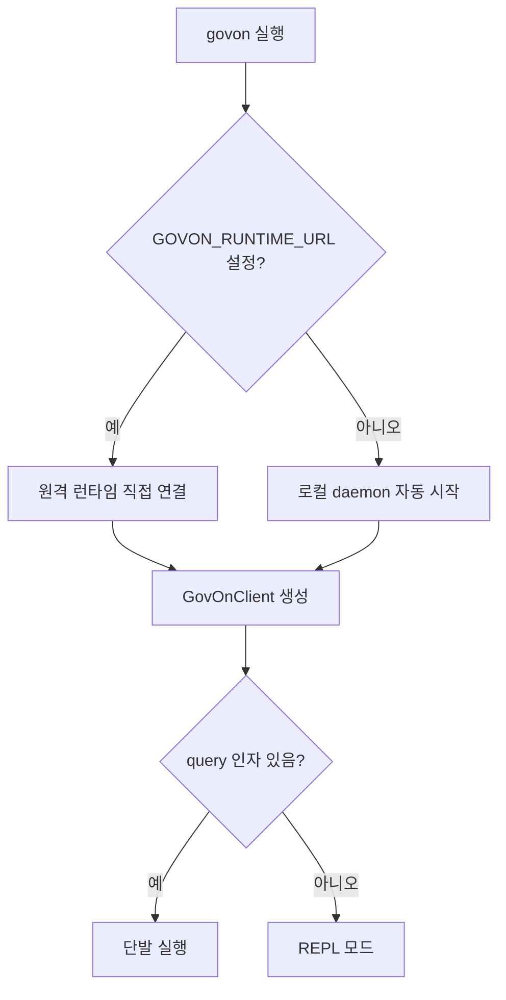
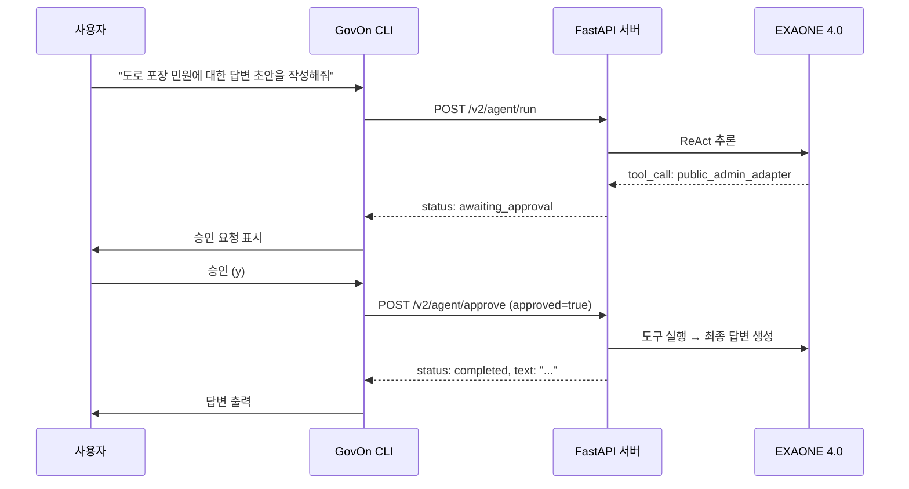
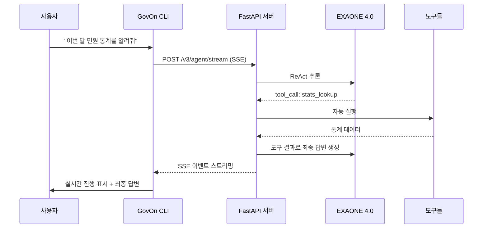

# GovOn 사용자 가이드

> 이 가이드를 읽으면, GovOn CLI를 설치하고 민원 답변 초안을 생성하는 전체 과정을 독립적으로 수행할 수 있다.

---

## 목차

1. [빠른 시작 (Quick Start)](#빠른-시작-quick-start)
2. [설치 방법](#설치-방법)
3. [CLI 사용법](#cli-사용법)
4. [v4 승인 흐름 사용 예시](#v4-승인-흐름-사용-예시)
5. [v3 자동 실행 사용 예시](#v3-자동-실행-사용-예시)
6. [멀티턴 대화](#멀티턴-대화)
7. [도구 설명](#도구-설명)
8. [FAQ](#faq)

---

## 빠른 시작 (Quick Start)

3단계로 GovOn을 실행한다.

```bash
# 1. 원격 런타임 URL 설정 (HF Space 또는 자체 서버)
export GOVON_RUNTIME_URL=https://umyunsang-govon-runtime.hf.space

# 2. pip 설치
pip install govon

# 3. 인터랙티브 셸 실행
govon
```

실행하면 `govon>` 프롬프트가 나타난다. 자연어로 질문을 입력하면 AI가 도구를 활용해 답변을 생성한다.

```
govon> 최근 도로 포장 관련 민원이 얼마나 접수되었나요?
```

---

## 설치 방법

### 방법 1: pip 설치

**사전 요구사항**: Python 3.10 이상, pip

```bash
pip install govon
```

설치 후 `govon` 명령이 등록된다. (`pyproject.toml`의 `[project.scripts]`에 `govon = "src.cli.shell:main"` 으로 정의)

### 방법 2: Docker

GPU가 탑재된 서버에서 Docker로 직접 실행할 수 있다.

```bash
# 1. 환경변수 파일 준비
cp .env.example .env
# .env 파일에서 API_KEY, MODEL_PATH 등 수정

# 2. Docker Compose로 실행
docker compose up -d --build
```

서버가 `http://localhost:8000` 에서 기동된다. CLI에서 연결하려면 다음과 같이 설정한다.

```bash
export GOVON_RUNTIME_URL=http://localhost:8000
govon
```

### 방법 3: HF Space 접근

별도의 설치 없이 HuggingFace Space에 배포된 런타임에 접속할 수 있다.

```bash
export GOVON_RUNTIME_URL=https://umyunsang-govon-runtime.hf.space
govon
```

> HF Space는 A100-Large GPU에서 EXAONE 4.0-32B-AWQ 모델을 서빙한다. API 키가 설정된 경우 `X-API-Key` 헤더로 인증이 필요하다.

---

## CLI 사용법

### 실행 모드

GovOn CLI는 두 가지 모드를 지원한다.

| 모드 | 명령 | 설명 |
|------|------|------|
| REPL (대화형) | `govon` | 프롬프트에서 반복적으로 질문 입력 |
| 단발 실행 | `govon "질문"` | 한 번 질문하고 종료 |

### 전체 옵션

```
govon [query] [--session SESSION_ID] [--status] [--stop]
```

| 옵션 | 설명 |
|------|------|
| `query` | 단발 실행할 질문. 생략하면 REPL 모드 |
| `--session SESSION_ID` | 기존 세션을 재개 |
| `--status` | daemon 상태 확인 후 종료 |
| `--stop` | daemon 중지 후 종료 |

### 런타임 연결 방식

GovOn CLI는 두 가지 방식으로 백엔드에 연결한다.



- **원격 런타임 모드**: `GOVON_RUNTIME_URL` 환경변수를 설정하면 해당 URL에 직접 연결한다. daemon을 관리하지 않는다.
- **로컬 daemon 모드**: 환경변수가 없으면 `DaemonManager`가 로컬 서버를 자동으로 시작한다.

### REPL 슬래시 명령

REPL 모드에서 사용할 수 있는 내장 명령이다.

| 명령 | 설명 |
|------|------|
| `/help` | 사용 가능한 명령과 도움말 표시 |
| `/clear` | 터미널 화면 초기화 |
| `/exit` | 셸 종료 |

슬래시 명령 외의 입력은 모두 자연어 질문으로 처리된다.

### 종료 방법

- `/exit` 입력
- `Ctrl+D` (EOF)
- `Ctrl+C` (대기 중일 때)

---

## v4 승인 흐름 사용 예시

v4 엔드포인트(`/v2/agent/*`)는 도구 실행 전에 사용자 승인을 요청하는 "approval-gated" 방식이다. 민원 답변 초안 생성(`public_admin_adapter`)이나 법률 답변 초안 생성(`legal_adapter`)처럼 `requires_approval: true`인 도구를 호출할 때 승인 단계가 삽입된다.

### 흐름 다이어그램



### 실제 대화 예시

```bash
$ govon
GovOn CLI  (종료: Ctrl+D 또는 /exit)

govon> 도로 포장 민원에 대한 답변 초안을 작성해줘

처리 중…
에이전트가 다음 도구 실행을 요청합니다:
  도구: public_admin_adapter
  입력: "도로 포장 관련 민원 답변 초안 작성"

승인하시겠습니까? [y/n]: y

승인됨 — 계속 진행 중…

────────────────────────────────────────
[답변 초안]
귀하의 민원에 감사드립니다. 해당 도로 포장 불량 건에 대해
관할 부서에서 현장 확인 후 보수 일정을 안내드리겠습니다.
보수 예정일은 접수일로부터 14일 이내이며, 진행 상황은
별도로 통보하겠습니다.
────────────────────────────────────────

세션 ID: a1b2c3d4-5678-90ab-cdef-1234567890ab
```

### 거절 시

```bash
승인하시겠습니까? [y/n]: n
# 도구가 실행되지 않고 프롬프트로 복귀
govon>
```

---

## v3 자동 실행 사용 예시

v3 엔드포인트(`/v3/agent/*`)는 모든 도구를 자동으로 실행하는 방식이다. 승인 단계가 없으므로 빠른 분석 작업에 적합하다.

### 흐름 다이어그램



### 실제 대화 예시

v3 스트리밍은 CLI가 자동으로 v3 경로를 시도한다. SSE(Server-Sent Events)로 도구 실행 과정이 실시간 표시된다.

```bash
govon> 이번 달 민원 통계를 알려줘

에이전트 추론 중…
[도구 호출] stats_lookup — 시작
[도구 호출] stats_lookup — 완료

────────────────────────────────────────
2026년 4월 기준 민원 접수 현황:
- 총 접수 건수: 1,247건
- 전월 대비: +8.3%
- 주요 카테고리: 도로·교통(312건), 환경·위생(289건), 건축·주거(201건)
────────────────────────────────────────
메타데이터:
  총 도구 호출: 1
  총 소요 시간: 2,340ms
```

### v3 SSE 이벤트 타입

CLI가 수신하는 SSE 이벤트 종류는 다음과 같다.

| 이벤트 타입 | 설명 |
|-------------|------|
| `thinking_start` | LLM 추론 시작 |
| `thinking_delta` | LLM 토큰 스트리밍 (실시간 출력) |
| `thinking_end` | LLM 추론 완료 (`tool_calls` 목록 포함) |
| `tool_start` | 도구 실행 시작 |
| `tool_end` | 도구 실행 완료 (`success` 여부 포함) |
| `run_complete` | 전체 실행 완료 (최종 답변 + 메타데이터) |
| `error` | 오류 발생 |

---

## 멀티턴 대화

GovOn은 `session_id`를 기반으로 대화 맥락을 유지한다. LangGraph의 checkpointer(SQLite 기반)가 이전 메시지를 자동 복원한다.

### REPL 모드에서의 멀티턴

REPL 모드에서는 세션이 자동으로 유지된다. 첫 질문에서 서버가 `session_id`를 발급하고, 이후 질문은 동일 세션에서 처리된다.

```bash
govon> 최근 소음 관련 민원 추이를 분석해줘

에이전트 추론 중…
[도구 호출] issue_detector — 시작
[도구 호출] issue_detector — 완료

────────────────────────────────────────
소음 민원 분석 결과:
- 지난 3개월간 소음 민원 43% 증가
- 주요 원인: 공사장 소음(58%), 생활 소음(27%), 교통 소음(15%)
────────────────────────────────────────

govon> 그중에서 공사장 소음에 대한 답변 초안을 작성해줘

처리 중…
# 이전 대화 맥락(소음 민원 분석 결과)을 활용하여 답변 생성
```

### 세션 재개

REPL을 종료할 때 출력되는 세션 ID를 기록해두면, 나중에 대화를 이어갈 수 있다.

```bash
# 세션 종료 시 출력되는 ID 확인
세션 ID: a1b2c3d4-5678-90ab-cdef-1234567890ab

# 다음 번에 같은 세션으로 재개
govon --session a1b2c3d4-5678-90ab-cdef-1234567890ab
```

단발 실행에서도 세션을 지정할 수 있다.

```bash
govon --session a1b2c3d4 "앞서 분석한 소음 민원에 대해 추가 설명해줘"
```

### 세션 격리

v2(`/v2/agent/*`)와 v3(`/v3/agent/*`)는 별도의 checkpointer 네임스페이스를 사용한다. v3 세션은 내부적으로 `v3:` prefix가 붙어 v2 세션과 충돌하지 않는다.

---

## 도구 설명

GovOn 에이전트는 7개의 도구를 LLM 판단에 따라 호출한다. 도구 선택은 키워드 매칭이 아닌 LLM의 자율적 판단으로 이루어진다.

### 도구 목록

| 도구 이름 | 역할 | 승인 필요 | 데이터 소스 |
|-----------|------|-----------|-------------|
| `api_lookup` | 공공데이터포털(data.go.kr) 검색 | 아니오 | 공공데이터포털 API |
| `issue_detector` | 반복·급증 민원 패턴 탐지 | 아니오 | 공공데이터포털 API |
| `stats_lookup` | 기간별 민원 통계 조회 | 아니오 | 공공데이터포털 API |
| `keyword_analyzer` | 민원 텍스트 키워드 빈도 분석 | 아니오 | 공공데이터포털 API |
| `demographics_lookup` | 민원 제출자 인구통계 분석 | 아니오 | 공공데이터포털 API |
| `public_admin_adapter` | 공공행정 민원 답변 생성 | 예 | LoRA 모델 (74K 학습) |
| `legal_adapter` | 법률 해석 및 법령 인용 답변 생성 | 예 | LoRA 모델 (270K 학습) |

### 도구별 상세

#### api_lookup

공공데이터포털에서 유사 민원 분석 보고서, 통계, 정책 데이터를 검색한다.

```
사용 예: "도로 포장 관련 공공데이터를 검색해줘"
```

| 파라미터 | 타입 | 기본값 | 설명 |
|----------|------|--------|------|
| `query` | `string` | (필수) | 검색 쿼리 |
| `ret_count` | `integer` | `5` | 반환 결과 수 (1-20) |

#### issue_detector

반복적으로 접수되거나 급증하는 민원 패턴을 탐지한다.

```
사용 예: "최근 급증한 민원 유형을 분석해줘"
```

| 파라미터 | 타입 | 기본값 | 설명 |
|----------|------|--------|------|
| `query` | `string` | (필수) | 탐지 키워드 |
| `analysis_time` | `string` | `null` | 분석 시점 (YYYYMMDDHH, 10자리) |
| `max_result` | `integer` | `10` | 최대 결과 수 |

#### stats_lookup

기간별·카테고리별 민원 접수 통계를 조회한다.

```
사용 예: "2026년 1분기 민원 접수 통계를 보여줘"
```

| 파라미터 | 타입 | 기본값 | 설명 |
|----------|------|--------|------|
| `query` | `string` | (필수) | 통계 조회 키워드 |
| `date_from` | `string` | `null` | 시작일 (YYYYMMDD) |
| `date_to` | `string` | `null` | 종료일 (YYYYMMDD) |
| `period` | `string` | `null` | 집계 단위 (`DAILY`, `WEEKLY`, `MONTHLY`, `YEARLY`) |

#### keyword_analyzer

민원 텍스트에서 빈출 키워드를 분석한다.

```
사용 예: "환경 분야 민원에서 자주 언급되는 키워드를 분석해줘"
```

| 파라미터 | 타입 | 기본값 | 설명 |
|----------|------|--------|------|
| `query` | `string` | (필수) | 분석 대상 텍스트 |
| `date_from` | `string` | `null` | 시작일 (YYYYMMDD) |
| `date_to` | `string` | `null` | 종료일 (YYYYMMDD) |
| `result_count` | `integer` | `20` | 반환 키워드 수 |

#### demographics_lookup

민원 제출자의 연령대, 지역, 성별 분포를 분석한다.

```
사용 예: "소음 민원을 가장 많이 제출하는 연령대는?"
```

| 파라미터 | 타입 | 기본값 | 설명 |
|----------|------|--------|------|
| `query` | `string` | (필수) | 인구통계 분석 쿼리 |
| `date_from` | `string` | `null` | 시작일 (YYYYMMDD) |
| `date_to` | `string` | `null` | 종료일 (YYYYMMDD) |

#### public_admin_adapter

공공행정 민원에 대한 답변을 LoRA 특화 모델로 생성한다. 중앙·지방행정기관 민원 QA(AI Hub 71852) 및 행정법 QA(AI Hub 71847) 등 74K건의 데이터로 학습된 어댑터를 사용한다.

```
사용 예: "도로 포장 불량 민원에 대한 답변 초안을 작성해줘"
```

| 파라미터 | 타입 | 기본값 | 설명 |
|----------|------|--------|------|
| `query` | `string` | (필수) | 민원 내용 또는 답변 요청 |

> 이 도구는 `requires_approval: true`이므로, v4 승인 흐름에서 실행 전 사용자 확인을 요청한다.

#### legal_adapter

법률 질의에 대해 관련 법령을 인용한 답변을 LoRA 특화 모델로 생성한다. 판례, 민사법(AI Hub 71841), 지식재산권법(AI Hub 71843), 형사법(AI Hub 71848) 등 270K건의 법률 문서로 학습된 어댑터를 사용한다.

```
사용 예: "소음규제법에 근거한 공사장 소음 민원 답변을 작성해줘"
```

| 파라미터 | 타입 | 기본값 | 설명 |
|----------|------|--------|------|
| `query` | `string` | (필수) | 법률 관련 민원 또는 질의 |

> 이 도구는 `requires_approval: true`이므로, v4 승인 흐름에서 실행 전 사용자 확인을 요청한다.

---

## FAQ

### Q1. GOVON_RUNTIME_URL은 어디서 확인하나요?

HF Space를 사용하는 경우, Space URL이 곧 런타임 URL이다.

```bash
export GOVON_RUNTIME_URL=https://umyunsang-govon-runtime.hf.space
```

자체 Docker 서버를 운영하는 경우, 서버의 호스트와 포트를 조합한다.

```bash
export GOVON_RUNTIME_URL=http://your-server:8000
```

### Q2. API 키 인증은 어떻게 하나요?

서버에 `API_KEY` 환경변수가 설정되어 있으면, 모든 요청에 `X-API-Key` 헤더가 필요하다. CLI는 내부적으로 `GovOnClient`를 통해 이 헤더를 전송한다. 서버에 `API_KEY`가 설정되지 않았고 `ALLOW_NO_AUTH=true`이면 인증 없이 사용 가능하다.

### Q3. "daemon 연결 실패" 오류가 나와요.

원인별 해결 방법:

1. **원격 런타임 모드인 경우**: `GOVON_RUNTIME_URL`이 올바르게 설정되었는지, 서버가 실행 중인지 확인한다.
   ```bash
   curl $GOVON_RUNTIME_URL/health
   ```
2. **로컬 daemon 모드인 경우**: `govon --status`로 daemon 상태를 확인한다. 중지 상태이면 `govon`을 다시 실행하면 자동으로 기동된다.

### Q4. v2와 v3 중 어떤 것을 사용해야 하나요?

| 상황 | 권장 버전 |
|------|-----------|
| 민원 답변 초안 생성 (검토 필요) | v4 (`/v2/agent/*`) — 승인 흐름 |
| 통계 조회, 트렌드 분석 | v3 (`/v3/agent/*`) — 자동 실행 |
| 빠른 정보 탐색 | v3 — 도구 자동 실행으로 빠른 결과 |

CLI는 연결 시 자동으로 v3 스트리밍을 먼저 시도하고, 사용할 수 없으면 v2, 그 다음 블로킹 모드로 폴백한다.

### Q5. 한 세션에서 최대 몇 번까지 도구를 호출하나요?

`AgentRunRequest`의 `max_iterations` 파라미터(기본값: 10, 최대: 20)로 제어된다. 한 iteration에서 여러 도구를 호출할 수 있으므로, 실제 도구 호출 횟수는 iteration 수보다 많을 수 있다.

### Q6. Ctrl+C를 누르면 어떻게 되나요?

- **질문 처리 중**: 현재 요청이 취소되고 `govon>` 프롬프트로 복귀한다.
- **프롬프트 대기 중**: 셸이 종료된다.

### Q7. prompt_toolkit이 없으면 어떻게 되나요?

CLI는 `prompt_toolkit` 라이브러리가 설치되지 않아도 동작한다. 설치되어 있으면 히스토리, 자동 완성 등의 향상된 입력 기능을 사용할 수 있고, 없으면 Python 기본 `input()`으로 대체된다.
