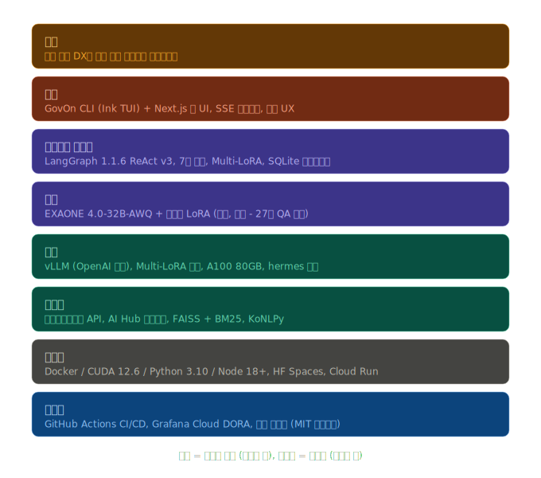

# GovOn 프로젝트 발표자료

> **대한민국 정부 디지털 인프라를 하나의 AI 인터페이스로 통합하는 AX(Agentic Transformation) 플랫폼**
>
> 이 문서는 기술 배경이 없는 분도 이해할 수 있도록 구성되었습니다.
> 핵심 개념은 실생활 비유로, 수치와 구조는 다이어그램으로 설명합니다.

---

## 목차

1. [한눈에 보는 GovOn](#1-한눈에-보는-govon)
2. [왜 필요한가 — 해결하려는 문제](#2-왜-필요한가--해결하려는-문제)
3. [전체 시스템 아키텍처](#3-전체-시스템-아키텍처)
4. [에이전트의 추론 방식 — ReAct 루프](#4-에이전트의-추론-방식--react-루프)
5. [도구 생태계 — GovOn이 사용할 수 있는 7가지 능력](#5-도구-생태계--govon이-사용할-수-있는-7가지-능력)
6. [실시간 응답 스트리밍](#6-실시간-응답-스트리밍)
7. [안전장치 — Human-in-the-Loop 승인](#7-안전장치--human-in-the-loop-승인)
8. [도메인 특화 학습 — LoRA 어댑터](#8-도메인-특화-학습--lora-어댑터)
9. [개발·배포 파이프라인과 성과 지표](#9-개발배포-파이프라인과-성과-지표)
10. [설정 관리 — 단일 진리원(Single Source of Truth)](#10-설정-관리--단일-진리원single-source-of-truth)
11. [기술 스택 전체 조망](#11-기술-스택-전체-조망)
12. [마무리 — 프로젝트의 의의](#12-마무리--프로젝트의-의의)

---

## 1. 한눈에 보는 GovOn

### 프로젝트 정의

> **GovOn은 대한민국 정부의 분산된 행정·법률 시스템을 하나의 AI 채팅 인터페이스로 통합하는 에이전틱 AI 플랫폼입니다.**

### 핵심 가치 제안

| 기존 방식 | GovOn 적용 후 |
|---|---|
| 기관별로 분리된 다수의 조회 시스템을 개별 접속 | 하나의 채팅창에 질문만 입력 |
| 담당자가 여러 법령·통계를 수동으로 교차 확인 | AI가 필요한 도구를 스스로 선택해 호출 |
| 문서 초안 작성에 평균 45분 소요 | 평균 5초 이내에 초안과 근거 제시 |
| 단순 조회 업무가 하루 업무의 상당 비중 차지 | 담당자는 판단·검토 업무에 집중 가능 |

### 한 문장 요약

**"각 기관의 API를 AI가 호출 가능한 도구(tool)로 감싸, 중앙의 대형언어모델(LLM)이 사용자의 질의에 맞춰 자율적으로 도구를 선택·체이닝하여 통합된 답변을 생성한다."**

---

## 2. 왜 필요한가 — 해결하려는 문제

### 현재 한국 공공부문의 디지털 현실

한국은 세계적 수준의 DX(Digital Transformation)를 달성했습니다. 대부분의 정부 서비스가 전산화되었고, 공공데이터포털을 통해 다양한 API가 공개되어 있습니다.

그러나 **각 시스템은 독립적으로 설계·운영**되어 있습니다.

- 민원 처리 시스템은 A 기관이 운영
- 법령 해석 데이터는 B 기관이 보유
- 인구 통계는 C 기관이 관리
- 각 시스템은 서로 다른 인증·인터페이스·데이터 형식을 사용

### 이로 인한 실무 부담

> **상황**: 시민이 "우리 동네 도로 파손 민원이 어떻게 처리되나요?"라고 문의한다.

담당 공무원이 수행해야 하는 절차:

1. 민원 처리 시스템 로그인 및 이력 조회
2. 관련 법령 검색 및 해석 확인
3. 해당 지역 통계 자료 조회
4. 위 정보를 취합하여 답변 초안 작성

**이 전 과정에 평균 45분**이 소요되며, 하루 수백 건의 유사 질의가 누적됩니다. 결과적으로 담당자는 **단순 조회 업무에 업무시간의 상당 비중**을 쓰게 됩니다.

### GovOn의 해결 접근

> **"흩어진 시스템을 통합하지 말고, 그 위에 AI 오케스트레이션 계층을 올리자."**

각 기관의 API를 그대로 둔 채, 중앙의 AI가 필요한 API를 자율적으로 호출해 통합 답변을 만드는 방식입니다. 기존 시스템을 **재구축하지 않고**도 통합 경험을 제공할 수 있습니다.

### 기대 효과

| 이해관계자 | 기대 효과 |
|---|---|
| 공무원 | 단순 조회 업무 시간 단축, 판단 업무에 집중 |
| 시민 | 복잡한 행정 절차를 쉬운 언어로 안내받음 |
| 정부 기관 | 기존 시스템을 유지하면서 통합 경험 제공 |
| 국가 전체 | 공공 AI 서비스의 모범 사례 확보 |

---

## 3. 전체 시스템 아키텍처



### 4계층 구조

GovOn은 **4개 계층이 수직으로 쌓인 구조**입니다. 각 계층은 독립적으로 교체·확장할 수 있도록 설계되었습니다.

#### 계층 1. 클라이언트 (Client Layer)

사용자가 직접 상호작용하는 인터페이스입니다.

- **GovOn CLI** — 터미널 기반 채팅 인터페이스. React + Ink 프레임워크로 구현. 배포 크기 약 10MB, GPU 불필요.
- **Next.js 웹 UI** — 웹 브라우저 기반 인터페이스. R1 이후 고도화 예정.

두 인터페이스 모두 백엔드와 **SSE(Server-Sent Events) 스트리밍**으로 통신합니다.

#### 계층 2. API 게이트웨이 (API Gateway Layer)

클라이언트 요청을 받아 인증·라우팅·제한을 수행하는 계층입니다.

- **FastAPI 서버** — Python 기반 비동기 API 프레임워크
- **주요 엔드포인트**: `/v3/agent/run`, `/v3/agent/stream`, `/v3/agent/approve`, `/v3/agent/cancel`, `/health`
- **보안**: X-API-Key 헤더 기반 인증
- **트래픽 제어**: 분당 30회 호출 제한 (slowapi)

#### 계층 3. 에이전트 코어 (Agent Core Layer) — 핵심

GovOn의 "두뇌"에 해당하는 계층입니다.

- **LangGraph ReAct v3 엔진** — 생각→도구→생각의 반복 구조 관리
- **세션 저장소** — SQLite 기반, 멀티턴 대화 이력 보존
- **어댑터 레지스트리** — 도메인별 LoRA 어댑터 관리
- **도구 레지스트리** — 7개 도구의 메타데이터 및 실행 관리
- **런타임 설정** — 4종 프로필(local, single, container, airgap)

#### 계층 4. 추론·데이터 (Inference & Data Layer)

실제 언어 생성과 외부 정보 조회가 일어나는 계층입니다.

- **vLLM 서버** — OpenAI 호환 API를 제공하는 고성능 추론 엔진
- **기반 모델** — EXAONE 4.0-32B-AWQ (LG AI Research, 4-bit 양자화)
- **LoRA 어댑터** — 동시에 최대 4개 어댑터 로드 (법률, 공공행정 등)
- **외부 API** — 공공데이터포털 등
- **검색 엔진** — FAISS + BM25 하이브리드 검색

### 부가 인프라

- **컨테이너화**: Docker (NVIDIA CUDA 12.6 기반)
- **배포 대상**: HuggingFace Spaces, Google Cloud Run, 온프레미스, 폐쇄망
- **관측성**: Grafana Cloud DORA 대시보드
- **CI/CD**: GitHub Actions (7종 워크플로우)

### 설계 철학

**"느슨한 결합, 높은 응집도"** — 각 계층은 명확한 계약(API)으로만 연결됩니다. 따라서 모델을 교체하거나, UI를 추가하거나, 배포 대상을 확장할 때 **다른 계층은 영향받지 않습니다**.

---

## 4. 에이전트의 추론 방식 — ReAct 루프



### ReAct란

**ReAct = Reasoning(추론) + Acting(행동)**

AI가 한 번에 답을 내는 대신, **"생각하고 → 행동하고 → 그 결과를 보고 다시 생각하는"** 과정을 반복하는 방식입니다. 사람이 복잡한 문제를 풀 때 검색 엔진을 열었다가, 결과를 보고 다시 검색어를 다듬고, 또 결과를 참고해 결론을 쓰는 과정과 유사합니다.

### GovOn의 ReAct 그래프 — 5개 노드

#### 노드 1. `session_load` — 대화 이력 복원

- SQLite에서 이전 대화 기록을 불러옴
- 메시지가 토큰 예산(4,500)의 60%를 초과하면 **추출적 요약** 수행
- 최근 6개 메시지는 항상 원문 보존

#### 노드 2. `agent` — LLM 추론

- 현재 대화 맥락과 사용 가능한 도구 목록을 LLM에 전달
- LLM은 **어떤 도구를 호출할지** 또는 **최종 답변을 할지** 결정
- 도구 호출이 필요하면 `pending_tool_calls` 필드에 명시

#### 노드 3. `tools` — 도구 실행

- LLM이 요청한 도구들을 실제로 실행
- 결과를 `ToolMessage` 형태로 대화 이력에 추가
- 반복 카운터(`iteration_count`) 증가

#### 조건 분기 `route_agent_v3`

- `pending_tool_calls`가 남아있고 `iteration_count < 10`이면 → `tools` 노드로 진행
- 그렇지 않으면 → `synthesize` 노드로 종료

#### 노드 4. `synthesize` — 최종 답변 생성 및 저장

- 최종 텍스트와 증거 자료(`evidence_items`) 구성
- 세션에 이번 턴을 영구 저장

### 반복 제어 — 왜 10회로 제한하는가

복잡한 질의는 여러 도구를 **순차적으로** 호출해야 할 수 있습니다. 예를 들어:

```
1회차: 민원 데이터 조회 → 도구 결과 확인
2회차: 관련 법령 검색 → 도구 결과 확인
3회차: 행정 답변 초안 생성 → 최종 응답
```

그러나 무한 반복은 비용과 응답 시간을 폭증시킵니다. **최대 10회**의 안전 한계를 두어 비용과 품질의 균형을 맞췄습니다.

### 컨텍스트 관리 전략

대화가 길어지면 LLM의 입력 한계를 초과합니다. GovOn은 다음 전략으로 이를 관리합니다.

| 전략 | 설정값 | 목적 |
|---|---|---|
| 토큰 예산 | 4,500 토큰 | 입력 크기 상한 |
| 최근 메시지 보존 | 6개 | 직전 문맥은 항상 유지 |
| 요약 임계점 | 예산의 60% | 이 지점을 넘으면 요약 시작 |
| 도구 메시지 정리 | 2회 반복 후 | 구형 도구 결과 제거 |

이 전략 덕분에 **긴 대화에서도 핵심 맥락을 잃지 않으면서** 입력 크기를 안정적으로 유지합니다.

---

## 5. 도구 생태계 — GovOn이 사용할 수 있는 7가지 능력



### 도구(Tool)란

AI가 직접 수행할 수 없는 작업(외부 API 호출, 데이터 분석, 도메인 특화 생성 등)을 대신 수행하는 함수입니다. LLM은 도구의 이름과 설명을 보고 **언제, 어떤 도구를, 어떤 인자로 호출할지** 결정합니다.

### 7개 도구의 분류

#### 카테고리 A. 검색 (1종)

**`api_lookup`** — 공공데이터포털의 민원분석정보 등을 조회하여 시민 불만·요구 데이터를 제공합니다. 타임아웃 10초, 재시도 1회.

#### 카테고리 B. 분석 (4종)

| 도구명 | 역할 |
|---|---|
| `issue_detector` | 트렌딩 이슈 감지 (최근 주목받는 민원 주제) |
| `stats_lookup` | 도메인 통계 수치 조회 |
| `keyword_analyzer` | 문서·민원에서 핵심 키워드 추출 |
| `demographics_lookup` | 지역별 인구 구성 조회 |

모두 승인 불필요, 순수 조회성 도구입니다.

#### 카테고리 C. 도메인 특화 생성 (2종) — **승인 필요**

| 도구명 | 역할 | 기반 어댑터 |
|---|---|---|
| `public_admin_adapter` | 행정 절차·민원·허가 관련 답변 초안 생성 | `umyunsang/govon-civil-adapter` |
| `legal_adapter` | 법률 해석·판례·근거 인용 답변 초안 생성 | `siwo/govon-legal-adapter` |

이 두 도구는 **LoRA 어댑터(8장 참조)**를 활용하여 도메인 특화 품질을 제공합니다. 법률·행정 답변은 오류 시 실제 피해가 발생할 수 있으므로, **반드시 담당자의 승인을 거친 후에 실행**됩니다.

### 도구의 동적 등록 — 코드 수정 없이 확장 가능

새 도메인을 추가할 때 코드를 수정할 필요가 없습니다. 설정 파일(`config/adapters.yaml`)에 새 어댑터 정보를 기술하면, 서버 기동 시 자동으로 새 도구가 등록됩니다.

```yaml
adapters:
  tax:                                    # 신규 도메인 예시
    path: "umyunsang/govon-tax-adapter"
    domain: "tax"
    lora_id: 3
    requires_approval: true
    tool_description: "세무 관련 답변 초안 생성"
```

이러한 **선언적 구성 방식**은 시스템의 유지보수성과 확장성을 크게 높입니다.

---

## 6. 실시간 응답 스트리밍



### 왜 스트리밍이 중요한가

LLM이 답변을 생성하는 데에는 수 초가 소요됩니다. 사용자가 **몇 초 동안 빈 화면을 응시**하는 경험은 불안과 이탈을 유발합니다.

GovOn은 **서버 전송 이벤트(SSE, Server-Sent Events)** 방식을 사용해, 답변이 생성되는 과정을 **실시간으로 중계**합니다. 사용자는 현재 AI가 무엇을 하고 있는지 즉시 파악할 수 있습니다.

### 이벤트 4종 분류

스트리밍되는 이벤트는 4개 범주로 구분됩니다.

| 범주 | 이벤트 | 의미 |
|---|---|---|
| 추론 | `thinking_start`, `thinking_delta`, `thinking_end` | AI가 어떤 도구를 쓸지 고민 중 |
| 도구 실행 | `tool_start`, `tool_end` | 외부 API 호출 또는 어댑터 실행 |
| 응답 생성 | `response_delta` | 최종 답변 텍스트를 한 조각씩 전송 |
| 종료 | `run_complete` | 전체 응답, 증거 자료, 메타데이터 확정 |

### 시간 흐름 예시

민원 조회와 행정 답변 생성이 필요한 질의의 실제 타임라인:

| 시점 | 이벤트 | 설명 |
|---|---|---|
| 0.00s | `thinking_start` | 1회차 추론 시작 |
| 0.50s | `thinking_end` | 2개 도구 호출 결정 |
| 0.55s | `tool_start (api_lookup)` | 민원 조회 시작 |
| 1.15s | `tool_end (api_lookup)` | 민원 조회 완료 |
| 1.20s | `tool_start (public_admin_adapter)` | 행정 답변 생성 시작 |
| 2.05s | `tool_end (public_admin_adapter)` | 행정 답변 생성 완료 |
| 2.10s | `thinking_start` | 2회차 추론 시작 |
| 2.80s | `response_delta` | 최종 답변 스트리밍 시작 |
| 3.50s | `run_complete` | 응답 확정 |

**약 3.5초** 내에 다도구 체이닝을 마치고 최종 응답을 전달합니다.

### 사용자 경험 측면의 이점

- **투명성**: AI가 어떤 도구를 사용하고 있는지 실시간으로 확인
- **체감 속도**: 첫 글자가 빠르게 나오므로 대기 시간이 짧게 느껴짐
- **신뢰감**: "블랙박스"가 아닌 과정을 보여주므로 결과를 더 신뢰할 수 있음

---

## 7. 안전장치 — Human-in-the-Loop 승인



### 배경 — AI의 자율성에 대한 한계

AI가 **모든 결정을 혼자 내리면** 다음 문제가 발생할 수 있습니다.

- 법률 해석 오류 → 시민의 권리 침해 가능성
- 잘못된 행정 안내 → 민원 이중 부담
- 부정확한 근거 인용 → 신뢰도 저하

GovOn은 **중요한 판단은 사람이 최종 확인**하도록 설계했습니다. 이를 **HITL(Human-in-the-Loop)**이라 합니다.

### 승인이 필요한 시점

도구의 메타데이터(`config/adapters.yaml`)에서 `requires_approval: true`로 표시된 도구가 호출되려 할 때 자동으로 작동합니다. 현재 대상은 `legal_adapter`, `public_admin_adapter`입니다.

### 작동 과정

#### 1단계. 감지

에이전트가 승인 필요 도구를 호출하려 할 때, 시스템이 자동 감지합니다.

#### 2단계. 실행 중단(interrupt)

LangGraph의 `interrupt()` 메커니즘이 그래프 실행을 **일시 정지**하고 현재 상태를 체크포인트로 저장합니다. 이는 게임의 세이브 포인트와 유사합니다.

#### 3단계. 승인 요청 UI 표시

클라이언트에 `approval_request` 이벤트가 전달되고, 담당자에게 다음 정보가 표시됩니다.

```
┌─ 승인 요청 ───────────────────────┐
│ 유형: 법률 답변 초안 작성           │
│ 호출 도구: legal_adapter           │
│ 대상 질의: "민법 제750조 해석"     │
│                                   │
│  [승인]   [거부]   [취소]          │
└───────────────────────────────────┘
```

#### 4단계. 담당자 판단

| 선택 | 이후 동작 |
|---|---|
| **승인(Approve)** | 저장된 지점부터 도구를 실행하고 답변 생성 |
| **거부(Reject)** | 해당 도구 없이 다른 방식으로 답변 재시도 |
| **취소(Cancel)** | 대화를 정상 종료 |

#### 5단계. 재개

선택된 결정에 따라 그래프가 **저장된 상태에서부터** 이어서 실행됩니다. 처음부터 다시 시작할 필요가 없습니다.

### 설계 의의

**"AI의 효율성 + 사람의 최종 책임"** 구조는 공공 영역에 필수적입니다. GovOn은 이를 아키텍처 수준에서 내장하여, 운영자가 별도 장치를 덧붙일 필요가 없습니다.

---

## 8. 도메인 특화 학습 — LoRA 어댑터



### 기반 모델의 한계

GovOn의 기반 모델인 **EXAONE 4.0-32B**는 일반적인 한국어 대화·요약·추론에 강점을 갖지만, **세부 법령 해석**이나 **행정 절차 문서 작성**같은 도메인 지식은 상대적으로 얕습니다.

### 전체 모델을 재학습하지 않는 이유

기반 모델을 재학습하려면:

- 수천억 개의 파라미터를 갱신해야 함
- 비용: 수억 원 단위
- 기간: 수 주 ~ 수 개월
- 여러 도메인(법률, 행정, 세무 등)마다 별도 모델 필요

이는 **현실적으로 지속 가능하지 않습니다**.

### LoRA(Low-Rank Adaptation) 기법

LoRA는 기반 모델은 그대로 두고, **작은 추가 파라미터 집합(어댑터)**만 학습하는 기법입니다.

> **비유**: 전문가용 양복 전체를 새로 맞추는 대신, **기본 양복에 분야별 배지만 교체**하는 방식.

이렇게 학습된 어댑터는 파일 크기가 수십~수백 MB에 불과하며, **런타임에 동적으로 교체 가능**합니다.

### GovOn의 LoRA 학습 파이프라인 — 6단계

#### 1단계. 데이터 수집

공개 데이터셋(AI Hub)에서 도메인 QA 쌍을 수집합니다.

| 데이터셋 | 도메인 | 규모 |
|---|---|---|
| AI Hub 71841 | 민법 | 약 90K |
| AI Hub 71843 | 지식재산권 | 약 90K |
| AI Hub 71848 | 형법 | 약 90K |
| **합계** | **법률 전반** | **약 270K** |

#### 2단계. 전처리

- 한국어 형태소 분석(KoNLPy · mecab)
- 품질 기준에 미달하는 데이터 제거
- 허깅페이스 데이터셋 허브에 업로드

#### 3단계. 학습 환경 구성

| 항목 | 사양 |
|---|---|
| GPU | NVIDIA A100 SXM4 80GB |
| 프레임워크 | Unsloth + TRL SFTTrainer |
| 양자화 | 4-bit NF4 |
| LoRA 설정 | rank=16, alpha=32, target 7개 모듈 |
| 정밀도 | BF16 + TF32 |
| 유효 배치 | 64 (batch 8 × grad accumulation 8) |

#### 4단계. 학습 실행

- 365 step 학습
- 소요 시간: 약 7시간
- Loss 감소: 2.334 → 0.889 (약 62% 감소)

#### 5단계. 아티팩트 배포

- 학습된 어댑터 가중치를 허깅페이스 허브에 업로드
- `config/adapters.yaml`에 어댑터 경로 등록

#### 6단계. 런타임 로드

- GovOn 서버 기동 시 레지스트리가 자동 로드
- vLLM의 Multi-LoRA 기능으로 최대 4개 어댑터 동시 서빙
- 사용자 질의 유형에 따라 **실시간으로 어댑터 전환**

### 비용·효과 요약

| 항목 | 전체 재학습 | **LoRA 방식** |
|---|---|---|
| 비용 | 수억 원 | 수백만 원 이하 |
| 기간 | 수 주 이상 | **약 7시간** |
| 유연성 | 도메인마다 모델 필요 | **어댑터만 추가** |
| 운영 효율 | 모델마다 별도 서버 | **단일 서버에서 다중 어댑터** |

---

## 9. 개발·배포 파이프라인과 성과 지표



### CI/CD란

**CI(지속적 통합)**: 코드 변경이 생길 때마다 자동으로 빌드·테스트
**CD(지속적 배포)**: 검증된 코드를 자동으로 운영 환경에 반영

GovOn은 **7종의 자동화 워크플로우**를 통해 이를 실현합니다.

### 7종 GitHub Actions 워크플로우

| 워크플로우 | 트리거 | 역할 |
|---|---|---|
| `ci.yml` | PR · push | 테스트 실행 (pytest, vitest) 및 경로 기반 선택적 검증 |
| `docker-publish.yml` | main push | 컨테이너 이미지 빌드 및 GHCR 업로드 |
| `deploy-hfspace.yml` | main push | HuggingFace Space에 런타임 동기화 |
| `deploy-cloud-run.yml` | release | Google Cloud Run에 컨테이너 배포 |
| `publish-npm.yml` | release | npm 레지스트리에 CLI 패키지 배포 |
| `compose-smoke.yml` | PR · 수동 | Docker Compose 기반 통합 검증 |
| `dora-metrics.yml` | 매일 자정(UTC) | DORA 지표 수집 및 대시보드 갱신 |

### 다중 배포 대상

단일 코드베이스에서 **4개 환경**으로 동시에 배포됩니다.

- **HuggingFace Spaces (A100 80GB)** — 공개 데모 및 검증용
- **Google Cloud Run** — 관리형 컨테이너 호스팅
- **온프레미스 Docker Compose** — 정부 내부망 배포용
- **에어갭(Airgap)** — 인터넷 격리 환경용 오프라인 패키지

### DORA 지표 — 소프트웨어 전달 성과

DORA(DevOps Research and Assessment)는 구글이 수립한 **소프트웨어 전달 성과의 국제 표준**입니다. 4개 지표로 조직의 역량을 측정합니다.

| 지표 | 의미 | GovOn 현재값 | 국제 등급 |
|---|---|---|---|
| 배포 빈도 | 프로덕션 배포 주기 | **30회 / 주** | **Elite** |
| 리드 타임 | 코드 작성 → 배포까지 소요 시간 | **0.1시간** | **Elite** |
| 변경 실패율 | 배포 중 장애를 유발한 비율 | 29.6% | High |
| MTTR | 장애 발생 시 복구까지 소요 시간 | **0.0시간** | **Elite** |

**4개 지표 중 3개가 Elite 등급** — 구글 DORA State of DevOps 보고서 기준, **상위 10% 수준의 개발 조직**에 해당합니다.

### 투명한 관측성

모든 지표는 **Grafana Cloud 공개 대시보드**에서 실시간으로 확인할 수 있습니다.

> `umyunsang.grafana.net/d/govon-dora/`

외부 이해관계자(교수, 심사위원, 협력 기관)도 프로젝트 진행 상황을 **투명하게** 검증할 수 있습니다.

---

## 10. 설정 관리 — 단일 진리원(Single Source of Truth)



### 설정 파편화 문제

많은 시스템이 설정을 **여러 곳에 분산**시킵니다. 그 결과:

- 어떤 값이 어디에 있는지 파악이 어려움
- 같은 값을 여러 파일에 중복 선언 → 불일치 발생
- 운영 중 값 변경이 복잡하고 위험함

### GovOn의 접근 — 2개 YAML 파일로 통합

**"모든 파라미터는 단 두 개의 YAML 파일에만 존재한다."**

#### 파일 1. `config/govon.yaml` — 전역 하이퍼파라미터

```yaml
generation:
  max_tokens: 512              # 답변 최대 길이
  temperature: 0.7             # 답변 창의성 (0=결정적, 1=창의적)
  agent_temperature: 0.0       # 도구 선택은 항상 결정적으로

serving:
  gpu_memory_utilization: 0.90 # GPU 메모리 90%까지 사용
  max_model_len: 8192          # 최대 컨텍스트 길이
  max_loras: 4                 # 동시 LoRA 어댑터 수

context:
  agent_input_budget: 4500     # 메시지 토큰 예산
  max_iterations: 10           # ReAct 최대 반복 횟수
  summary_threshold_ratio: 0.6 # 요약 시작 임계점

tools:
  defaults:
    timeout_sec: 10.0          # 도구 기본 타임아웃
```

#### 파일 2. `config/adapters.yaml` — 도메인 어댑터 레지스트리

```yaml
adapters:
  public_admin:
    path: "umyunsang/govon-civil-adapter"
    domain: "public_admin"
    lora_id: 1
    requires_approval: true
    tool_description: "행정 절차·민원 관련 답변 초안"

  legal:
    path: "siwo/govon-legal-adapter"
    domain: "legal"
    lora_id: 2
    requires_approval: true
    tool_description: "법률 해석·근거 인용 답변 초안"
```

### 환경변수 오버라이드

배포 환경에 따라 코드·파일 수정 없이 값을 즉시 변경할 수 있습니다.

```bash
GOVON_GENERATION_MAX_TOKENS=1024    # 답변을 더 길게
GOVON_CONTEXT_MAX_ITERATIONS=15     # 반복 횟수 증가
GOVON_SERVING_MAX_LORAS=8           # 더 많은 어댑터 동시 로드
```

네이밍 규칙은 `GOVON_<섹션>_<키>` — 직관적이며 오타 가능성이 낮습니다.

### 설정의 6개 소비자

이 2개 파일을 **6개 코드 모듈**이 공유합니다.

| 소비자 | 사용하는 설정 |
|---|---|
| `runtime_config.py` | 서빙 프로필, GPU 사용률 |
| `adapter_registry.py` | 어댑터 경로 및 메타데이터 |
| `graph/nodes.py` | 컨텍스트 예산, 반복 한계 |
| `graph/tools/__init__.py` | 도구 타임아웃·재시도 |
| `entrypoint.sh` (vLLM) | 모델·양자화·LoRA 설정 |
| `api_server.py` | API 속도 제한, 인증 |

**설정을 한 곳에 두면, 한 곳에서 추적·감사·변경이 가능합니다.**

---

## 11. 기술 스택 전체 조망



### 8계층 스택 — 아래에서 위로

GovOn은 **사용자 가치**를 최상단에 두고, 그것을 구현하기 위한 기술을 아래로 쌓은 구조입니다.

#### 계층 1. 관측성(Observability) — 기반

- GitHub Actions CI/CD
- Grafana Cloud DORA 대시보드
- MIT 라이선스 오픈소스 — **외부 검증 가능**

#### 계층 2. 플랫폼(Platform)

- Docker 컨테이너 (CUDA 12.6 런타임)
- Python 3.10, Node.js 18+
- 다중 클라우드 호환 (HF Spaces, GCP, 온프레미스, 에어갭)

#### 계층 3. 데이터(Data)

- 공공데이터포털 API
- AI Hub 도메인 데이터셋
- FAISS 벡터 검색 + BM25 키워드 검색 하이브리드
- KoNLPy 한국어 형태소 분석

#### 계층 4. 추론(Inference)

- vLLM (OpenAI 호환 고성능 서버)
- Multi-LoRA 동시 서빙 (최대 4개)
- NVIDIA A100 80GB
- Hermes 도구 호출 파서

#### 계층 5. 모델(Model)

- **EXAONE 4.0-32B-AWQ** (LG AI Research) — 32B 파라미터 한국어 특화 모델
- 도메인별 LoRA 어댑터 (public_admin, legal)

#### 계층 6. 에이전트 런타임(Agent Runtime)

- **LangGraph 1.1.6 ReAct v3**
- 7개 도구 통합
- SQLite 기반 멀티턴 세션
- 컨텍스트 자동 관리

#### 계층 7. 사용자 경험(Experience)

- **GovOn CLI** (React + Ink) — 터미널 기반
- **Next.js 웹 UI** — 브라우저 기반
- SSE 실시간 스트리밍
- 승인 UX 내장

#### 계층 8. 가치(Value) — 최상단

> **"한국 정부 디지털 인프라의 통합 AX 인터페이스"**
>
> - 단일 채팅 진입점
> - 도메인 특화 응답 품질
> - 사람 중심 안전성

### 모듈성의 이점

각 계층은 **명확한 계약**으로만 연결됩니다. 따라서:

- **모델이 바뀌어도** (예: EXAONE 5.0 출시) 상위 계층은 영향 없음
- **UI가 추가되어도** (예: 모바일 앱) 아래 계층은 재사용 가능
- **배포 대상이 확장되어도** (예: AWS 추가) 모델·에이전트 로직은 동일

---

## 12. 마무리 — 프로젝트의 의의

### 핵심 요약

GovOn은 다음 세 가지 축으로 설계되었습니다.

#### 1. 기술적 축 — 에이전틱 AI의 실전 적용

- LangGraph ReAct 아키텍처
- Multi-LoRA 동적 어댑터 교체
- SSE 실시간 스트리밍
- 설정 기반 동적 도구 확장

#### 2. 운영적 축 — 프로덕션 품질

- DORA Elite 등급 (4개 지표 중 3개)
- 4개 배포 환경 동시 지원
- 투명한 Grafana 대시보드 공개
- 7종 CI/CD 워크플로우

#### 3. 사회적 축 — 공공 AI의 책임감

- Human-in-the-Loop 승인 내장
- MIT 오픈소스 공개
- 한국어 특화 모델(EXAONE) 채택
- 기존 정부 시스템 재사용(호환성 우선)

### 프로젝트의 차별점

| 차별점 | 의미 |
|---|---|
| 통합 재구축이 아닌 **오케스트레이션** | 기존 정부 시스템을 건드리지 않고 가치 창출 |
| **선언적 확장성** | 코드 수정 없이 YAML만으로 도구·어댑터 추가 |
| **안전장치 내장** | 아키텍처 수준에서 사람 승인을 필수화 |
| **투명한 개발 프로세스** | 소스·지표·데이터 모두 공개 |

### 기대 임팩트

- **공무원**: 단순 업무 자동화로 고부가 판단 업무에 집중
- **시민**: 쉬운 언어로 복잡한 행정을 이해
- **정부**: 기존 투자를 보존하면서 통합 경험 제공
- **산업**: 한국어 에이전틱 AI의 레퍼런스 구현

### 참고 링크

| 자원 | URL |
|---|---|
| 소스 코드 | `github.com/GovOn-Org/GovOn` |
| DORA 대시보드 | `umyunsang.grafana.net/d/govon-dora/` |
| 런타임(HF Space) | `huggingface.co/spaces/umyunsang/govon-runtime` |
| 법률 어댑터 | `huggingface.co/siwo/govon-legal-adapter` |
| 행정 어댑터 | `huggingface.co/umyunsang/govon-civil-adapter` |

---

**— 발표자료 끝 —**

**질의응답 시간에 어떤 부분이라도 더 자세히 설명드릴 수 있습니다.**
