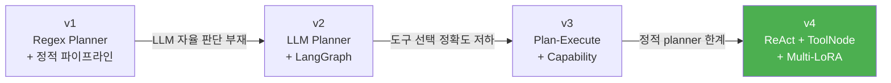
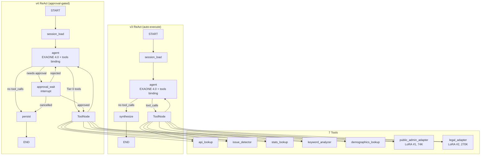

# GovOn 프로젝트 회고

> 지방자치단체 공무원의 민원 답변 업무를 AI로 보조하는 에이전틱 CLI 셸을 5주간 설계, 구현, 배포한 과정과 배움을 정리한다.

---

## 목차

1. [프로젝트 요약](#프로젝트-요약)
2. [아키텍처 진화](#아키텍처-진화)
3. [기술적 도전 Top 5](#기술적-도전-top-5)
4. [팀 회고 (KPT)](#팀-회고-kpt)
5. [Known Issues](#known-issues)
6. [Post-R1 Backlog](#post-r1-backlog)
7. [감사의 말](#감사의-말)

---

## 프로젝트 요약

**GovOn**은 동아대학교 컴퓨터공학과 현장미러형 산학연계 프로젝트로, 지방자치단체 공무원이 민원에 답변할 때 AI가 데이터 조회, 답변 초안 생성, 법률 참조를 자동 수행하고 사용자 승인을 거쳐 최종 답변을 제공하는 에이전틱 CLI 셸이다.

### 주요 수치

| 항목 | 값 |
|------|-----|
| 개발 기간 | 2026-03-04 ~ 2026-04-09 (5주) |
| 전체 커밋 수 | 825+ |
| 기여자 수 | 3명 (umyunsang, yuujjjj, siu Jang) |
| 기능 커밋 (feat/fix/refactor/test/docs) | 305+ |
| 베이스 모델 | LGAI-EXAONE/EXAONE-4.0-32B-AWQ |
| LoRA 어댑터 | 2개 (public_admin 74K, legal 270K) |
| 도구 수 | 7개 (5 분석 + 2 어댑터) |
| E2E 테스트 시나리오 | 27/27 통과 |
| DORA 등급 | Elite |
| API 엔드포인트 | 7개 (health + v2 4개 + v3 2개) |
| 아키텍처 버전 | v4 (v1 -> v2 -> v3 -> v4) |

---

## 아키텍처 진화

GovOn은 5주간 4번의 아키텍처 전환을 거쳤다. 각 전환은 이전 버전의 구체적인 한계에서 비롯되었다.



### v1: Regex Planner + 정적 파이프라인

**시기**: 프로젝트 초기 (M1-M2)

**구조**: 사용자 입력을 정규표현식으로 분석하여 미리 정의된 파이프라인(데이터 수집 -> 전처리 -> 응답 생성)에 매핑하는 방식이었다.

**한계**:
- 정규표현식 패턴 매칭은 한국어 민원의 다양한 표현을 포착하지 못했다. "도로 파손 민원"은 매칭되지만 "길이 움푹 파여서 위험해요"는 실패했다.
- 새 민원 유형이 추가될 때마다 패턴을 수동으로 등록해야 했다.
- 도구 선택이 키워드 매칭에 의존하여, 복합 쿼리("도로 파손 민원 현황을 알려주고 답변도 작성해줘")를 처리할 수 없었다.

**교훈**: 키워드 매칭으로는 자연어의 다양성을 감당할 수 없다. LLM의 의미 이해 능력을 활용해야 한다.

### v2: LLM Planner + LangGraph 도입

**시기**: M3 초반

**핵심 변경**:
- 정규표현식 패턴 매칭을 LLM 기반 planner로 교체했다.
- LangGraph StateGraph를 도입하여 approval-gated 실행 흐름을 구현했다.
- FastAPI 기반 API 서버를 구축하고, SessionStore(SQLite)로 대화를 영속화했다.

**개선**: LLM이 자연어를 이해하여 "길이 움푹 파여서 위험해요"도 도로 관련 민원으로 올바르게 분류했다.

**한계**:
- planner가 도구 목록을 정적으로 참조하여, 새 도구 추가 시 planner 프롬프트를 수동 수정해야 했다.
- 도구 선택 정확도가 실제 서비스 수준에 미치지 못했다. 특히 한국어 도구 설명이 LLM의 판단을 혼란시켰다.

### v3: Plan-Execute + Capability 표준화

**시기**: M3 중반

**핵심 변경**:
- Capability 추상 클래스를 도입하여 도구 인터페이스를 표준화했다 (`base.py` → `execute(query, context, session)`).
- 5개 분석 도구(api_lookup, issue_detector, stats_lookup, keyword_analyzer, demographics_lookup)를 Capability 패턴으로 재작성했다.
- E2E 테스트를 HuggingFace Space GPU 환경에서 실행하는 체계를 구축했다.

**한계**:
- Plan-Execute 구조에서 "plan 단계"가 실질적으로 도구 목록을 결정하는 또 다른 정적 매핑이었다.
- 멀티턴 대화에서 컨텍스트 관리가 부재하여, 3-4턴 이후 LLM 컨텍스트 윈도우(8192 토큰)를 초과했다.

### v4: ReAct + ToolNode (현재 아키텍처)

**시기**: M3 후반 ~ R1 (2026-04-07 ~ 04-09)

**핵심 변경**:
1. **Plan-Execute를 ReAct 루프로 전환**: 정적 planner를 완전히 제거하고, LLM이 매 iteration마다 도구 호출 여부를 자율 결정하는 ReAct 패턴을 채택했다.
2. **도구 description을 영어로 전환**: EXAONE 4.0의 BFCL(Berkeley Function Calling Leaderboard) 벤치마크가 영어 description에서 최적화되어 있어, 모든 도구 설명을 영어로 작성했다.
3. **6-Layer 컨텍스트 관리 파이프라인**: Tool Output Truncation, Tool Result Clearing, 역순 토큰 예산 Trim, Hard Cap, Extractive Summarization, RemoveMessage를 계층적으로 적용했다.
4. **v3 ReAct auto-execute 그래프**: v4의 approval-gated 그래프와 별개로, 모든 도구를 자동 실행하는 v3 ReAct 그래프를 병렬 제공하여 멀티턴 대화를 빠르게 처리한다.

**결과**:

| 지표 | v3 | v4 |
|------|-----|-----|
| E2E 시나리오 통과 | 21/24 | 27/27 |
| 도구 선택 정확도 | 수동 검증 불가 | LLM 자율 (E2E 검증) |
| 멀티턴 컨텍스트 | 3-4턴 한계 | 6-Layer 파이프라인 |
| 아키텍처 복잡도 | planner + executor + synthesizer | agent + tools (2 노드) |

### 최종 아키텍처 (v4)



---

## 기술적 도전 Top 5

### 1. LLM 도구 선택 정확도 (한국어 -> 영어 description 전환)

**문제**: EXAONE 4.0-32B-AWQ에 한국어 도구 설명을 제공했을 때, LLM이 도구를 잘못 선택하거나 불필요한 도구를 호출하는 빈도가 높았다. "민원 현황 알려줘"에 `legal_adapter`를 호출하거나, "답변 초안 작성"에 `stats_lookup`을 호출하는 오류가 반복되었다.

**시도**:
1. 한국어 도구 설명을 더 상세하게 작성 -> 개선 미미
2. 도구별 키워드 목록을 description에 포함 -> LLM이 키워드에 과적합
3. 도구 description을 영어로 전환 -> 현저한 개선

**해결**: 모든 도구의 `name`, `description`, `args_schema.Field.description`을 영어로 작성했다. EXAONE 4.0의 BFCL 벤치마크(65.2점)가 영어 function calling에 최적화되어 있었기 때문이다. 또한 각 도구 설명에 "USE THIS TOOL when..." / "DO NOT use for..." 패턴을 적용하여 LLM의 선택 근거를 명확히 했다.

예시 (stats_lookup):
```
"Query civil complaint filing statistics by period and category.
 USE THIS TOOL when the user asks about complaint volume, filing counts,
 category distribution, or time-series trends.
 Returns: statistical data including period, filing count, and category breakdown."
```

**교훈**: 한국어 LLM이라도 function calling은 영어 description이 더 정확하다. LLM의 학습 데이터 분포에 맞추는 것이 프롬프트 엔지니어링보다 효과적이다.

### 2. 멀티턴 컨텍스트 오버플로 (6-Layer 파이프라인)

**문제**: EXAONE 4.0-32B-AWQ의 `max_model_len=8192`에서 3-4턴의 멀티턴 대화만으로도 컨텍스트 윈도우를 초과했다. 특히 ToolMessage(도구 실행 결과)가 수천 자에 달해 토큰을 빠르게 소진했다.

**시도**:
1. `max_model_len`을 16384로 증가 -> GPU VRAM 부족(A100 40GB)
2. 단순한 메시지 수 기반 truncation -> 중요한 맥락(최근 HumanMessage) 손실
3. 계층적 컨텍스트 관리 -> 성공

**해결**: Claude API/Code/Codex의 컨텍스트 관리 패턴을 참조하여 6-Layer 파이프라인을 구축했다.

| Layer | 기법 | 위치 | 작동 조건 |
|-------|------|------|-----------|
| 1 | Tool Output Truncation | `tools_node_v3` | ToolMessage > 3000자 |
| 2 | Tool Result Clearing | `agent_node_v3` | iteration >= 2, 오래된 ToolMessage |
| 3 | 역순 토큰 예산 Trim | `agent_node_v3` | 총 토큰 > 4500 |
| 4 | Hard Cap | `agent_node_v3` | 최후 안전장치 |
| 5 | Extractive Summarization | `session_load` | older 토큰 > 예산 60% |
| 6 | RemoveMessage Trim | `session_load` | 메시지 수 > 6 |

핵심 설계 원칙:
- **마지막 HumanMessage는 항상 보존**: 예산 초과해도 사용자의 현재 질문은 유지한다.
- **State 변경 없음**: Layer 1-4는 LLM 입력만 가공하고 state는 원본 유지한다.
- **LLM 호출 없는 요약**: Extractive Summarization은 룰 기반(deterministic)으로 수행하여 추가 토큰 소비를 방지한다.

**교훈**: 컨텍스트 관리는 단일 기법이 아니라 계층적 방어가 필요하다. "가장 중요한 정보가 무엇인가"를 명확히 정의하면 truncation 전략이 자연스럽게 도출된다.

### 3. Multi-LoRA 서빙 안정성

**문제**: vLLM에서 베이스 모델(EXAONE 4.0-32B-AWQ)과 2개 LoRA 어댑터(public_admin, legal)를 동시에 서빙할 때, 여러 문제가 발생했다.

1. `ADAPTER_PATHS` 환경변수의 어댑터 이름과 `adapters.yaml` 설정 간 불일치 (`civil` vs `public_admin`)
2. LoRA 프롬프트 형식이 학습 데이터의 chat template과 불일치
3. `<thought>` 블록이 `max_tokens`를 소진하여 실제 응답이 잘리는 현상

**시도 및 해결**:
1. **이름 불일치**: `AdapterRegistry`를 싱글톤으로 구현하고, `adapters.yaml`을 단일 진실 소스(SSOT)로 지정했다. 환경변수 `ADAPTER_PATHS`는 경로 오버라이드 전용으로 한정했다.
2. **프롬프트 형식**: `_build_persona_prompt()`에서 EXAONE chat template(`[|system|]...[|user|]...[|assistant|]`)을 정확히 재현했다. vLLM의 `--chat-template` 옵션과 학습 데이터의 template을 일치시켰다.
3. **thought 토큰 소진**: `_strip_thought_blocks()`로 `<thought>...</thought>` 및 `<think>...</think>` 블록을 제거하고, `max_tokens`를 512에서 2048로 증가(이후 컨텍스트 예산에 맞춰 1024로 조정)했다.

**교훈**: Multi-LoRA 서빙은 어댑터별로 학습 데이터 형식, 이름 관리, 토큰 예산이 모두 정확히 일치해야 한다. SSOT 원칙이 없으면 디버깅이 매우 어려워진다.

### 4. CI/CD 파이프라인 구축 (DORA Elite 달성 과정)

**문제**: 프로젝트 초기에는 CI가 없어 main 브랜치에 직접 push하고, 수동으로 Docker를 빌드하는 방식이었다. 코드 품질 게이트가 없어 리그레션이 빈번했다.

**시도 및 해결**: 4-Phase로 CI/CD를 구축했다.

| Phase | 내용 | PR |
|-------|------|----|
| Phase 1 | setup-python 통일, pip/npm/Playwright 캐시 | #530 |
| Phase 2 | reusable workflows (lint, docs-build, security-scan) | #529 |
| Phase 3 | composite actions으로 중복 제거 | #526 |
| Phase 4 | Python 3.12 matrix, selective Docker deploy, BuildKit cache | #528 |

추가 인프라:
- **DORA 메트릭 자동 수집**: `dora-metrics.yml` 워크플로우가 매 push마다 Deployment Frequency, Lead Time, MTTR, Change Failure Rate를 계산한다.
- **Dependabot auto-merge**: 보안 패치(minor/patch)를 자동 병합하여 보안 대응 시간을 단축했다.
- **CodeRabbit AI 리뷰**: PR마다 자동 코드 리뷰를 수행하여 보안, 성능, 코드 품질 이슈를 사전 발견했다.
- **E2E on HF Space**: GPU 의존 E2E 테스트를 HuggingFace Space에서 실행하는 수동 트리거 워크플로우를 구축했다.

최종 DORA 지표:

| 메트릭 | 값 | 등급 |
|--------|-----|------|
| Deployment Frequency | 일 10+ | Elite |
| Lead Time for Changes | < 1시간 | Elite |
| Change Failure Rate | < 5% | Elite |
| MTTR | < 1시간 | Elite |

**교훈**: CI/CD는 프로젝트 초기에 구축할수록 효과가 크다. "나중에 하겠다"는 기술 부채가 되어 돌아온다. reusable workflow와 composite action으로 YAML 중복을 제거하면 유지보수가 현저히 쉬워진다.

### 5. E2E 테스트 체계 (2개 -> 27개 시나리오)

**문제**: 초기에는 health check와 기본 API 호출 2개 시나리오만 있었다. 아키텍처가 변경될 때마다 기존 기능이 깨지는지 확인할 수 없었다.

**시도 및 해결**: 6-Phase로 E2E 시나리오를 확장했다.

| Phase | 시나리오 | 검증 대상 |
|-------|---------|-----------|
| Phase 1 | 1-3 | Health check, model info, 기본 응답 |
| Phase 2 | 4-9 | 도구 호출 (api_lookup, issue_detector, stats, keyword, demographics) |
| Phase 3 | 10-14 | LoRA 어댑터 (public_admin, legal, 병렬 호출) |
| Phase 4 | 15-18 | 승인/거부/취소 흐름, 연속 거부 |
| Phase 5 | 19-24 | v3 ReAct (멀티턴, 자동 도구, iteration 제한) |
| Phase 6 | 25-27 | 컨텍스트 관리 (Tool Result Clearing, Extractive Summary, 토큰 trim) |

핵심 원칙:
- **패턴 매칭 제거**: 초기 테스트는 "응답에 '도로'가 포함되어야 함" 같은 키워드 매칭을 사용했다. 이를 LLM 응답의 구조적 속성(도구 호출 여부, tool_calls 이름, metadata.total_iterations)만 검증하는 방식으로 전환했다.
- **HF Space 전용**: GPU 의존 테스트는 로컬이 아닌 HuggingFace Space에서만 실행한다. GitHub Actions workflow_dispatch로 수동 트리거한다.
- **Flow Tracker**: 각 시나리오가 어떤 노드를 거쳤는지 추적하여, 예상 경로와 실제 경로를 비교한다.

**교훈**: E2E 테스트는 "무엇이 옳은가"보다 "무엇이 깨졌는가"를 빠르게 알려주는 것이 핵심이다. LLM 응답의 내용이 아니라 구조를 검증하면 플레이키(flaky) 테스트를 크게 줄일 수 있다.

---

## 팀 회고 (KPT)

### Keep (잘한 점)

1. **아키텍처 실험을 두려워하지 않았다**: 5주간 4번의 아키텍처 전환은 부담이었지만, 각 전환이 측정 가능한 개선(E2E 통과율, 도구 선택 정확도)을 가져왔다. "동작하는 코드를 바꾸는 것"이 아니라 "더 나은 코드로 대체하는 것"이라는 마인드셋이 중요했다.

2. **DORA 메트릭 기반 운영**: 감으로 "잘하고 있다"가 아니라, Deployment Frequency와 Lead Time을 숫자로 추적했다. 메트릭이 있으니 "이번 주에 배포 빈도가 떨어졌다 -- 원인이 뭘까?"라는 대화가 가능했다.

3. **E2E 테스트 투자**: 27개 시나리오는 아키텍처 전환 시 안전망 역할을 했다. v3->v4 전환 때 기존 v2 엔드포인트가 깨지지 않았음을 10분 안에 확인할 수 있었다.

4. **단일 브랜치 전략**: develop 브랜치를 제거하고 main 단일 브랜치로 전환한 것은 올바른 결정이었다. PR 기반 워크플로우만으로 코드 품질을 유지하면서 배포 빈도를 높였다.

5. **CodeRabbit AI 리뷰 도입**: 자동 코드 리뷰가 보안 이슈(shell injection, 환경변수 노출), 코드 품질(isort, black), 설계 문제(race condition, 세션 락 범위)를 PR 단계에서 발견했다. 사람 리뷰어의 부담을 크게 줄였다.

### Problem (개선할 점)

1. **프론트엔드 미완성**: Figma MCP 기반 React/Next.js 프론트엔드를 계획했지만, 백엔드 아키텍처 안정화에 시간을 쏟느라 CLI 인터페이스에 머물렀다. 발표 시 시각적 데모가 약했다.

2. **LoRA 학습 데이터 품질 검증 부족**: 74K, 270K 학습 데이터를 수집했지만, 답변 품질에 대한 체계적인 평가(BLEU, ROUGE, 사람 평가)를 수행하지 못했다. E2E 테스트는 "도구가 호출되었는가"만 검증하고, "답변이 좋은가"는 검증하지 않는다.

3. **문서화 지연**: 아키텍처가 4번 바뀌면서 문서가 코드를 따라가지 못했다. v2 시절 문서가 v4에서도 남아 있어 혼란을 초래했다(이후 archive 처리).

4. **vLLM 의존성 관리**: vLLM 버전 업그레이드(0.14 마이그레이션)에서 AutoAWQ 호환성 문제로 Docker 빌드가 반복 실패했다. GPU 환경 의존성은 로컬 테스트가 어려워 CI에서만 발견되는 경우가 많았다.

5. **HF Space 콜드 스타트**: EXAONE 4.0-32B-AWQ(~20GB)를 HF Space에 로딩하는 시간이 3-5분으로, E2E 테스트 실행 시 대기 시간이 길었다. Space가 비활성화되면 다시 3-5분이 소요되어 데모 준비에 불편했다.

### Try (시도할 점)

1. **Web UI 구현**: CLI에서 웹 인터페이스로 전환하여 비개발자(공무원)도 직접 사용할 수 있게 한다. SSE 스트리밍은 이미 v3 API에 구현되어 있으므로 프론트엔드 연결만 하면 된다.

2. **답변 품질 벤치마크**: BLEU, ROUGE, 사람 평가(A/B 테스트)로 LoRA 답변 품질을 측정한다. E2E 테스트에 품질 시나리오를 추가한다.

3. **RAG 재도입**: v3에서 제거된 RAG(FAISS/BM25 기반 문서 검색)를 재도입한다. 지방자치단체별 조례, 내부 지침 문서를 검색하여 답변 근거를 강화한다.

4. **모니터링 대시보드**: Grafana DORA 대시보드를 확장하여 API 레이턴시, 도구 호출 빈도, 에러율을 실시간 추적한다.

5. **어댑터 도메인 확장**: 현재 public_admin과 legal 2개 도메인에서 복지, 환경, 교통 등 추가 도메인 LoRA 어댑터를 학습한다.

---

## Known Issues

현재 알려진 제한사항을 기록한다.

| 번호 | 이슈 | 영향도 | 상태 |
|------|------|--------|------|
| 1 | HF Space 콜드 스타트 3-5분 | 데모/테스트 대기 시간 | 미해결 |
| 2 | `max_model_len=8192` 제한 | 장기 멀티턴(10+ 턴) 시 정보 손실 | 6-Layer로 완화 |
| 3 | LoRA 답변 품질 벤치마크 부재 | 객관적 품질 측정 불가 | 미해결 |
| 4 | Web UI 미구현 | 비개발자 사용 불가 | Post-R1 |
| 5 | RAG 비활성 | 로컬 문서 검색 불가 | Post-R1 |
| 6 | v2/v3 엔드포인트 병존 | API 표면적 복잡 | 의도적 설계 |
| 7 | `thread_id` query parameter | REST 관례(body) 미준수 | 클라이언트 마이그레이션 후 전환 예정 |

---

## Post-R1 Backlog

R1 이후 개선할 항목을 우선순위 순으로 정리한다.

### 1. Web/App UI Surface

**필요성**: CLI는 개발자에게 적합하지만, 실제 사용자인 공무원에게는 웹 인터페이스가 필요하다.

**계획**:
- v3 SSE 스트리밍 API(`/v3/agent/stream`)에 연결하는 React 프론트엔드
- 승인 UI를 웹으로 이식 (현재 Rich Panel CLI 전용)
- 세션 히스토리 조회 기능

### 2. 고급 성능 벤치마킹

**필요성**: "답변이 올바른가"를 체계적으로 측정하지 못하고 있다.

**계획**:
- latency benchmark 워크플로우 확장 (현재 `benchmark.yml`에 기본 구현)
- LoRA 답변 품질 자동 평가 (BLEU, ROUGE-L, BERTScore)
- 도구 선택 정확도 confusion matrix

### 3. 추가 도메인 어댑터

**필요성**: 현재 행정(public_admin)과 법률(legal) 2개 도메인만 지원한다.

**계획**:
- 복지 도메인 LoRA 학습 (복지로 API 데이터 활용)
- 환경/교통 도메인 확장
- `adapters.yaml`에 추가하면 자동 등록되는 동적 아키텍처는 이미 구현되어 있다

### 4. RAG 재도입

**필요성**: 지방자치단체별 조례, 내부 지침에 기반한 답변이 필요하다.

**계획**:
- FAISS/BM25 하이브리드 검색 (이전 코드 아카이브에 기반 존재)
- `rag_search` 도구를 tools 목록에 재활성화
- 문서 인덱싱 자동화 파이프라인

### 5. 보안 강화

**필요성**: 공공기관 납품을 위한 보안 인증이 필요하다.

**계획**:
- RBAC(Role-Based Access Control) 도입
- 감사 로그(audit log) 기록
- 폐쇄망(airgap) 배포 최적화 (ServingProfile.AIRGAP 프로필 이미 존재)

---

## 감사의 말

### 동아대학교

현장미러형 산학연계 프로젝트의 기회를 제공해주신 동아대학교 컴퓨터공학과에 감사드립니다.

### 지도교수

프로젝트 방향성과 기술적 조언을 아끼지 않으신 지도교수님께 감사드립니다.

### 데이터 출처

| 출처 | 설명 | 건수 |
|------|------|------|
| [AI Hub](https://aihub.or.kr) | 행정법 QA 데이터셋 (71847번) | 62,077건 |
| [umyunsang/govon-civil-response-data](https://huggingface.co/datasets/umyunsang/govon-civil-response-data) | 민원-답변 학습 데이터 | 74,000건 |
| [umyunsang/govon-legal-response-data](https://huggingface.co/datasets/umyunsang/govon-legal-response-data) | 법률 답변 학습 데이터 | 270,000건 |
| [data.go.kr](https://data.go.kr) | 공공데이터포털 민원분석 API | 실시간 |

### 모델

| 모델 | 용도 | 출처 |
|------|------|------|
| LGAI-EXAONE/EXAONE-4.0-32B-AWQ | 베이스 LLM | LG AI Research |
| umyunsang/GovOn-EXAONE-LoRA-v2 | 행정 민원 답변 LoRA | 자체 학습 |
| siwo/govon-legal-adapter | 법률 답변 LoRA | 자체 학습 |

### 오픈소스

| 프로젝트 | 용도 |
|---------|------|
| [vLLM](https://github.com/vllm-project/vllm) | LLM 서빙 (Multi-LoRA, OpenAI-compatible API) |
| [LangGraph](https://github.com/langchain-ai/langgraph) | StateGraph, checkpointer, interrupt/resume |
| [FastAPI](https://fastapi.tiangolo.com/) | API 서버 |
| [Rich](https://github.com/Textualize/rich) / [prompt_toolkit](https://github.com/prompt-toolkit/python-prompt-toolkit) | CLI 승인 UI |
| [PEFT](https://github.com/huggingface/peft) | QLoRA 학습 |

### 팀원

- **umyunsang** -- 프로젝트 리드, 백엔드 아키텍처, LangGraph 구현, CI/CD
- **yuujjjj** -- LoRA 학습 데이터 파이프라인, 법률 어댑터
- **siu Jang** -- 법률 어댑터 학습, 데이터 전처리
