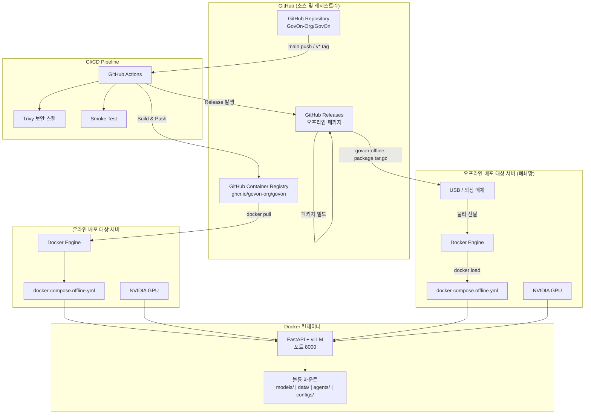
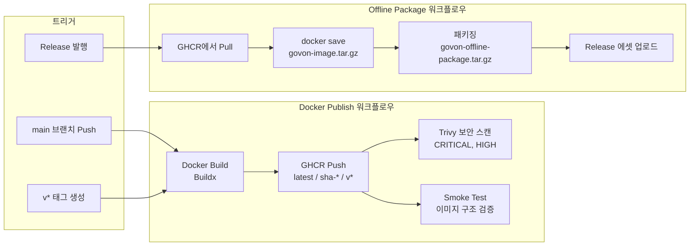
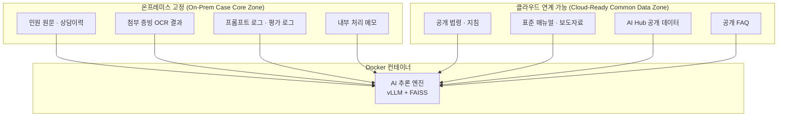

# 인프라 아키텍처

GovOn 시스템의 배포 인프라 구성, CI/CD 파이프라인, 온라인/오프라인 배포 전략을 설명한다.

---

## 전체 인프라 아키텍처



---

## 컨테이너 내부 구조

```mermaid
graph LR
    subgraph "Docker 컨테이너 (govon-backend)"
        API[FastAPI API 서버<br/>포트 8000]
        VLLM[vLLM 엔진<br/>EXAONE-Deep-7.8B]
        FAISS[FAISS 벡터 검색<br/>multilingual-e5-large]
        BM25[BM25 텍스트 검색]
        RAG[RAG 파이프라인]

        API --> VLLM
        API --> RAG
        RAG --> FAISS
        RAG --> BM25
    end

    subgraph "볼륨 마운트"
        MODEL[/app/models<br/>모델 파일, 인덱스]
        DATA[/app/data<br/>학습/검색 데이터]
        AGENT[/app/agents<br/>에이전트 설정]
        CONFIG[/app/configs<br/>시스템 설정]
    end

    subgraph "외부"
        CLIENT[웹 브라우저<br/>Next.js 프론트엔드]
        GPU[NVIDIA GPU]
    end

    CLIENT -->|HTTP :8000| API
    GPU -->|CUDA| VLLM
    MODEL --> VLLM
    MODEL --> FAISS
    MODEL --> BM25
    DATA --> RAG
    AGENT --> API
    CONFIG --> API
```

---

## CI/CD 배포 파이프라인



---

## 온라인 vs 오프라인 배포 비교

| 항목 | 온라인 배포 | 오프라인 배포 (폐쇄망) |
|------|-----------|---------------------|
| **이미지 소스** | GHCR에서 직접 Pull | GitHub Release 패키지 → `docker load` |
| **Compose 파일** | `docker-compose.yml` 또는 `docker-compose.offline.yml` | `docker-compose.offline.yml` |
| **모델 파일** | HuggingFace에서 자동 다운로드 가능 | USB 등으로 사전 전달 필요 |
| **인터넷 필요** | 최초 Pull 시 필요 | 불필요 (완전 오프라인) |
| **배포 스크립트** | `scripts/deploy.sh` (Blue/Green) | `scripts/offline-deploy.sh` |
| **업데이트 방법** | `docker pull` → 재시작 | 새 패키지 전달 → `docker load` → 재시작 |
| **보안 감사** | 외부 레지스트리 접근 이력 존재 | 외부 네트워크 연결 0건 |
| **적합 환경** | 개발/스테이징 서버, 인터넷 접근 가능한 서버 | 행정 내부망, 보안 등급 서버, 폐쇄망 |

---

## 배포 모드별 상세

### 온라인 배포

```
개발자 PC → git push → GitHub Actions → GHCR → 서버에서 docker pull → docker compose up
```

- `main` 브랜치에 push할 때마다 최신 이미지가 자동으로 빌드되어 GHCR에 저장된다
- 서버에서 `docker pull`로 최신 이미지를 가져와 배포한다
- Blue/Green 배포 스크립트(`scripts/deploy.sh`)를 사용하면 무중단 업데이트가 가능하다

### 오프라인 배포

```
GitHub Release 발행 → 오프라인 패키지 자동 생성 → USB 전달 → offline-deploy.sh 실행
```

- Release를 발행하면 GitHub Actions가 자동으로 오프라인 패키지를 생성한다
- 패키지에는 Docker 이미지 아카이브, 배포 스크립트, Compose 파일이 포함된다
- 폐쇄망 서버에서 `offline-deploy.sh` 한 번 실행으로 전체 배포가 완료된다

---

## 데이터 영역 분리

GovOn은 사건별 핵심 데이터와 공개/공통 데이터를 구조적으로 분리하는 하이브리드 전략을 따른다.



| 데이터 유형 | 배치 전략 | 근거 |
|------------|----------|------|
| 사건별 민원 핵심 데이터 | **온프레미스 고정** | 개인정보보호법 제23조, 제24조, 제26조, 제29조 |
| 권리영향 판단 보조 데이터 | **온프레미스 고정** | 공공 AI 영향평가 대상 (행동계획 92쪽) |
| 공개/공통 참조 데이터 | **클라우드 연계 가능** | 범정부 AI 공통기반 연계 대상 |
| 비식별 공개 학습 데이터 | **하이브리드 운영 가능** | 정책과 예산에 따라 유동적 |

---

## 포트 구성

| 서비스 | 포트 | 설명 |
|--------|------|------|
| GovOn API (기본) | `8000` | 단일 인스턴스 배포 |
| GovOn API (Blue) | `8001` | Blue/Green 배포 시 Blue 슬롯 |
| GovOn API (Green) | `8002` | Blue/Green 배포 시 Green 슬롯 |
| 프론트엔드 (Next.js) | `3000` | 웹 UI (별도 구성) |
