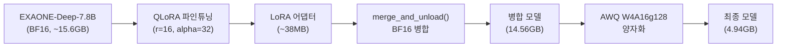
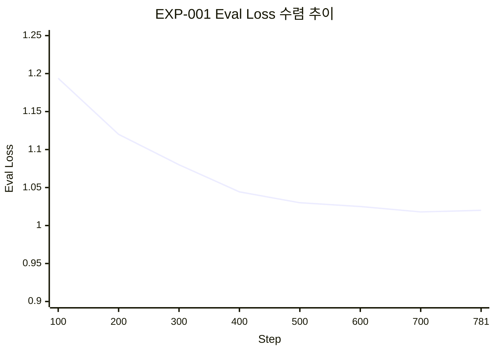

# 파인튜닝: QLoRA 실험

EXAONE-Deep-7.8B 모델을 민원 도메인에 특화하기 위한 QLoRA 파인튜닝 실험 설계, 실행 과정, 결과를 정리한다.

---

## 실험 목적과 가설

### 연구 목적

한국어 특화 LLM인 EXAONE-Deep-7.8B를 민원 도메인에 특화하여 파인튜닝하고, 온프레미스 환경 배포를 위한 최적의 양자화 기법을 검증한다.

### 핵심 가설

| 가설 | 내용 | 검증 기준 |
|------|------|----------|
| **H1** | QLoRA 4-bit 상태 파인튜닝으로 민원 분류 정확도 85% 이상 달성 | Test set accuracy |
| **H2** | AI Hub 민원 데이터 파인튜닝으로 일반 도메인 대비 30%p 이상 성능 향상 | 도메인 비교 |
| **H3** | AWQ 4-bit 양자화 시 크기 50%+ 감소, 속도 2배+ 향상, 성능 저하 5% 미만 | 압축률/속도 측정 |
| **H4** | EXAONE Chat Template 적용 시 답변 품질 향상 | 생성 품질 비교 |

---

## 실험 파이프라인



---

## QLoRA 설정

### 양자화 설정

```python
QLORA_CONFIG = {
    "load_in_4bit": True,
    "bnb_4bit_quant_type": "nf4",
    "bnb_4bit_compute_dtype": "bfloat16",
    "bnb_4bit_use_double_quant": True,
    "lora_r": 16,
    "lora_alpha": 32,
    "target_modules": [
        "q_proj", "k_proj", "v_proj", "o_proj",
        "gate_proj", "up_proj", "down_proj"
    ],
    "lora_dropout": 0.05,
    "task_type": "CAUSAL_LM"
}
```

### 학습 하이퍼파라미터 (EXP-001 Baseline)

| 파라미터 | 값 | 비고 |
|---------|-----|------|
| Batch Size | 2 | Per-device |
| Gradient Accumulation | 8 | Effective Batch Size: 16 |
| Learning Rate | 2e-4 | |
| Epochs | 1 (초기) / 3 (Full) | |
| Max Seq Length | 2,048 | EXAONE 최대 32K 중 학습 효율 위해 제한 |
| Optimizer | paged_adamw_8bit | 메모리 효율 최적화 |
| Scheduler | cosine | |

---

## 데이터셋 구성

### AI Hub 데이터셋

| 데이터셋 번호 | 명칭 | 예상 규모 | 용도 | 우선순위 |
|-------------|------|----------|------|---------|
| **71852** | 공공 민원 상담 LLM 데이터 | 150,000건+ | **주 학습 데이터** (Instruction Tuning) | 1 |
| **71844** | 민간 민원 상담 LLM 데이터 | 200,000건+ | 보조 학습 데이터 (도메인 확장) | 2 |

### 데이터 분할

```python
SPLIT_RATIOS = {
    "train": 0.80,      # 80% 학습용
    "validation": 0.10,  # 10% 검증용
    "test": 0.10         # 10% 평가용
}
```

### 전처리 파이프라인

1. **PII 마스킹**: 이름, 주민번호, 전화번호 등 개인정보 자동 탐지 및 마스킹
2. **데이터 정제**: 중복 제거, 길이 필터링 (최소 20자 이상)
3. **포맷 변환**: EXAONE Chat Template 형식으로 변환

### 데이터 포맷

```text
[|system|]
당신은 지자체 민원 담당 공무원을 돕는 AI 어시스턴트입니다.
[|user|]
{instruction}\n\n{input}
[|assistant|]
{output}
```

---

## 실험 설계

| 실험 ID | 변경 변수 | 설정값 | 목적 |
|---------|----------|--------|------|
| **EXP-001** | Baseline | r=16, lr=2e-4 | 기준 성능 측정 |
| EXP-002 | LoRA Rank | r=8, r=32 | 경량화 및 성능 변화 검증 |
| EXP-003 | Learning Rate | lr=1e-4 | 수렴 안정성 검증 |

---

## M2 베이스라인 결과 (EXP-001)

### 실험 환경

| 항목 | 값 |
|------|-----|
| GPU | NVIDIA A100 (80GB VRAM) |
| 실행 환경 | Google Colab Pro |
| 실행일 | 2026-03-05 |

!!! note "L4에서 A100으로 이전"
    L4 런타임(24GB)에서 OOM이 발생하여 A100(80GB)으로 이전한 후 학습을 완수하였다.

### 학습 결과

| 단계 | Eval Loss |
|------|-----------|
| Step 100 | 1.1938 |
| Step 400 | 1.0443 |
| Step 700 (Best) | **1.0179** |
| Step 781 (Final) | Training Loss ~1.01 |



!!! success "핵심 발견"
    1 epoch 학습만으로도 Eval Loss 1.0179 수준의 우수한 수렴도를 확인하였다. 이는 EXAONE-Deep-7.8B가 민원 도메인에 빠르게 적응할 수 있음을 보여준다.

### 모델 배포

| 모델 | URL | 크기 |
|------|-----|------|
| LoRA 어댑터 | [umyunsang/civil-complaint-exaone-lora](https://huggingface.co/umyunsang/civil-complaint-exaone-lora) | ~38MB |
| BF16 병합 | [umyunsang/civil-complaint-exaone-merged](https://huggingface.co/umyunsang/civil-complaint-exaone-merged) | 14.56 GB |
| AWQ 4-bit | [umyunsang/civil-complaint-exaone-awq](https://huggingface.co/umyunsang/civil-complaint-exaone-awq) | 4.94 GB |

### W&B 실험 추적

- **EXP-001 Run**: [EXP-001-Baseline-EXAONE-7.8B](https://wandb.ai/umyun3/huggingface/runs/kmx8rlvv)

---

## 환경 호환성 이슈 및 해결

### transformers 5.x 호환성 패치

EXAONE 모델을 최신 transformers 버전에서 사용하기 위해 여러 호환성 패치가 필요했다.

#### 이슈 1: `check_model_inputs` 삭제

`transformers` 5.3.0에서 `check_model_inputs`가 삭제되어 EXAONE 모델의 `modeling_exaone.py`에서 임포트 에러 발생.

```python
# 해결: generic.py에 수동 정의
def check_model_inputs(func):
    return func
```

#### 이슈 2: `get_input_embeddings` NotImplementedError

EXAONE 모델이 PEFT와 연동될 때 `get_input_embeddings` 미구현 에러 발생.

```python
# 해결: 몽키 패치
try:
    model.get_input_embeddings()
except (NotImplementedError, AttributeError):
    model.get_input_embeddings = lambda: model.transformer.wte
```

#### 이슈 3: `evaluation_strategy` 파라미터 변경

`transformers` 5.3.0 이상에서 파라미터명이 변경됨.

```python
# 변경 전
evaluation_strategy="steps"
# 변경 후
eval_strategy="steps"
```

!!! warning "교훈: 라이브러리 버전 고정 필수"
    Dynamic Module을 사용하는 특정 모델(EXAONE 등)은 학습/추론 시 사용한 라이브러리 버전을 고정하는 것이 필수적이다.

---

## Google Colab 실행 가이드

### 1. 런타임 설정

- **런타임 유형**: GPU (A100 권장)
- **High-RAM 설정**: 활성화 (40GB VRAM 이상 권장)

### 2. 패키지 설치

```bash
!pip install -q -U transformers datasets accelerate peft bitsandbytes trl wandb python-dotenv
```

### 3. 프로젝트 클론

```python
!git clone https://github.com/GovOn-org/GovOn.git
%cd GovOn

import sys, os
sys.path.append(os.getcwd())

import wandb
wandb.login()
```

### 4. 파인튜닝 실행

```bash
!python src/training/train_qlora.py \
    --train_path data/processed/civil_complaint_train.jsonl \
    --val_path data/processed/civil_complaint_val.jsonl \
    --output_dir ./models/checkpoints/exaone-civil-qlora \
    --epochs 3 \
    --batch_size 4 \
    --grad_accum 4 \
    --lr 2e-4
```

### 5. 결과 백업

```python
from google.colab import drive
drive.mount('/content/drive')
!cp -r ./models/checkpoints/exaone-civil-qlora /content/drive/MyDrive/
```

---

## 필수 라이브러리 버전

| 라이브러리 | 버전 | 비고 |
|-----------|------|------|
| transformers | 5.3.0 | EXAONE 모델 지원, 호환성 패치 필요 |
| trl | 0.12.0 | DataCollatorForCompletionOnlyLM 포함 |
| peft | >= 0.14.0 | LoRA 어댑터 |
| bitsandbytes | >= 0.45.0 | 4-bit 양자화 |
| accelerate | >= 1.3.0 | 분산 학습 |
| PyTorch | 2.6.0 | CUDA 12.x |

---

## 기대 효과 및 KPI 목표

| 지표 | 베이스라인 | 목표값 | M2 실측값 |
|------|-----------|--------|----------|
| 민원 분류 정확도 | 55% (키워드 기반) | >= 85% | 파서 개선 후 90% (M3) |
| 답변 생성 BLEU | N/A | >= 30 | 17.32 |
| 답변 생성 ROUGE-L | N/A | >= 40 | 18.28 |
| 추론 속도 (p50) | N/A | < 2초 | 2.43초 (M3, vLLM) |
| GPU VRAM | 15GB (BF16) | < 8GB | 4.95GB |
| 모델 크기 | 15.6GB (BF16) | < 5GB | 4.94GB |

---

## 참고 자료

- [EXAONE-Deep-7.8B (HuggingFace)](https://huggingface.co/LGAI-EXAONE/EXAONE-Deep-7.8B)
- [W&B EXP-001 Run](https://wandb.ai/umyun3/huggingface/runs/kmx8rlvv)
- [AI Hub 공공 민원 상담 LLM 데이터 (71852)](https://aihub.or.kr)
