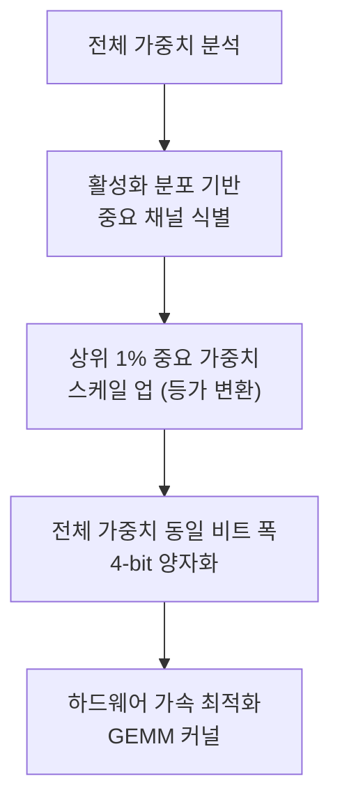
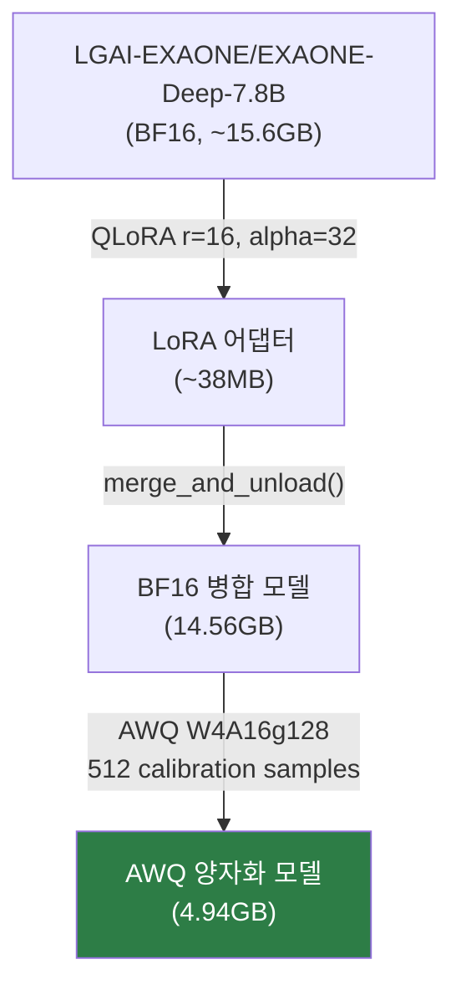
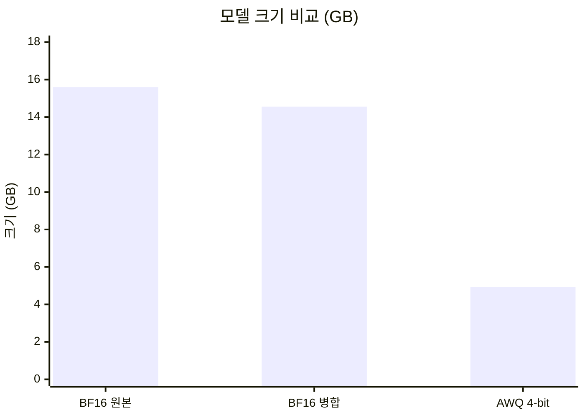
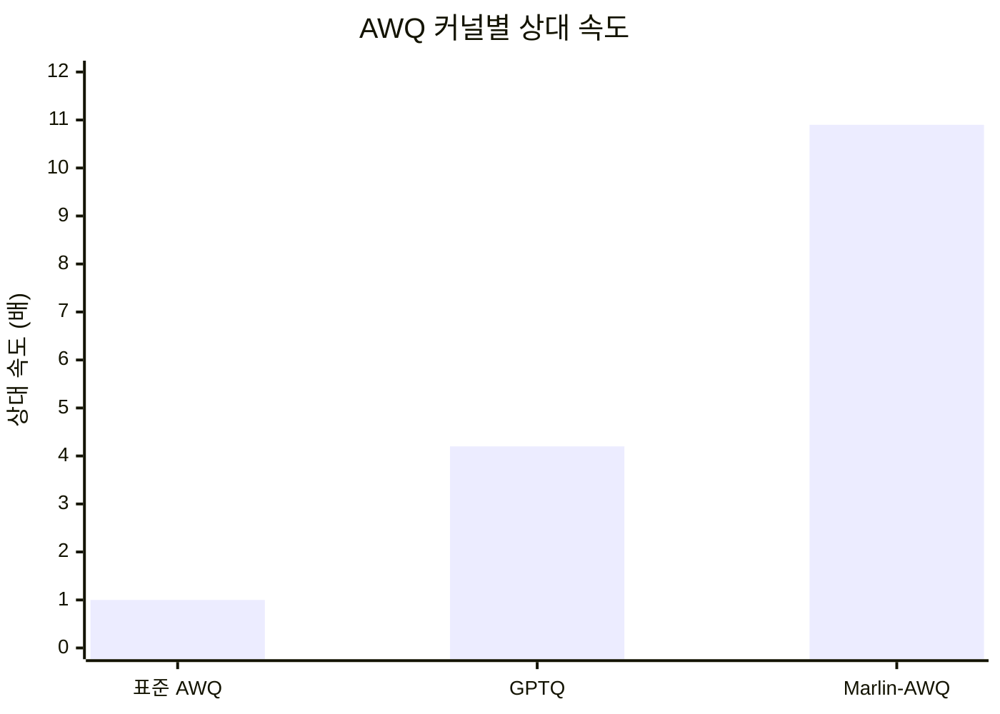

# 양자화: AWQ W4A16g128

EXAONE-Deep-7.8B 파인튜닝 모델의 AWQ 양자화 과정, 설정, 성능 비교 결과를 정리한다.

---

## AWQ 양자화 개요

**AWQ (Activation-aware Weight Quantization)**는 MIT Han Lab에서 개발한 4비트 가중치 전용 양자화 기법이다. MLSys 2024 Best Paper Award를 수상하였다.

### 핵심 원리



1. **Activation-aware**: 활성화 분포를 기반으로 중요한 가중치 채널을 식별한다
2. **선택적 보호**: 상위 1%의 중요 가중치만 보호해도 양자화 오류가 크게 감소한다
3. **등가 변환**: 혼합 정밀도 대신, 중요 채널을 스케일 업하는 수학적 등가 변환을 사용한다
4. **하드웨어 친화적**: 전체 가중치를 동일 비트 폭으로 양자화하여 하드웨어 가속을 최적화한다

---

## 양자화 설정 (W4A16g128)

### 설정 파라미터

| 파라미터 | 값 | 설명 |
|---------|-----|------|
| **bits** | 4 | 4비트 가중치 양자화 |
| **group_size** | 128 | 128개 가중치마다 스케일 팩터 적용 |
| **quant_method** | awq | AWQ 양자화 방식 |
| **version** | gemm | GEMM 최적화 커널 사용 |
| **zero_point** | true | Zero-point 양자화 활성화 |
| **modules_to_not_convert** | lm_head | 출력 헤드는 전체 정밀도 유지 |

### 양자화 사양 표기

- **W4**: 4비트 가중치 (Weights)
- **A16**: 16비트 활성화 (Activations)
- **g128**: 그룹 크기 128

```json
{
  "quantization_config": {
    "bits": 4,
    "group_size": 128,
    "modules_to_not_convert": ["lm_head"],
    "quant_method": "awq",
    "version": "gemm",
    "zero_point": true
  }
}
```

---

## 양자화 파이프라인

### 전체 흐름



### 캘리브레이션 설정

| 항목 | 값 |
|------|-----|
| 캘리브레이션 데이터 | 민원 도메인 훈련 데이터 512 샘플 |
| 소요 시간 | ~20-40분 (A100 80GB 환경) |
| AutoAWQ 버전 | 최신 (deprecated, but functional) |

!!! tip "캘리브레이션 데이터 선택"
    캘리브레이션 데이터는 학습 도메인과 동일한 민원 데이터를 사용하여, 양자화 시 민원 도메인에 중요한 가중치 채널이 보호되도록 한다.

---

## 양자화 결과

### 모델 크기 비교

| 모델 | 크기 | 원본 대비 |
|------|------|----------|
| BF16 원본 | ~15.6 GB | 기준 |
| BF16 병합 (LoRA merged) | 14.56 GB | -6.7% |
| **AWQ 4-bit** | **4.94 GB** | **-68.3%** |



!!! success "핵심 성과: 68.3% 크기 감소"
    AWQ 4-bit 양자화로 15.6GB에서 4.94GB로 약 3.16배 압축에 성공하였다. 이는 소비자급 GPU(RTX 3060 6GB 이상)에서 실행 가능한 수준이다.

### VRAM 사용량

| 환경 | VRAM | 비고 |
|------|------|------|
| BF16 추론 | ~20 GB | A100 필요 |
| AWQ 4-bit 추론 | 4.95 GB | RTX 3060 이상 실행 가능 |
| AWQ + vLLM | 4.17 GB | vLLM 최적화 적용 |

### 품질 영향

| 지표 | BF16 | AWQ 4-bit | 차이 |
|------|------|-----------|------|
| Perplexity | - | 3.1957 | 양호 (절대값 기준) |
| 언어 모델링 품질 | 기준 | 유지 | < 1% 손실 추정 |

---

## AWQ 양자화 영향 상세 분석

M3 평가에서 LoRA v2(FP16/BF16) 대비 AWQ INT4 양자화 후 품질 변화를 측정하였다.

### 메트릭별 양자화 영향

| 메트릭 | LoRA v2 (FP) | AWQ v2 (INT4) | 변화 | 해석 |
|--------|-------------|---------------|------|------|
| SacreBLEU | 11.45 | 7.74 | **-3.71** | n-gram precision 하락 |
| ROUGE-L | 25.14 | 18.76 | **-6.38** | 구조적 유사도 유의미 감소 |
| BERTScore | 72.34 | 71.04 | **-1.30** | 의미적 유사도 거의 보존 |
| EOS 종료율 | 91.3% | 88.6% | **-2.7%p** | 경미한 하락 |

!!! info "양자화 품질 손실 패턴"
    INT4 양자화 시 토큰 단위의 미세한 확률 분포 변화가 lexical overlap 메트릭(BLEU, ROUGE-L)에 민감하게 반영된다. 반면 BERTScore(-1.30)는 거의 보존되어, **의미적 품질은 유지되고 있다**.

---

## 다른 양자화 방식과의 비교

| 양자화 방식 | 비트 폭 | 메모리 | 속도 | 품질 | 하드웨어 지원 |
|-----------|--------|-------|------|------|------------|
| **AWQ** | 4-bit | 매우 좋음 | 매우 빠름 | 우수 | CUDA, ROCm 등 |
| GPTQ | 4-bit | 매우 좋음 | 빠름 | 좋음 | 광범위 |
| GGUF Q4_K_M | 4-bit | 매우 좋음 | 보통 | 보통 | CPU/GPU |
| bitsandbytes | 4/8-bit | 좋음 | 보통 | 좋음 | NVIDIA 전용 |

### AWQ 선택 이유

- **vLLM 공식 지원**: Marlin 커널을 통한 고성능 추론
- **GPTQ 대비 2.6배 속도 향상** (Marlin 커널 기준)
- **표준 AWQ 대비 10.9배 속도 향상** (Marlin-AWQ 조합)
- **하드웨어 범용성**: CUDA, ROCm 모두 지원

---

## vLLM 서빙 성능

### AWQ + vLLM 조합 결과 (M3)

| 지표 | 측정값 | 목표 | 판정 |
|------|--------|------|------|
| 평균 추론 속도 | 2.43s | < 2s | 근접 |
| p50 레이턴시 | 1.559s | - | - |
| p95 레이턴시 | 2.849s | < 3.0s | 달성 |
| 처리량 | 178.4 tok/s | - | - |
| GPU VRAM | 4.17 GB | < 8GB | 달성 |
| 분류 정확도 | 90.0% | >= 85% | 달성 |

### Marlin 커널 효과

vLLM은 AWQ 모델에 대해 `awq_marlin` 커널을 활용한 고성능 추론을 지원한다.



- `enforce_eager=False` (CUDA Graph 활성화)와 결합하여 커널 launch 오버헤드 최소화
- Ampere 아키텍처(SM 8.0)에서 최적화된 GEMM 제공

---

## 발견된 문제점 및 해결

### Merged 모델 손상 (Critical)

M2 단계에서 생성한 `civil-complaint-exaone-merged` 모델에 손상이 발견되었다.

| 항목 | 내용 |
|------|------|
| **증상** | AWQ 모델에서 의미 없는 출력 생성 |
| **원인** | transformers v5 환경에서 merge_and_unload() 수행 시 EXAONE 모델 코드 불일치 |
| **조치** | HuggingFace에서 merged 모델 삭제, AWQ 모델도 무효화 판정 |
| **재양자화** | M3 평가 결과 확인 후 올바른 버전 조합으로 재수행 |

### 올바른 양자화를 위한 필수 조건

!!! danger "양자화 전 반드시 확인할 사항"
    1. **transformers 4.44~4.49** 사용 (LoRA 학습 시점 버전)
    2. **EXAONE revision `17b70148e344`** 고정 (학습 호환 코드)
    3. `merge_and_unload()` 후 **sanity check 필수** (정상 출력 확인)
    4. 캘리브레이션 데이터는 학습 도메인과 동일한 **민원 데이터** 사용

---

## 참고 자료

- [AWQ 논문 (arXiv)](https://arxiv.org/abs/2306.00978)
- [AutoAWQ GitHub](https://github.com/casper-hansen/AutoAWQ)
- [EXAONE-Deep-7.8B-AWQ (공식)](https://huggingface.co/LGAI-EXAONE/EXAONE-Deep-7.8B-AWQ)
- [GovOn AWQ v2 모델](https://huggingface.co/umyunsang/GovOn-EXAONE-AWQ-v2)
